# Customer Deployment Guide: Fabric Private Workspace

This is the standalone operator runbook for deploying the repository in a
customer environment without an AI assistant. Follow it from top to bottom. Do
not skip a **STOP** gate, reuse a saved plan after changing permissions or
variables, or restrict Workspace A public access before the final gate.

The guide embeds every portal screenshot already captured during the reference
deployment. Screenshots show the navigation and expected state; customer names,
subscriptions, regions, CIDRs, workspace IDs, and capacity IDs will differ.

For architecture rationale and the detailed reference deployment history, see
[workloads/fabric/README.md](workloads/fabric/README.md). For the Layer 1
as-built evidence, see [platform/DEPLOYMENT.md](platform/DEPLOYMENT.md).

## Contents

- [Scope and release boundary](#scope-and-release-boundary)
- [Required operator inputs](#required-operator-inputs)
- [Day-0 readiness gate](#day-0-readiness-gate)
- [Reference lab checkpoint](#reference-lab-checkpoint-do-not-copy-to-a-customer)
- [Execution model](#execution-model)
- [Deployment timeline](#timeline)
  - [1. Prepare the operator workstation](#1-prepare-the-operator-workstation)
  - [2. Establish state and Layer 1](#2-establish-private-terraform-state-and-deploy-layer-1)
  - [3. Validate the network handoff](#3-validate-the-customer-network-handoff)
  - [4. Complete Fabric tenant prerequisites](#4-complete-fabric-tenant-prerequisites)
  - [5. Deploy Fabric Phase A](#5-terraform-phase-a-fabric-foundation)
  - [6. Create both workspaces](#6-create-both-fabric-workspaces)
  - [7. Grant runner workspace access](#7-grant-the-runner-fabric-workspace-lifecycle-access)
  - [8. Deploy workspace Private Link](#8-terraform-phase-b-workspace-private-link)
  - [9. Prepare SQL and OPDG](#9-prepare-the-customer-sql-server-and-opdg-hosts)
  - [10. Install and register OPDG](#10-phase-5-install-and-register-opdg)
  - [11. Create the lakehouse and ingest SQL](#11-phase-6-create-the-private-lakehouse-and-ingest-sql)
  - [12. Build the semantic model and report](#12-phase-7-build-the-public-semantic-model-and-report)
  - [13. Run pre-lockdown validation](#13-phase-8-final-pre-lockdown-validation)
  - [14. Restrict Workspace A](#14-phase-9-restrict-workspace-a-last)
  - [15. Pause nonproduction resources](#15-pause-nonproduction-resources-when-idle)
- [Evidence acceptance criteria](#evidence-acceptance-criteria)
- [Rollback order](#rollback-order)
- [Troubleshooting matrix](#troubleshooting-matrix)
- [Firewall rule reference (OPDG + Fabric)](#firewall-rule-reference-opdg--fabric)
- [Reference lab resume appendix](#reference-lab-resume-appendix)

## Scope and release boundary

This repository deploys:

- Implemented Layer 1 roots: state storage, management-group hierarchy, hub
  VNet, Azure Firewall, Private DNS Resolver, and Log Analytics workspace.
- Fabric Phase A: F capacity, Fabric spoke, UDR, hub peerings, diagnostics, and
  the workspace-level Private Link DNS zone.
- Fabric Phase B: the hidden workspace Private Link service, private endpoint,
  and DNS zone group.
- Optional **lab-only** SQL Server and OPDG Windows VMs in an existing simulated
  on-premises VNet.

This repository does **not** deploy the following customer production
dependencies. Their owners must complete and sign them off before the matching
STOP gate:

| Dependency | Customer owner | Required outcome |
|---|---|---|
| Azure subscriptions and management-group placement | Cloud platform | Target subscriptions exist; deployment identity has approved roles |
| Private Terraform runner | Cloud platform | Runner can reach Azure Resource Manager, Git, and the private state endpoint |
| Private backend endpoint and DNS path | Cloud/network | State storage resolves privately and TCP 443 succeeds from the runner |
| On-prem to hub connectivity | Network | On-prem is peered to the hub; on-prem routes the Fabric spoke and internet to the hub firewall (transit) |
| Azure Firewall/SWG rules | Network/security | Terraform, Fabric, OneLake, Entra, Azure Relay, and gateway endpoints are allowed |
| Production SQL Server | Database | Supported SQL instance, database, least-privilege login, backup, TLS, and operations ownership |
| Production OPDG hosts | Data platform | Windows Server 2019+, 8 cores/8 GB+ recommended, SSD, latest supported gateway, HA design |
| Entra Conditional Access | Identity/security | Workspace B public access is protected by an approved CA policy |
| Stages `30-egress` and `50-security` | Cloud/security | Separate production implementation; current repository roots are design stubs |

**Production release gate:** do not call this a production landing-zone
deployment until the missing customer-owned controls above are implemented and
approved. The reference lab uses one subscription, a peered on-prem simulation,
empty Firewall rule collections, and single OPDG/SQL hosts. Those are not a
production baseline.

### Supported subscription topology in this release

The current `workloads/fabric` root configures one AzureRM provider using
`subscription_id_workloads`. It also looks up the hub VNet/Firewall and central
Log Analytics workspace through that same provider. Therefore:

- **Supported and validated now:** management, connectivity, monitoring, Fabric
  workload, and state resources in one Azure subscription, with tenant-scoped
  management groups.
- **Not executable from this commit:** a true multi-subscription enterprise
  topology where hub, monitoring, and Fabric live in different subscriptions.

For multi-subscription production, stop before deployment and implement/test
aliased AzureRM providers for connectivity, monitoring, and workloads; bind each
data/resource block to its owner; add cross-subscription RBAC; then update this
guide and capture a reviewed Terraform plan. Setting different subscription IDs
in the tfvars file alone does not provide cross-subscription behavior.

## Legend

| Label | Run from | Meaning |
|---|---|---|
| **LAPTOP** | Local terminal | Azure CLI control-plane command |
| **RUNNER** | Private runner VM | Terraform command with managed identity |
| **PORTAL** | Azure, Entra, or Fabric portal | Manual operator action; capture evidence |
| **API** | Laptop or runner | Fabric/Azure API action; record request result |
| **CHECK** | Named host | Read-only validation |
| **STOP** | Operator decision | Do not continue until the stated evidence passes |

## Execution modes: Terraform vs. manual

This deployment is **mixed-mode**: some steps run **Terraform** (infrastructure
as code, from the private runner) and some are **manual** actions in a portal
(Azure, Microsoft Entra, or Microsoft Fabric) or on the on-premises hosts. Read
the mode badge at the start of every step before you begin.

- 🟦 **TERRAFORM** — run the documented `terraform` commands from the **RUNNER**.
  Do **not** create these resources by hand in the portal.
- 🟨 **MANUAL** — perform the steps yourself in a **PORTAL** / **API** / on a host
  (**LAPTOP**, **RUNNER**, SQL/OPDG VM). Terraform does not do these.
- ⬜ **PREP / VALIDATE** — one-time workstation prep or read-only checks
  (**LAPTOP** / **CHECK**); no resources are created.

### Mode at a glance

| # | Step | Mode |
|---|---|---|
| 1 | Prepare the operator workstation | ⬜ PREP (LAPTOP) |
| 2 | Establish private state + deploy Layer 1 | 🟦 TERRAFORM (RUNNER) |
| 3 | Validate the customer network handoff | ⬜ VALIDATE (CHECK) |
| 4 | Complete Fabric tenant prerequisites | 🟨 MANUAL (PORTAL) |
| 5 | Terraform Phase A: Fabric foundation | 🟦 TERRAFORM (RUNNER) |
| 6 | Create both Fabric workspaces | 🟨 MANUAL (PORTAL) |
| 7 | Grant the runner workspace access | 🟨 MANUAL (PORTAL/API) |
| 8 | Terraform Phase B: workspace Private Link | 🟦 TERRAFORM (RUNNER) |
| 9 | Prepare the SQL Server and OPDG hosts | 🟦 TERRAFORM (RUNNER)* |
| 10 | Phase 5: install and register OPDG | 🟨 MANUAL (OPDG host) |
| 11 | Phase 6: private lakehouse + ingest SQL | 🟨 MANUAL (PORTAL) |
| 12 | Phase 7: semantic model + report | 🟨 MANUAL (PORTAL) |
| 13 | Phase 8: pre-lockdown validation | ⬜ VALIDATE (CHECK) |
| 14 | Phase 9: restrict Workspace A | 🟨 MANUAL (PORTAL) |
| 15 | Pause nonproduction resources | 🟨 MANUAL (PORTAL) |

\* Step 9 uses Terraform only for the **lab** SQL/OPDG hosts. In a customer
environment these are customer-owned production hosts (manual).

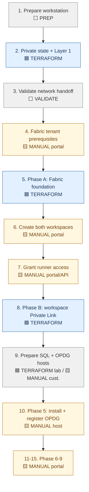
```mermaid
flowchart TD
    S1["1. Prepare workstation<br/>⬜ PREP"] --> S2["2. Private state + Layer 1<br/>🟦 TERRAFORM"]
    S2 --> S3["3. Validate network handoff<br/>⬜ VALIDATE"]
    S3 --> S4["4. Fabric tenant prerequisites<br/>🟨 MANUAL portal"]
    S4 --> S5["5. Phase A: Fabric foundation<br/>🟦 TERRAFORM"]
    S5 --> S6["6. Create both workspaces<br/>🟨 MANUAL portal"]
    S6 --> S7["7. Grant runner access<br/>🟨 MANUAL portal/API"]
    S7 --> S8["8. Phase B: workspace Private Link<br/>🟦 TERRAFORM"]
    S8 --> S9["9. Prepare SQL + OPDG hosts<br/>🟦 TERRAFORM lab / 🟨 MANUAL cust."]
    S9 --> S10["10. Phase 5: install + register OPDG<br/>🟨 MANUAL host"]
    S10 --> S11["11-15. Phase 6-9<br/>🟨 MANUAL portal"]

    classDef tf fill:#e3f0ff,stroke:#2b6cb0,color:#1a365d;
    classDef manual fill:#fff7e0,stroke:#b7791f,color:#744210;
    classDef prep fill:#f0f0f0,stroke:#888,color:#333;
    class S2,S5,S8 tf;
    class S4,S6,S7,S10,S11 manual;
    class S1,S3,S9 prep;
```

### About the reference screenshots in this guide

> 📸 **Reference-only screenshots.** For each **🟦 TERRAFORM** step, this guide
> embeds Azure portal screenshots under a *"Expected Terraform result"* heading.
> **These are for verification only** — they show what the portal should look
> like *after* the `terraform apply` succeeds, so you can confirm the result in a
> customer environment. **Do not recreate these resources by hand**; Terraform
> already builds them. Screenshots are from the reference lab
> (`azr-sbx-lab-0001`, Israel Central); your names, IDs, and regions will differ.

## Required operator inputs

Create an approved deployment worksheet before running commands. Never put
secret values in this document or Git.

| Input | Example variable | Record before starting |
|---|---|---|
| Tenant ID | `TENANT_ID` | `<customer-tenant-guid>` |
| Management subscription | `subscription_id_management` | `<guid>` |
| Connectivity subscription | `subscription_id_connectivity` | `<guid>` |
| Workloads subscription | `subscription_id_workloads` | `<guid>` |
| Monitoring subscription | `subscription_id_monitor` | `<guid>` |
| Region | `location` | Customer-approved Fabric/Azure region |
| Naming tokens | `env`, `org`, `subcode_*` | Approved naming values |
| Hub/Fabric/on-prem CIDRs | `hub_vnet_cidr`, `fabric_spoke_cidr` | Non-overlapping ranges |
| Fabric administrator UPN | `fabric_admin_upn` | Named operator or approved group member |
| Private runner | `RUNNER_RG`, `RUNNER_VM` | Existing private execution host |
| Private variables file | `TFVARS_FILE` | `_private/customer.private.tfvars` |
| Backend file | `BACKEND_FILE` | `_private/backend.hcl` |
| Evidence folder | `EVIDENCE_DIR` | `workloads/fabric/images/` or customer evidence system |

Subcodes are cross-root lookup keys, not cosmetic labels.
`subcode_connectivity` in every workload must match the deployed hub, and
`subcode_monitor` must match the monitoring workspace. A mismatch makes data
sources look for resources that do not exist.

For the currently supported path, record the same subscription GUID for all
subscription inputs. Different GUIDs require the provider refactor above.

## Day-0 readiness gate

The customer must complete this checklist before Terraform:

- [ ] Address spaces do not overlap with on-premises, hub, peer VNets, or other
  cloud networks.
- [ ] Fabric F SKU is available in the selected region and the subscription has
  sufficient quota.
- [ ] `Microsoft.Fabric`, `Microsoft.Network`, `Microsoft.Compute`,
  `Microsoft.Storage`, `Microsoft.OperationalInsights`, and
  `Microsoft.Insights` providers are registered in the relevant subscriptions.
- [ ] The deployment identity can create resources in each target subscription
  and has management-group rights if Stage 10 will be used.
- [ ] The runner identity has **Storage Blob Data Contributor** on the state
  container or storage account. Azure Contributor alone does not grant state
  data-plane access.
- [ ] The private runner resolves the state account to a private IP and reaches
  it on TCP 443.
- [ ] On-prem to hub VNet peering, DNS forwarding, Firewall/SWG rules, and return
  routes are approved and tested.
- [ ] A Fabric Administrator can open the Fabric Admin portal and can become
  Workspace A Admin.
- [ ] Change records, rollback owners, evidence location, maintenance window,
  and cost owner are assigned.

**STOP:** if any box is unchecked, hand the action to the named customer owner.
The Terraform in this repository cannot repair missing enterprise prerequisites.

## Reference lab checkpoint (do not copy to a customer)

As of **2026-07-13**:

- Platform foundation: deployed.
- Fabric Phase A: deployed and converged.
- Private and public Fabric workspaces: created on F2.
- Fabric Phase B workspace Private Link: deployed and converged.
- SQL and OPDG lab VMs: deployed and validated.
- Next deployment action: **Phase 5, interactive OPDG installation and
  registration**.
- Runtime state restored on **2026-07-19**: F2 is `Active`; all six subscription
  VMs are `VM running`; the Container App revision is active with one replica.
- Resume validation passed: on-prem to hub peering is connected, the Fabric spoke
  is reachable via the firewall, SQL and OPDG are healthy, all five private Fabric endpoints resolve
  and accept TCP 443, and authenticated Workspace A access returns HTTP `200`.
- Workspace A public access is still `Allow`. Do not restrict it yet.

## Execution model

Terraform state is private. Run Terraform from the customer-provided private
runner, not an off-network laptop. The reference lab uses Azure VM Run Command;
customers can use their approved private CI agent, privileged access
workstation, or management host instead.

The three Layer 2 Terraform roots use independent state keys:

| Terraform root | State key |
|---|---|
| `workloads/fabric` | `workloads-fabric.tfstate` |
| `workloads/fabric-private-link` | `workloads-fabric-private-link.tfstate` |
| `workloads/onprem-lab` | `workloads-onprem-lab.tfstate` (lab only) |

Never combine these states. Never put passwords, access tokens, recovery keys,
private tfvars, Terraform plans, or state files in Git or screenshots.

### How to execute a RUNNER block

Start the runner, verify `/home/azureuser/lz` is on the approved commit, then use
this reference pattern from the laptop if Azure VM Run Command is the approved
access method. Replace every placeholder. Keep credentials out of the command.

```bash
SUBSCRIPTION_ID=<runner-subscription-id>
TENANT_ID=<tenant-id>
RUNNER_RG=<runner-resource-group>
RUNNER_VM=<runner-vm-name>
TERRAFORM_ROOT=workloads/fabric
TFVARS_FILE=../../_private/customer.private.tfvars
BACKEND_FILE=../../_private/backend.hcl

az vm start \
  --subscription "$SUBSCRIPTION_ID" \
  --resource-group "$RUNNER_RG" \
  --name "$RUNNER_VM"

az vm run-command invoke \
  --subscription "$SUBSCRIPTION_ID" \
  --resource-group "$RUNNER_RG" \
  --name "$RUNNER_VM" \
  --command-id RunShellScript \
  --scripts "set -e
export HOME=/home/azureuser
export ARM_USE_MSI=true
export ARM_SUBSCRIPTION_ID=$SUBSCRIPTION_ID
export ARM_TENANT_ID=$TENANT_ID
cd /home/azureuser/lz/$TERRAFORM_ROOT
git rev-parse --short HEAD
terraform init -reconfigure -backend-config=$BACKEND_FILE
terraform validate
terraform plan -var-file=$TFVARS_FILE -out=deployment.tfplan
terraform show -no-color deployment.tfplan"
```

Review the plan before running a second invocation that applies the saved plan.
Do not combine plan and apply when a stop gate requires human approval.

When running the later **RUNNER** blocks in an interactive shell instead of the
wrapper, initialize the session first:

```bash
export HOME=/home/azureuser
export ARM_USE_MSI=true
export ARM_SUBSCRIPTION_ID=<subscription-used-by-this-root>
export ARM_TENANT_ID=<tenant-guid>
export TFVARS_FILE=../../_private/customer.private.tfvars
export BACKEND_FILE=../../_private/backend.hcl
```

Change `ARM_SUBSCRIPTION_ID` for each root's owning subscription. Confirm the
managed identity has the required management- and data-plane roles before plan.

Terraform exit codes:

- `0`: command succeeded; for `plan -detailed-exitcode`, no changes remain.
- `1`: error; stop and resolve it.
- `2`: `plan -detailed-exitcode` succeeded and changes are pending.

After every apply, rerun the same plan with `-detailed-exitcode`. Continue only
when it returns `0`. If code, variables, identity, or permissions change after a
plan is saved, delete that plan and create a new one.

## Timeline

### 1. Prepare the operator workstation

> **Mode: ⬜ PREP (LAPTOP)** — one-time workstation setup; no Azure resources created.

**LAPTOP**

```bash
export TENANT_ID=<customer-tenant-guid>
export MANAGEMENT_SUBSCRIPTION_ID=<management-subscription-guid>
export CONNECTIVITY_SUBSCRIPTION_ID=<connectivity-subscription-guid>
export WORKLOADS_SUBSCRIPTION_ID=<workloads-subscription-guid>
export MONITOR_SUBSCRIPTION_ID=<monitor-subscription-guid>
export LOCATION=<approved-azure-region>

az login --tenant "$TENANT_ID"
az account show --query '{tenant:tenantId,subscription:id,user:user.name}' -o table
terraform version  # must be >= 1.6
az version
jq --version
curl --version
bash scripts/check-sensitive.sh
```

Create the private overlay from the examples and fill in environment-specific
values. `_private/` is ignored by Git.

```bash
cp _private/denylist.txt.example _private/denylist.txt
cp examples/enterprise/enterprise.tfvars.example \
  _private/customer.private.tfvars
```

Add every variable required by the selected roots. At minimum, the Fabric path
needs subscription IDs, tenant ID, naming tokens, region, hub/spoke CIDRs,
Fabric capacity SKU, Fabric administrator UPN, and later Workspace A ID. Compare
the private file with each selected root's `variables.tf`.

Minimum cross-root template; replace every placeholder and use customer-approved
non-overlapping CIDRs:

```hcl
tenant_id                    = "<tenant-guid>"
subscription_id_management   = "<management-subscription-guid>"
subscription_id_connectivity = "<connectivity-subscription-guid>"
subscription_id_workloads    = "<workloads-subscription-guid>"
subscription_id_monitor      = "<monitor-subscription-guid>"

env      = "prd"
org      = "<approved-org-token>"
location = "<approved-region>"

subcode_management   = "<management-code>"
subcode_connectivity = "<connectivity-code>"
subcode_monitor      = "<monitor-code>"
subcode_fabric       = "<fabric-code>"

hub_vnet_cidr = "<hub-cidr>"
subnet_prefixes = {
  firewall     = "<azure-firewall-subnet-cidr>"
  gateway      = "<gateway-subnet-cidr>"
  dns_inbound  = "<dns-inbound-subnet-cidr>"
  dns_outbound = "<dns-outbound-subnet-cidr>"
  egress_swg   = "<egress-swg-subnet-cidr>"
}
enable_ddos = true

fabric_spoke_cidr       = "<fabric-spoke-cidr>"
fabric_pe_subnet_prefix = "<fabric-private-endpoint-subnet-cidr>"
fabric_capacity_sku     = "F2"
fabric_admin_upn        = "<fabric-administrator-upn>"

# Add after Workspace A is created:
# fabric_private_workspace_id = "<workspace-a-guid>"
```

Verify the approved tenant and all target subscriptions before continuing. Then
register the resource providers listed below. Re-running registration is safe.

```bash
for namespace in Microsoft.Resources Microsoft.Storage; do
  az provider register --subscription "$MANAGEMENT_SUBSCRIPTION_ID" \
    --namespace "$namespace" --wait
done

for namespace in Microsoft.Network Microsoft.Compute Microsoft.Storage; do
  az provider register --subscription "$CONNECTIVITY_SUBSCRIPTION_ID" \
    --namespace "$namespace" --wait
done

for namespace in Microsoft.Fabric Microsoft.Network Microsoft.Insights; do
  az provider register --subscription "$WORKLOADS_SUBSCRIPTION_ID" \
    --namespace "$namespace" --wait
done

for namespace in Microsoft.OperationalInsights Microsoft.Insights; do
  az provider register --subscription "$MONITOR_SUBSCRIPTION_ID" \
    --namespace "$namespace" --wait
done
```

**Evidence:** save the approved input worksheet, account context, RBAC approval,
provider registration, F SKU quota/region approval, and CIDR review in the
customer change record. Do not commit customer identifiers to this repository.

**STOP:** tenant and subscription IDs must match the approved change record.

The current lab already has its private overlay and backend configuration. Do
not overwrite them when resuming.

### 2. Establish private Terraform state and deploy Layer 1

> **Mode: 🟦 TERRAFORM (RUNNER)** — infrastructure as code. Do not build these
> resources by hand; see *Expected Terraform result* screenshots at the end of
> this step to verify.

#### 2.1 Customer-provided private backend

This is a mandatory Day-0 handoff. `platform/00-bootstrap` creates a
private-only storage account and container, but it does **not** create the
private endpoint, DNS record, runner, or RBAC path needed to reach that account.
Do not run it from an off-network laptop and expect a complete backend.

The platform team must provide or precreate:

1. State resource group, storage account, and `tfstate` container.
2. Shared-key access disabled and public network access disabled.
3. Blob private endpoint reachable from the runner.
4. `privatelink.blob.core.windows.net` DNS record and forwarding path.
5. **Storage Blob Data Contributor** for the runner identity.
6. Blob versioning, retention, logging, and customer backup controls.

Create `_private/backend.hcl` only on the runner or through the approved secure
configuration process:

```hcl
resource_group_name  = "<state-resource-group>"
storage_account_name = "<state-storage-account>"
container_name       = "tfstate"
use_azuread_auth     = true
```

**RUNNER CHECK**

```bash
STATE_ACCOUNT=<state-storage-account>
getent ahostsv4 "$STATE_ACCOUNT.blob.core.windows.net"
curl -I --connect-timeout 10 \
  "https://$STATE_ACCOUNT.blob.core.windows.net"

cd /home/azureuser/lz/platform/00-bootstrap
export ARM_SUBSCRIPTION_ID=<management-subscription-guid>
export ARM_TENANT_ID=<tenant-guid>
export ARM_USE_MSI=true
export BACKEND_FILE=../../_private/backend.hcl
terraform init -reconfigure -backend-config="$BACKEND_FILE"
```

Expected: private IP resolution and an HTTP response over TCP 443. An HTTP
`403` can prove network reachability, but Terraform still needs data-plane RBAC.
Terraform must report that the AzureRM backend initialized successfully.

If the customer precreated the three Stage 00 resources and wants Terraform to
own them, initialize the `00-bootstrap` backend and import the resource group,
storage account, and container before planning. Do not import the private
endpoint into this root; it is not declared there.

**STOP:** `terraform init` from the runner must access the backend without a
storage key before any other root is deployed.

#### 2.2 Implemented Layer 1 roots

Skip this section when resuming the current lab. The implemented platform roots
were deployed in this order:

1. `platform/00-bootstrap`
2. `platform/10-management-groups`
3. `platform/20-connectivity-hub`
4. `platform/40-monitoring`

`platform/30-egress` and `platform/50-security` are design stubs. Do not mark
egress or security complete because Terraform returns no changes for those
roots. Customer Firewall/SWG rules, Defender, policy, and CNAPP
controls require separate approved implementations.

Set the runner's subscription context for each implemented root:

| Root | `ARM_SUBSCRIPTION_ID` |
|---|---|
| `platform/00-bootstrap` | Management subscription |
| `platform/10-management-groups` | Management subscription; operations are tenant-scoped |
| `platform/20-connectivity-hub` | Connectivity subscription |
| `platform/40-monitoring` | Monitoring subscription |
| `workloads/fabric` | Workloads subscription; current release requires the supported single-subscription topology |
| `workloads/fabric-private-link` | Workloads subscription |
| `workloads/onprem-lab` | Workloads subscription; optional lab only |

For each implemented root, run **RUNNER**:

```bash
cd /home/azureuser/lz/<terraform-root>
terraform init -reconfigure -backend-config="$BACKEND_FILE"
terraform validate
rm -f stage.tfplan
terraform plan -var-file="$TFVARS_FILE" -out=stage.tfplan
terraform show -no-color stage.tfplan
# Human review and change approval happen here.
terraform apply stage.tfplan
terraform plan -detailed-exitcode -var-file="$TFVARS_FILE"
```

Expected final detailed exit code: `0` (`No changes`). Review
[platform/DEPLOYMENT.md](platform/DEPLOYMENT.md) for Layer 1 screenshots and the
as-built inventory.

After Stage 20, the network team must establish on-prem to hub connectivity (VNet
peering with firewall transit) and approved Firewall/SWG rules because this
repository does not.
After Stage 40, verify the Log Analytics workspace. AMPLS, DCRs, alerting, and
workbooks described in the architecture are not created by the starter root.

**STOP:** the hub VNet, Azure Firewall, DNS Resolver, Log Analytics workspace,
private state path, and customer hybrid path must all be healthy before Layer 2.

#### Expected Terraform result (reference screenshots)

> 📸 **Reference only — do not perform manually.** These show the expected Azure
> portal state **after** `terraform apply` succeeds for Layer 1. Use them to
> verify your customer deployment. Names/IDs/regions will differ from the lab.

**Management groups** — the governance hierarchy (CAF-style `mgmt / workloads /
monitor / sandbox` in production; the reference tenant shows its own tree).

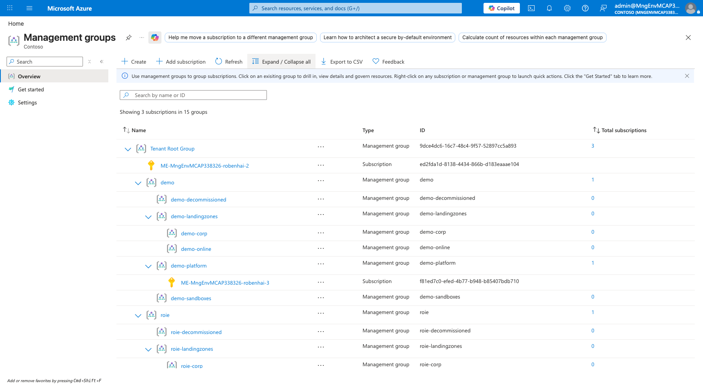

**Resource groups** — the Layer 1 resource groups, all in the target region.

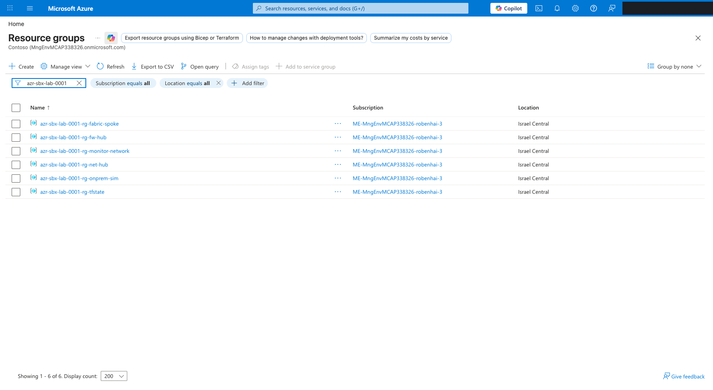

**Private Terraform state storage** — public network access **Disabled**, shared
key access **Disabled**, a private endpoint connection, and versioning **Enabled**.

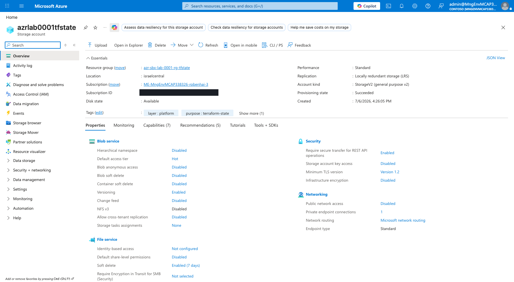

**Hub VNet subnets** — Firewall, Gateway, DNS inbound/outbound, egress, and PE subnets.

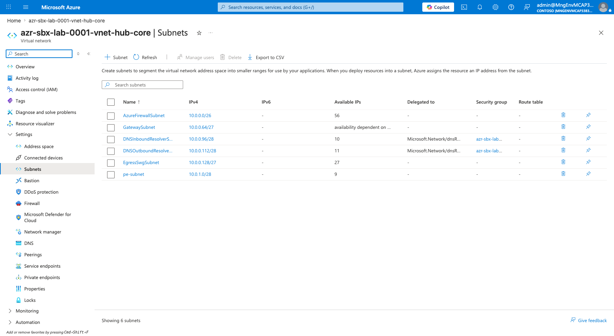

**Azure Firewall** — Standard SKU, private IP, attached Firewall Policy.

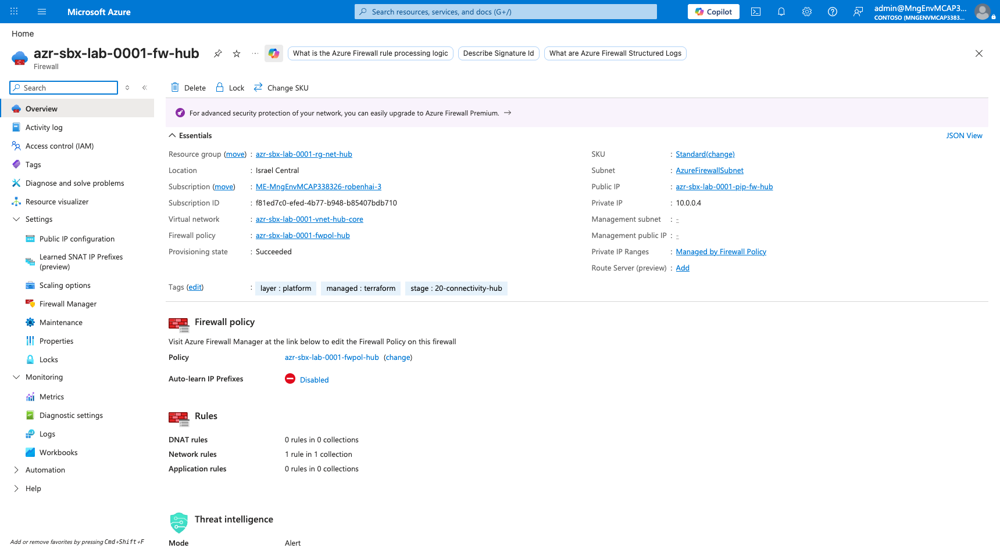

**Firewall Policy** — Standard tier, attached to the hub firewall.

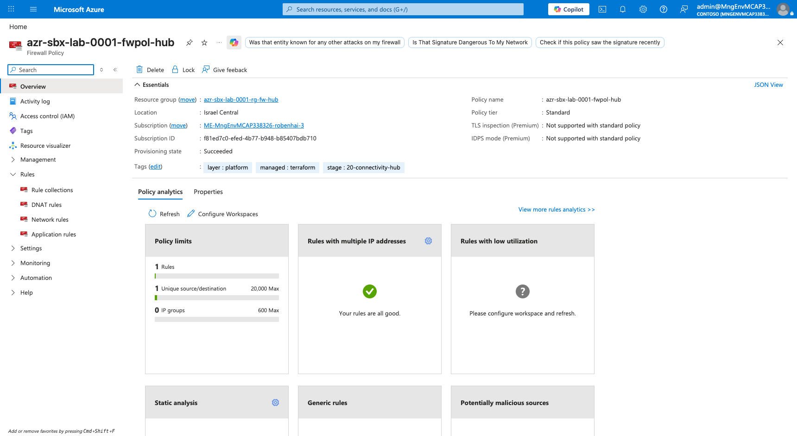

**Private DNS Resolver** — one inbound and one outbound endpoint, Connected.

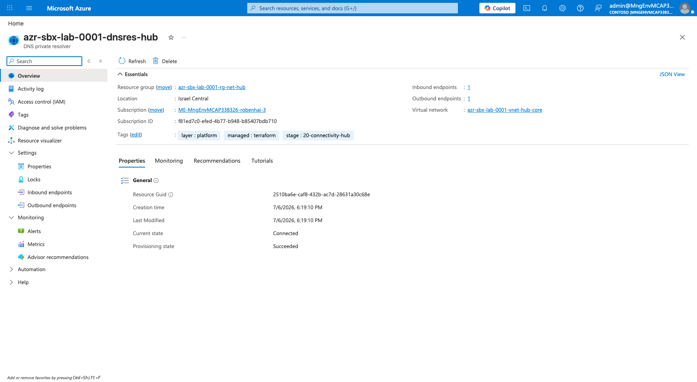

**Central Log Analytics workspace** — Active, pay-as-you-go.

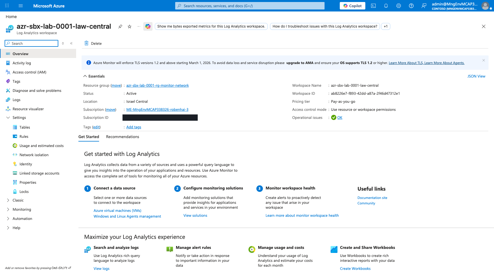

### 3. Validate the customer network handoff

> **Mode: ⬜ VALIDATE (CHECK)** — read-only connectivity checks; no resources created.

The network team must provide the hub VNet/resource group, Azure Firewall
private IP, DNS Resolver inbound IP, on-premises SQL/OPDG subnets, hybrid route
evidence, and Firewall/SWG change IDs. The names must match the `env`, `org`, and
`subcode_connectivity` values used by the workload Terraform data sources.

**CHECK from the runner and planned OPDG network**

```powershell
Test-NetConnection <private-state-fqdn> -Port 443
Test-NetConnection login.microsoftonline.com -Port 443
Test-NetConnection api.fabric.microsoft.com -Port 443
```

Required OPDG public-cloud outbound rules include:

- TCP 443 to `*.download.microsoft.com`, `*.powerbi.com`,
  `*.analysis.windows.net`, Entra sign-in endpoints,
  `gatewayadminportal.azure.com`, `*.dc.services.visualstudio.com`, and
  `ecs.office.com`.
- TCP 443 and, when HTTPS-only mode is not enforced, TCP 5671-5672 and
  9350-9354 to `*.servicebus.windows.net`.
- TCP 443 to Fabric workload endpoints including
  `*.dfs.fabric.microsoft.com` and `*.frontend.clouddatahub.net`.
- When warehouse staging is used, TCP 1433 to both
  `*.datawarehouse.pbidedicated.windows.net` and
  `*.datawarehouse.fabric.microsoft.com`.
- No inbound internet ports are required by OPDG.

Prefer FQDN rules or documented Microsoft service tags where supported. Azure
Relay has no dedicated service tag; the gateway app's network ports test is the
final authority for its current region endpoints.

The complete, tag-free rule set (network, application, TDS, management-plane, and
default-deny) is in the [Firewall rule reference (OPDG + Fabric)](#firewall-rule-reference-opdg--fabric)
appendix.

**Evidence:** BGP/route tables, DNS forwarding, Firewall/SWG change, and TCP
tests.

**STOP:** do not deploy the Fabric spoke until the customer network owner signs
off routing, DNS, and egress.

### 4. Complete Fabric tenant prerequisites

> **Mode: 🟨 MANUAL (PORTAL)** — perform these steps yourself in Microsoft Entra
> and the Fabric admin portal. Terraform does not do these.

Skip this section when resuming the current lab; it is complete.

**PORTAL: Microsoft Entra admin center**

1. Open **Identity governance** > **Privileged Identity Management** >
   **Microsoft Entra roles**.
2. Assign or activate **Fabric Administrator** for the operator.
3. Complete the wizard. Allow up to 15-30 minutes for propagation, then sign out
  of Fabric completely and sign in again in a new browser session.
4. Verify the operator can open the Fabric **Admin portal**.

Reference screenshot: Fabric Administrator role assignment.


**PORTAL: Microsoft Fabric**

1. Open **Settings** > **Admin portal**.


2. Select **Tenant settings**.
3. Under **Advanced networking**, open **Configure workspace-level inbound
   network rules**.
4. Enable it for the customer-approved security group or the entire
  organization.

Reference screenshot: enabled selection before Apply. The **Unapplied changes**
banner means the action is not complete.


5. Select **Apply**, wait for propagation, refresh the page, and verify the
  setting persists with no unapplied changes.

Reference screenshot: final applied state.


**LAPTOP**

```bash
az provider register \
  --namespace Microsoft.Fabric \
  --subscription "$WORKLOADS_SUBSCRIPTION_ID" \
  --wait

az provider show \
  --namespace Microsoft.Fabric \
  --subscription "$WORKLOADS_SUBSCRIPTION_ID" \
  --query registrationState -o tsv
```

**Customer evidence:** capture the customer equivalent of all four screens. Do
not reuse these reference screenshots as proof of the customer change.

**STOP:** Admin portal access must work, the setting must remain enabled after
refresh, and the provider must report `Registered`.

### 5. Terraform Phase A: Fabric foundation

> **Mode: 🟦 TERRAFORM (RUNNER)** — infrastructure as code. Do not build these
> resources by hand; see *Expected Terraform result* screenshots at the end of
> this step to verify.

Skip this section when resuming the current lab; it is complete and had no
drift before shutdown.

Phase A creates the F2 capacity, Fabric spoke, private-endpoint subnet, route
table, hub peerings, diagnostics, and `privatelink.fabric.microsoft.com` zone.

**RUNNER**

```bash
cd /home/azureuser/lz/workloads/fabric
terraform init -reconfigure -backend-config="$BACKEND_FILE"
terraform validate
rm -f phase-a.tfplan
terraform plan \
  -var-file="$TFVARS_FILE" \
  -out=phase-a.tfplan
terraform show -no-color phase-a.tfplan
# Human review and approval happen here.
terraform apply phase-a.tfplan
terraform plan \
  -detailed-exitcode \
  -var-file="$TFVARS_FILE"
```

Reference deployment expectation: `13 added, 0 changed, 0 destroyed`.
Final expectation: exit code `0`, no drift.

No portal screenshot is required for this Terraform-only phase. Record the plan,
apply summary, and read-only Azure checks in the runbook.

**RUNNER CHECK**

```bash
SPOKE_VNET_ID=$(terraform output -raw fabric_spoke_vnet_id)
CAPACITY_ID=$(terraform output -raw fabric_capacity_id)
DNS_ZONE_ID=$(terraform output -raw workspace_private_dns_zone_id)

az resource show --ids "$SPOKE_VNET_ID" \
  --query '{name:name,state:properties.provisioningState,address:properties.addressSpace.addressPrefixes}' -o json
az resource show --ids "$CAPACITY_ID" \
  --query '{name:name,state:properties.state,provisioning:properties.provisioningState,sku:sku.name}' -o json
az network private-dns link vnet list \
  --resource-group "$(echo "$DNS_ZONE_ID" | cut -d/ -f5)" \
  --zone-name "$(basename "$DNS_ZONE_ID")" \
  --query '[].{name:name,state:virtualNetworkLinkState,provisioning:provisioningState}' -o table
```

In Azure, also verify:

- `pe-subnet` has the approved prefix and private endpoint policies disabled.
- `to-firewall` is `0.0.0.0/0` to the actual hub Firewall private IP.
- `fabric-spoke-to-hub` and `hub-to-fabric-spoke` are `Connected` with forwarded
  traffic allowed (firewall transit).
- DNS links for hub and Fabric spoke report completed/succeeded.
- F capacity is active and has the approved administrator.

The spoke reaches on-prem via the hub firewall (on-prem is separately peered to
the hub; VNet peering is non-transitive). No gateway transit is used.

**STOP:** all checks must pass and the post-apply plan must return `0`.

#### Expected Terraform result (reference screenshots)

> 📸 **Reference only — do not perform manually.** Expected Azure portal state
> **after** Phase A `terraform apply` succeeds. Verify against your environment.

**Fabric capacity** — Status **Active**, the approved SKU (lab uses F2).

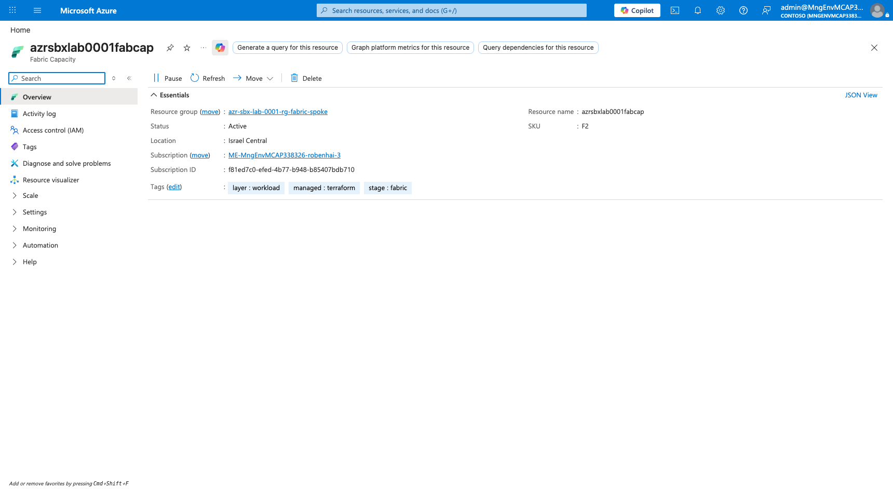

**Fabric spoke VNet** — the `pe-subnet` with an attached NSG and route table.

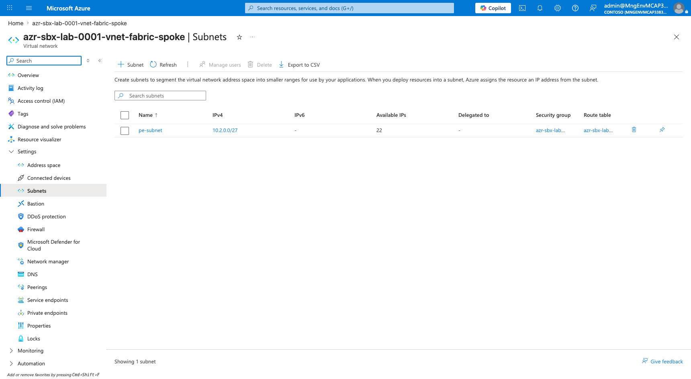

**Forced-tunnel route table** — a single route `0.0.0.0/0 → VirtualAppliance`
(the hub Azure Firewall private IP).

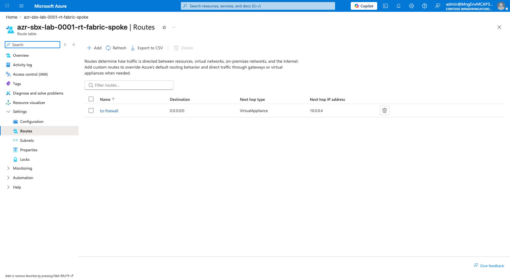

**Spoke ↔ hub peering** — Fully Synchronized / Connected.

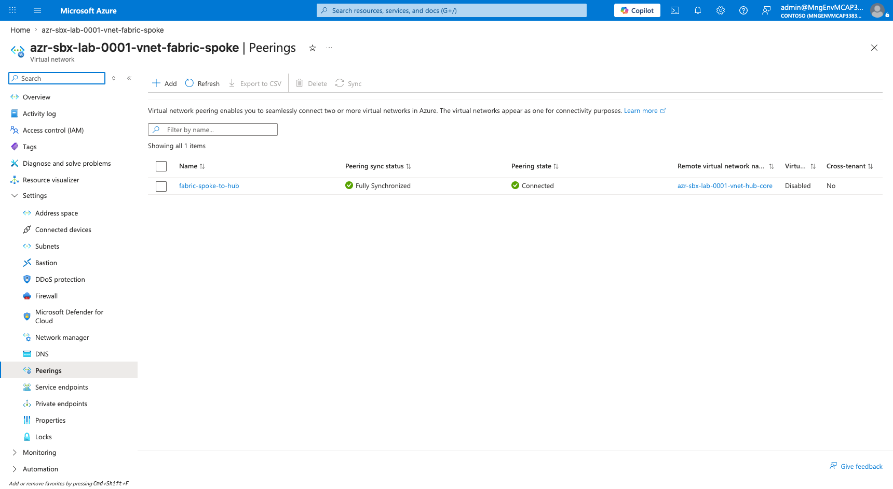

**`privatelink.fabric.microsoft.com` DNS zone** — linked to the hub and spoke VNets.

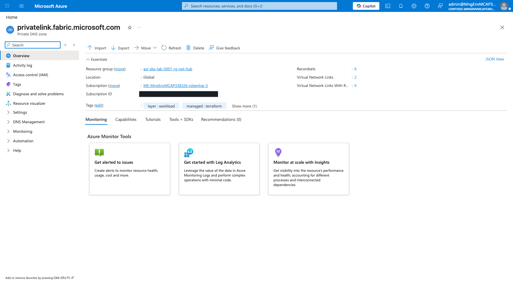

### 6. Create both Fabric workspaces

> **Mode: 🟨 MANUAL (PORTAL)** — create the workspaces yourself in Microsoft Fabric.

Skip this section when resuming the current lab; it is complete.

**PORTAL: Microsoft Fabric**

Create Workspace A:

1. Open **Workspaces** > **New workspace**.


2. Enter the approved private workspace name. Leave **Domain** empty unless the
  customer has an approved Fabric domain design. Keep the accountable
  administrators in the contact list.


3. Under **Advanced**, select the F capacity created in Phase A. Confirm the
  capacity name and region; do not select Trial, Pro, or P SKU.


4. Select **Apply**. Reopen **Workspace settings** > **Workspace type** (or
  **License info**) and confirm the saved name, `Fabric` type, capacity, SKU,
  and region.


5. Keep Workspace A inbound public access enabled during deployment. It is
  restricted only in Step 14 after all private and gateway tests pass.
6. Copy Workspace A's object ID from the `group=` value in the workspace URL.

Create Workspace B:

1. Create the approved public/reporting workspace name and verify the saved
  General settings.


2. Assign Workspace B to the same approved F capacity and verify the applied
  Workspace type/License info after refresh.


3. Keep Workspace B public access enabled only when the customer-approved Entra
  Conditional Access policy is active and tested.
4. Copy Workspace B's object ID from its workspace URL.

Record both workspace IDs and the capacity ID. Add only Workspace A's ID to the
private tfvars file:

```hcl
fabric_private_workspace_id = "<workspace-a-object-id>"
```

**Customer evidence:** capture the customer equivalent of all six screens and
record Workspace A ID, Workspace B ID, capacity resource ID, capacity object ID,
region, workspace administrators, and Conditional Access change/test evidence.

**STOP:** both workspaces must show the saved names and F capacity assignment
after refresh. Workspace A and B must still allow public access at this stage.

### 7. Grant the runner Fabric workspace lifecycle access

> **Mode: 🟨 MANUAL (PORTAL/API)** — assign workspace access yourself.

Skip this section when resuming the current lab; it is complete.

**API**

The runner managed identity needs both Azure Contributor permissions and Fabric
Workspace A `Admin`. Use a signed-in Fabric Administrator to add the runner's
service principal through the Fabric workspace role-assignment API. Record the
HTTP result and read the assignment back. Do not record the bearer token.

Run from the authenticated operator workstation. `RUNNER_PRINCIPAL_ID` is the
managed identity's **service principal object ID**, not its application/client
ID.

```bash
export WORKSPACE_A_ID=<private-workspace-guid>
export RUNNER_PRINCIPAL_ID=<runner-service-principal-object-guid>

az ad sp show --id "$RUNNER_PRINCIPAL_ID" \
  --query '{objectId:id,appId:appId,displayName:displayName,type:servicePrincipalType}' \
  -o json

TOKEN=$(az account get-access-token \
  --resource https://api.fabric.microsoft.com \
  --query accessToken -o tsv)

HTTP_CODE=$(curl -sS -o /tmp/fabric-role-add.json -w '%{http_code}' \
  -X POST \
  -H "Authorization: Bearer $TOKEN" \
  -H 'Content-Type: application/json' \
  "https://api.fabric.microsoft.com/v1/workspaces/$WORKSPACE_A_ID/roleAssignments" \
  -d "{\"principal\":{\"id\":\"$RUNNER_PRINCIPAL_ID\",\"type\":\"ServicePrincipal\"},\"role\":\"Admin\"}")

unset TOKEN
echo "HTTP $HTTP_CODE"
jq . /tmp/fabric-role-add.json
test "$HTTP_CODE" = "201"
```

Read the assignment back with a new short-lived token:

```bash
TOKEN=$(az account get-access-token \
  --resource https://api.fabric.microsoft.com \
  --query accessToken -o tsv)

curl -sS \
  -H "Authorization: Bearer $TOKEN" \
  "https://api.fabric.microsoft.com/v1/workspaces/$WORKSPACE_A_ID/roleAssignments" \
  | jq --arg id "$RUNNER_PRINCIPAL_ID" \
    '[.value[] | select(.principal.id == $id) | {principal:.principal,role:.role}]'

unset TOKEN
```

Expected: POST returns HTTP `201`; read-back returns the service principal with
role `Admin`. A `403` means the signed-in operator lacks workspace/admin rights.
A Phase B `409 Workspace validation failed` usually means the ARM deployment
identity is not Workspace A Admin or the workspace ID/tenant is wrong.

Retain this assignment. Terraform needs it to update or destroy the hidden
workspace Private Link service later.

**Evidence:** save the service principal metadata, HTTP status, and redacted
read-back. Delete `/tmp/fabric-role-add.json`; never store the token.

**STOP:** read-back must show the runner as Workspace A `Admin`.

### 8. Terraform Phase B: workspace Private Link

> **Mode: 🟦 TERRAFORM (RUNNER)** — infrastructure as code. Do not build these
> resources by hand; see *Expected Terraform result* screenshots at the end of
> this step to verify.

Skip this section when resuming the current lab; it is complete and had no
drift before shutdown.

**RUNNER**

```bash
cd /home/azureuser/lz/workloads/fabric-private-link
terraform init -reconfigure -backend-config="$BACKEND_FILE"
terraform validate
rm -f phase-b.tfplan
terraform plan \
  -var-file="$TFVARS_FILE" \
  -out=phase-b.tfplan
terraform show -no-color phase-b.tfplan
# Human review and approval happen here.
terraform apply phase-b.tfplan
terraform plan \
  -detailed-exitcode \
  -var-file="$TFVARS_FILE"
```

Reference deployment expectation: `2 added, 0 changed, 0 destroyed`.
Final expectation: exit code `0`, no drift.

**RUNNER CHECK**

```bash
PE_ID=$(terraform output -raw workspace_private_endpoint_id)
PLS_ID=$(terraform output -raw workspace_private_link_service_id)
WORKSPACE_API_FQDN=$(terraform output -raw workspace_api_fqdn)
terraform output -json workspace_private_endpoint_ips | jq .

az resource show --ids "$PLS_ID" \
  --query '{name:name,state:properties.provisioningState,workspace:properties.workspaceId}' -o json
az network private-endpoint show --ids "$PE_ID" \
  --query '{name:name,state:provisioningState,connections:privateLinkServiceConnections[].privateLinkServiceConnectionState.status,nic:networkInterfaces[0].id}' \
  -o json
```

Expected: Private Link service `Succeeded`; private endpoint `Succeeded`;
connection `Approved`; five private IP addresses returned. Reserve at least ten
subnet addresses per workspace endpoint even though Fabric currently allocates
five.

**CHECK: on-prem test VM or OPDG VM**

Verify the five Workspace A FQDNs resolve to the private endpoint IPs and accept
TCP 443. The actual IPs are allocated dynamically; the reference lab values are
shown only to explain the mapping:

| Endpoint | Expected IP |
|---|---|
| Workspace API | `10.2.0.4` |
| Control | `10.2.0.5` |
| OneLake | `10.2.0.6` |
| DFS | `10.2.0.7` |
| Blob | `10.2.0.8` |

Construct the customer FQDNs from Workspace A ID: remove dashes, then use `z`
plus the first two ID characters.

```powershell
$workspaceId = "<workspace-a-guid>"
$compact = $workspaceId.Replace("-", "").ToLower()
$prefix = $compact.Substring(0, 2)
$names = @(
  "$compact.z$prefix.w.api.fabric.microsoft.com",
  "$compact.z$prefix.c.fabric.microsoft.com",
  "$compact.z$prefix.onelake.fabric.microsoft.com",
  "$compact.z$prefix.dfs.fabric.microsoft.com",
  "$compact.z$prefix.blob.fabric.microsoft.com"
)

foreach ($name in $names) {
  $addresses = Resolve-DnsName $name -Type A |
    Where-Object Type -eq A |
    Select-Object -ExpandProperty IPAddress
  $tcp = Test-NetConnection $name -Port 443 -InformationLevel Quiet
  [pscustomobject]@{ FQDN = $name; IP = ($addresses -join ","); TCP443 = $tcp }
}
```

Expected: each FQDN resolves to one of the private endpoint NIC addresses and
every TCP result is `True`. Public IP resolution is a hard failure.

For an Azure VM runner with managed identity, verify authenticated private API
access without printing the token:

```bash
WORKSPACE_A_ID=<private-workspace-guid>
WORKSPACE_API_FQDN=$(terraform output -raw workspace_api_fqdn)

TOKEN=$(curl -sS -H Metadata:true \
  'http://169.254.169.254/metadata/identity/oauth2/token?api-version=2019-08-01&resource=https%3A%2F%2Fapi.fabric.microsoft.com' \
  | jq -r .access_token)

HTTP_CODE=$(curl -sS -o /tmp/workspace-private-check.json -w '%{http_code}' \
  -H "Authorization: Bearer $TOKEN" \
  "https://$WORKSPACE_API_FQDN/v1/workspaces/$WORKSPACE_A_ID")

unset TOKEN
echo "HTTP $HTTP_CODE"
jq '{id,displayName}' /tmp/workspace-private-check.json
test "$HTTP_CODE" = "200"
rm -f /tmp/workspace-private-check.json
```

Read both workspace communication policies from the authenticated operator
workstation. Both must remain `Allow` at this checkpoint:

```bash
TOKEN=$(az account get-access-token \
  --resource https://api.fabric.microsoft.com \
  --query accessToken -o tsv)

for workspace_id in <workspace-a-guid> <workspace-b-guid>; do
  curl -sS -H "Authorization: Bearer $TOKEN" \
    "https://api.fabric.microsoft.com/v1/workspaces/$workspace_id/networking/communicationPolicy" \
    | jq .
done

unset TOKEN
```

Expected pre-lockdown shape for both workspaces:

```json
{
  "inbound": {
    "publicAccessRules": {
      "defaultAction": "Allow"
    }
  },
  "outbound": {
    "publicAccessRules": {
      "defaultAction": "Allow"
    }
  }
}
```

A `401` indicates token/audience or authentication failure. A `403` indicates
the operator lacks workspace permissions. A `404` usually indicates the wrong
workspace/tenant or an unavailable endpoint; stop rather than treating an empty
response as `Allow`.

If apply is interrupted or Azure says a resource already exists, do not create
a duplicate. Compare `terraform state list`, the saved plan, and the live Azure
resource ID. Import the existing resource into the correct Phase B state only
after confirming its tenant/workspace/subresource, or delete the partial child
resource under an approved rollback and regenerate the plan.

**STOP:** keep Workspace A public access enabled if DNS, routing, endpoint
approval, five-IP output, TCP 443, authenticated API, policy, or no-drift
validation fails.

#### Expected Terraform result (reference screenshots)

> 📸 **Reference only — do not perform manually.** Expected Azure portal state
> **after** Phase B `terraform apply` succeeds.

**Workspace private endpoint** — target sub-resource **workspace**, connection
status **Approved**, in the Fabric spoke `pe-subnet`.

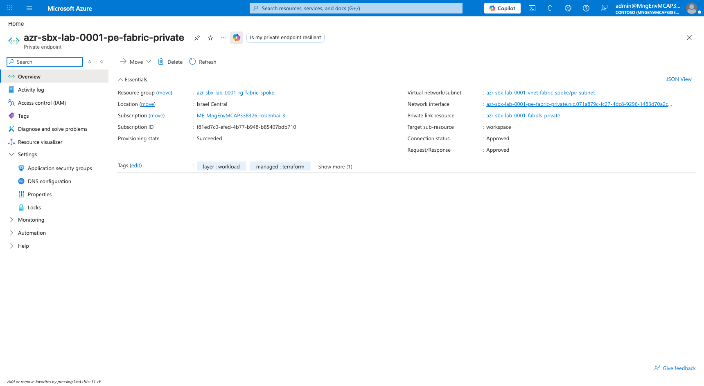

**Private endpoint DNS configuration** — the workspace FQDNs
(`*.fabric.microsoft.com`) resolve to private spoke IPs via the
`privatelink.fabric.microsoft.com` zone.

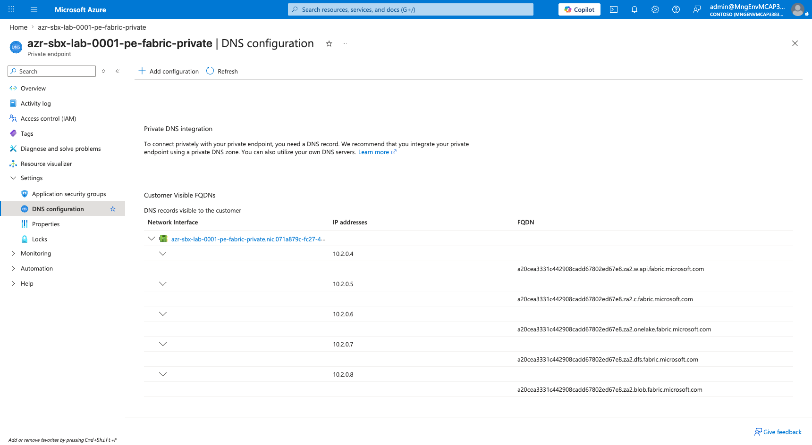

### 9. Prepare the customer SQL Server and OPDG hosts

> **Mode: 🟦 TERRAFORM (RUNNER) for the lab / 🟨 MANUAL for customer prod** — the
> `workloads/onprem-lab` root deploys the lab SQL + OPDG VMs. In a customer
> environment these are customer-owned production hosts (not Terraform). See
> *Expected Terraform result* screenshots at the end of this step.

Choose exactly one path.

#### Path A: customer production hosts (recommended)

Do **not** deploy `workloads/onprem-lab`. The database and data-platform teams
must provide:

- A supported production SQL Server reachable privately from OPDG.
- A dedicated least-privilege SQL login that can read only the approved source
  objects; store its credential in the customer secret manager.
- SQL TLS, backup, monitoring, patching, HA/DR, and ownership sign-off.
- At least two standard-mode OPDG hosts for production HA, sized and patched to
  customer standards. Microsoft recommends 8 cores, 8 GB+ RAM, and SSD.
- OPDG-to-SQL TCP connectivity and outbound gateway/Fabric rules from Step 3.
- No inbound internet rule for OPDG.

Record the server FQDN, database, source schema/table, gateway cluster name,
gateway administrators, recovery-key owner, and change IDs in the customer
worksheet.

**STOP:** the customer database and gateway owners must sign this handoff.

#### Path B: optional lab simulation only

Use this path only for a sandbox. It adds one SQL Developer VM and one OPDG VM
to an **existing** VNet/subnet named in the private variables. It does not create
the simulated on-premises VNet, hub peering, NAT, or private runner.
Read [workloads/onprem-lab/README.md](workloads/onprem-lab/README.md) before
planning this optional root.

**RUNNER**

```bash
cd /home/azureuser/lz/workloads/onprem-lab
terraform init -reconfigure -backend-config="$BACKEND_FILE"
terraform validate
rm -f onprem-lab.tfplan
terraform plan -var-file="$TFVARS_FILE" -out=onprem-lab.tfplan
terraform show -no-color onprem-lab.tfplan
# Human review and approval happen here.
terraform apply onprem-lab.tfplan
terraform plan -detailed-exitcode -var-file="$TFVARS_FILE"
```

Reference sandbox expectation: 14 resources on first deployment and final plan
exit code `0`.

**CHECK**

- SQL VM is running and SQL Server listens on TCP 1433.
- OPDG VM reaches SQL TCP 1433.
- The generated SQL login authenticates and reads exactly three sample rows.
- `C:\FabricHybridLab.ready` contains `SQL_READY`.
- `C:\FabricGatewayInstaller.ready` exists.
- `C:\Installers\GatewayInstall.exe` exists.
- OPDG resolves and reaches all five workspace endpoints on TCP 443.

Terraform stages the official gateway installer. It does not perform the
user-authenticated gateway registration.

#### Expected Terraform result (reference screenshots)

> 📸 **Reference only — do not perform manually.** In the **lab**, the
> `workloads/onprem-lab` root deploys these hosts. In a **customer** environment
> the SQL Server and OPDG hosts are customer-owned production systems — these
> screenshots then illustrate the expected shape, not a Terraform output.

**On-premises simulation resource group** — the lab SQL VM, OPDG VM, runner VM,
their NICs/NSGs/disks, VNet, and NAT.

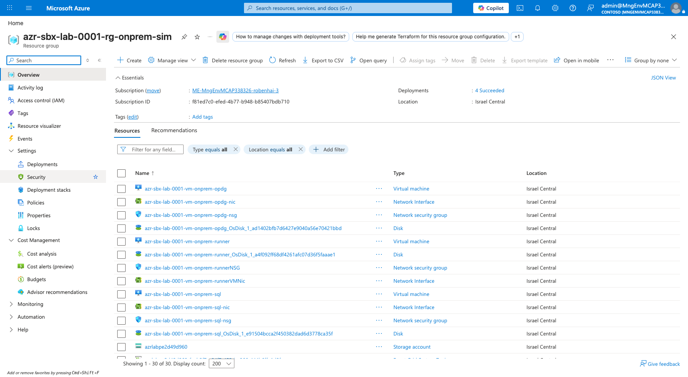

**Simulated on-prem SQL Server VM** — Windows Server, private IP on the on-prem
VNet, tagged `purpose: fabric-hybrid-simulation`.

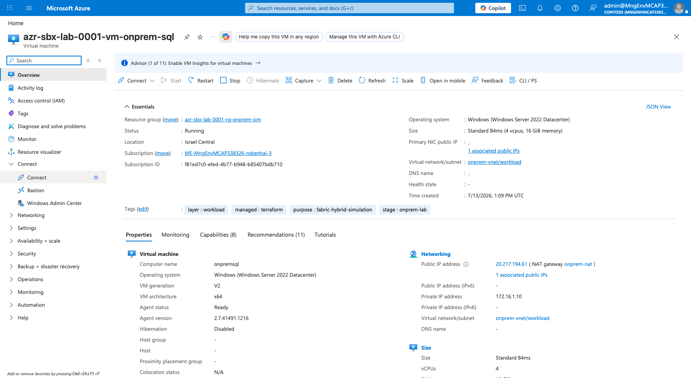

### 10. Phase 5: install and register OPDG

> **Mode: 🟨 MANUAL (OPDG host)** — install and register the gateway on the OPDG
> Windows host. Terraform does not do this.
>
> **Reference lab status:** ✅ completed 2026-07-19. Gateway
> `azr-sbx-lab-0001-opdg` is registered in **West US 3** (tenant home region) and
> shows **Microsoft Fabric → Ready**. See the region gotcha below.

**OPDG VM interactive session**

The operator needs an approved interactive administration path such as private
RDP through Bastion, PAM, or the customer management network. Azure VM Run
Command cannot complete the organizational sign-in UI.

1. Sign in to the first OPDG host with a local/domain administrator account.
2. For the lab, run `C:\Installers\GatewayInstall.exe` as Administrator. For a
  customer host, download the current **standard-mode** installer from
  <https://go.microsoft.com/fwlink/?LinkId=2116849&clcid=0x409> through the
  approved software process. Do not install personal mode.
3. Keep the approved installation path, accept the terms, select **Install**,
  and wait for completion.
4. Open the **On-premises data gateway** app > **Diagnostics** > **Network ports
  test** > **Start new test**. The result must be `Completed (Succeeded)`.
  Export the detailed result to the customer change record.
5. If customer policy permits only HTTPS, open **Network**, enable **HTTPS
  mode**, select **Apply**, and rerun the network ports test. This restarts the
  gateway service.
6. Sign in with the approved organizational account that will administer the
  Fabric gateway.
7. Select **Register a new gateway on this computer**.
8. Enter the approved **standard-mode** cluster name. The reference lab uses
  `azr-sbx-lab-0001-opdg`; use the customer naming standard in production.
9. **Leave the region at the wizard's recommended value** — this is your Power
   BI/Fabric tenant's default (home) region, which the gateway *must* use to be
   usable by Fabric. Do **not** change it to match the capacity's Azure region.
   See the region gotcha note below.
10. Generate a strong recovery key using the approved secret process. Enter it
   in the installer and store it immediately in the customer secret manager.
   Microsoft cannot retrieve it. Never capture it in a screenshot.
11. For production HA, install the same supported gateway version on the second
   host, choose **Add to an existing gateway cluster**, select the cluster, and
   provide the recovery key through the approved secret-handling process.
12. In Fabric, open **Settings** > **Manage connections and gateways** >
   **On-premises data gateways**. Open the cluster and verify every intended
   member is `Online`.
13. Add the approved backup gateway administrators; do not leave a single
   personal account as the only administrator.

**Host check**

```powershell
Get-Service PBIEgwService | Format-List Name,Status,StartType
```

Expected: service status `Running`. Repeat the gateway app network test after
Firewall, proxy, or gateway-version changes.

Reference deployment screenshots — full step-by-step walkthrough (captured
2026-07-19). The reference gateway is named **`azr-sbx-lab-0001-opdg-new`**
(the plain `-opdg` name was already held by an earlier registration; pick an
unused cluster name).

**1. Accept the license terms**, keep the default install path, select Install.

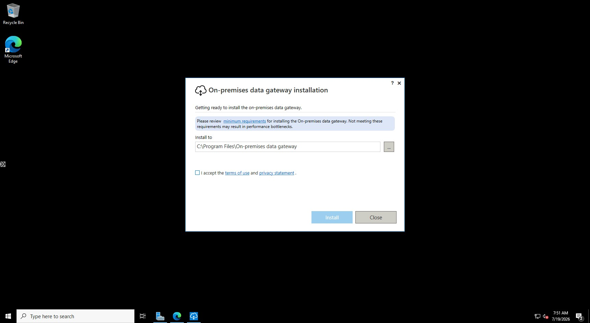

**2. Installation runs** (a minute or two).

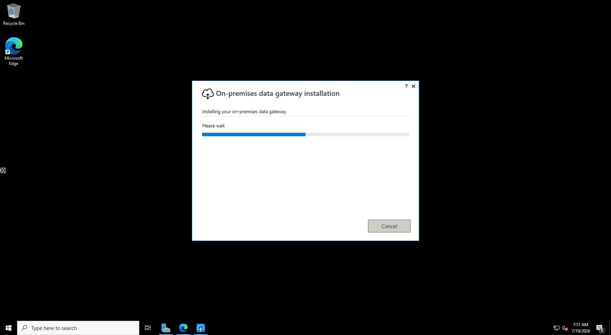

**3. Installation succeeds** — enter the administering email to register.


**4. Sign in** with the approved organizational (work/school) account.

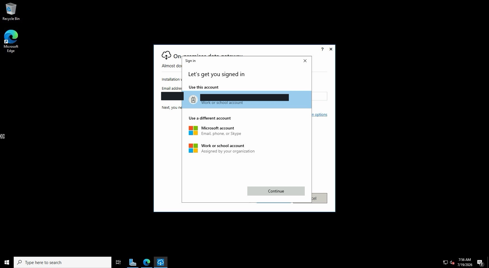

**5. Register a new gateway** on this computer.

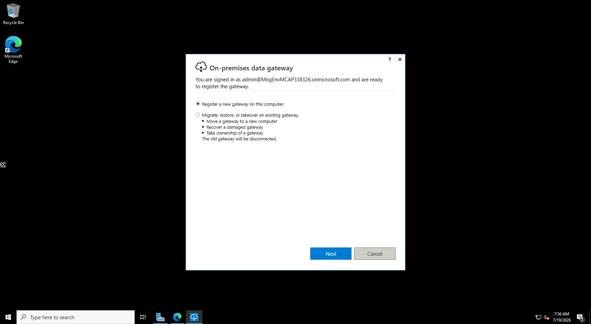

**6. Configure** the cluster name, **leave the recommended region** (here
**West US 3** — the tenant home region), and enter the recovery key (masked;
never screenshotted).

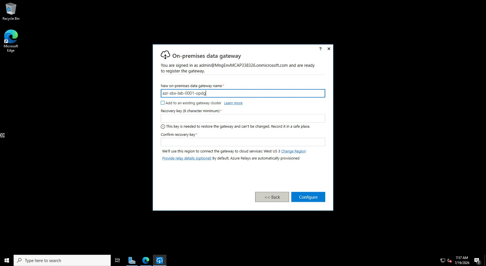

**7. Gateway online and Fabric-Ready** — the status panel must show
**Microsoft Fabric → Ready** (see the region gotcha below).


**8. Network — HTTPS mode** (recommended) routes gateway traffic via Azure
Service Bus over HTTPS.

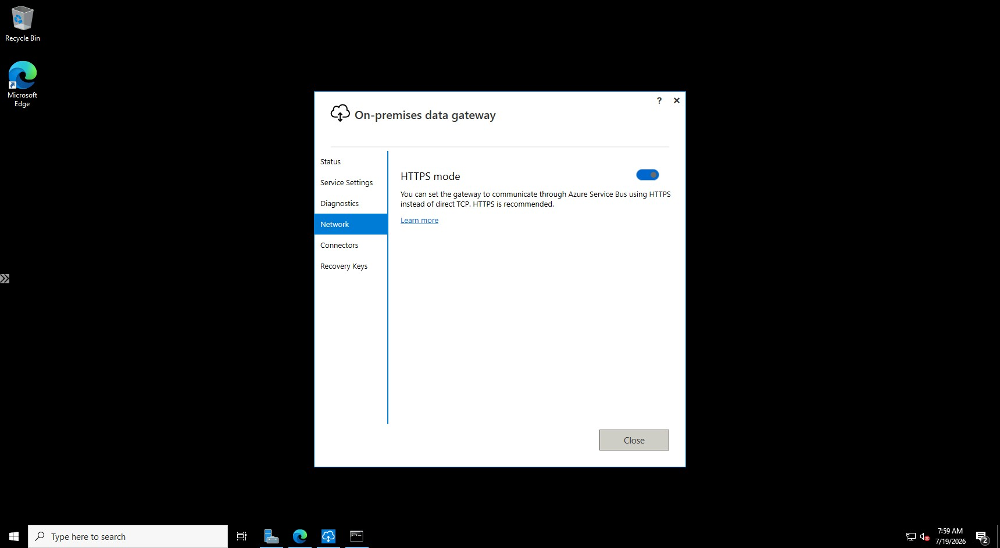

**9. Service Settings** — the gateway runs as the `PBIEgwService` Windows
service.

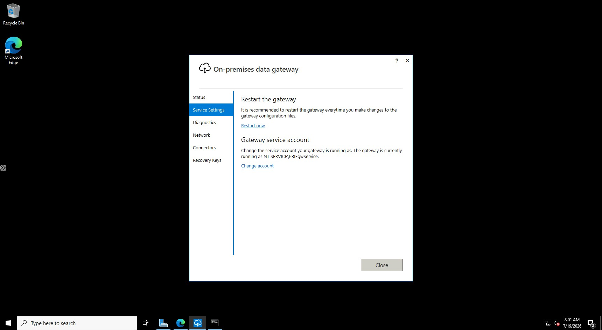

**10. Cluster online in Fabric** — the cluster appears under Fabric **Manage
connections and gateways → On-premises data gateways** with status **Online**.


> **⚠️ Region gotcha (important).** The gateway region must be your **Power BI /
> Fabric tenant's default (home) region** — *not* the Azure region of your Fabric
> capacity. In the reference lab the capacity is in **Israel Central**, but the
> tenant home region is **West US 3**. Registering the gateway in Israel Central
> produced **"Microsoft Fabric — Not available — Can't be used outside your
> default environment"**, making the gateway unusable by the workspace. The fix is
> to **uninstall and re-register the gateway, leaving the region at the
> recommended (tenant-default) value** — here **West US 3**. Accept the wizard's
> recommended region unless you have a specific reason not to.
>
> **Secret handling:** never show the recovery key, password, token, or connection
> secret in any screenshot. The recovery-key fields above are masked by design.

**Rollback:** before any data source uses the cluster, uninstall the failed
member or remove it from the cluster under an approved change. Do not discard a
recovery key for a cluster that owns live connections.

**STOP:** the network ports test, Windows service, cluster, and all intended HA
members must be healthy, and screenshots 09-11 must be approved.

### 11. Phase 6: create the private lakehouse and ingest SQL

> **Mode: 🟨 MANUAL (PORTAL)** — build the lakehouse and copy pipeline yourself in Microsoft Fabric.

**PORTAL: Workspace A**

1. Open Workspace A and select **New item** > **Lakehouse**.
2. Enter the approved lakehouse name. The reference lab uses
  `lh_onprem_private`. Select **Create**.
3. Refresh the workspace and verify the Lakehouse item exists in Workspace A.
4. Open **Settings** > **Manage connections and gateways** > **Connections** >
  **New** and select **SQL Server**.
5. Enter the customer SQL Server FQDN/IP and database. For the reference lab:
  - Server: `172.16.1.10`
  - Database: `FabricHybridLab`
6. Select the approved authentication type. For the reference lab only, use
  **Basic**, login `fabric_gateway`, and retrieve the password privately from
  an approved interactive session on the runner. Do not retrieve it through
  Azure VM Run Command, CI logs, chat, screenshots, or recorded/shared
  terminals. Customer production uses its approved secret manager and
  least-privilege identity; it does not use Terraform state as a credential
  delivery mechanism.
7. Under gateway, select the OPDG cluster registered in Step 10.
   - **Encryption note:** if the source SQL Server has no TLS certificate that
     the gateway trusts (common for lab/on-prem SQL), the wizard fails with
     *"We were unable to connect to the data source using an encrypted
     connection."* Uncheck **Use encrypted connection** and re-test. The
     reference lab connection is unencrypted for this reason; a customer with a
     trusted certificate should leave encryption enabled.
   - Select **Test connection**. Save only after the test succeeds.
8. In the Workspace A lakehouse editor, select **New copy job** (Copy job is the
   simplest managed-Delta ingestion path and lands a clean queryable table).
   Choose **SQL Server database** as the source and select the connection saved
   in Step 6-7 (shown as `[On-premises] <gateway name>`).
9. On **Choose data**, select the approved source table (`dbo.SalesOrders` in the
   lab). The gateway enumerates the table through the firewall-routed path.
10. On **Settings**, keep **Full copy** and a destination root of **Tables**
   (managed Delta). On **Map to destination**, confirm the target table
   (`dbo.SalesOrders`) and review column names/types.
11. Select **Save + Run** (or **Save**, then **Run** from the toolbar).
12. Open the **Results** tab and verify status `Succeeded`, `Rows read` and
   `Rows written` match, and jobs completed `1/1`. The lab expects exactly three
   rows read and written.
13. In the Lakehouse **Explorer**, refresh **Tables**, expand the `dbo` schema,
   and open the target table. Verify it renders as a normal Delta table (not
   **Unidentified**) and previews the expected rows. The lab expects exactly
   three rows.

**Screenshots (captured, firewall-routed run 2026-07-20):**

Private lakehouse created in Workspace A:


SQL Server connection online through the on-premises data gateway (unencrypted,
Basic auth, `[On-premises] azlab-gateway`):


Copy job succeeded — 3 rows read, 3 rows written, `dbo.SalesOrders → dbo.SalesOrders`:


Clean queryable Delta table in the lakehouse (all 3 rows, 4 columns):


**Firewall transit evidence (this run):** with all on-prem egress forced through
the Azure hub firewall (UDR), the copy-job run at 09:33-09:34 (GMT+3) was
observed in the firewall logs, proving both control- and data-plane traffic
traversed the firewall:

- **Application rule (Allow):** gateway → `*.servicebus.windows.net`
  (control channel) and `wu3.frontend.clouddatahub.net` (Fabric copy data plane).
- **Network rule (Allow):** gateway `172.16.x` → Fabric private endpoint
  `10.2.0.7:443` — 14 TCP connections during the run window (06:33:52-06:34:00
  UTC), matching the data-plane write to OneLake.
- Windows/Defender/telemetry FQDNs were **Denied** by the catch-all, confirming
  least-privilege egress. See `docs/fabric-opdg-firewall-rules.md` for the full
  rule set and validated FQDN list.

Record the lakehouse, SQL analytics endpoint, copy job, connection IDs, run ID,
start/end time, and row counts.

<details>
<summary><b>Copy job wizard walkthrough (step-by-step screenshots)</b></summary>

1. In the lakehouse, start **New copy job**:

   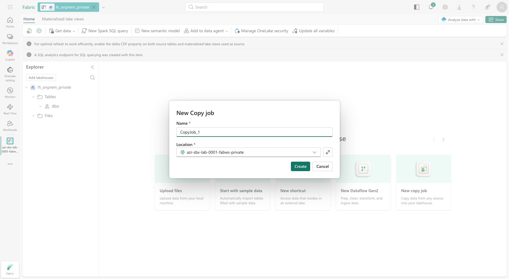

2. **Choose data source** — select **SQL Server database**:

   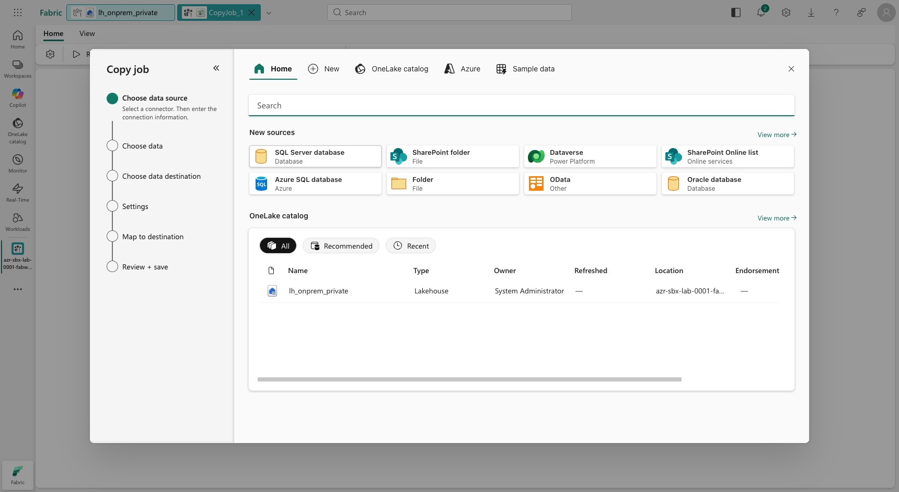

3. Select the on-premises data gateway (`[On-premises] azlab-gateway`):

   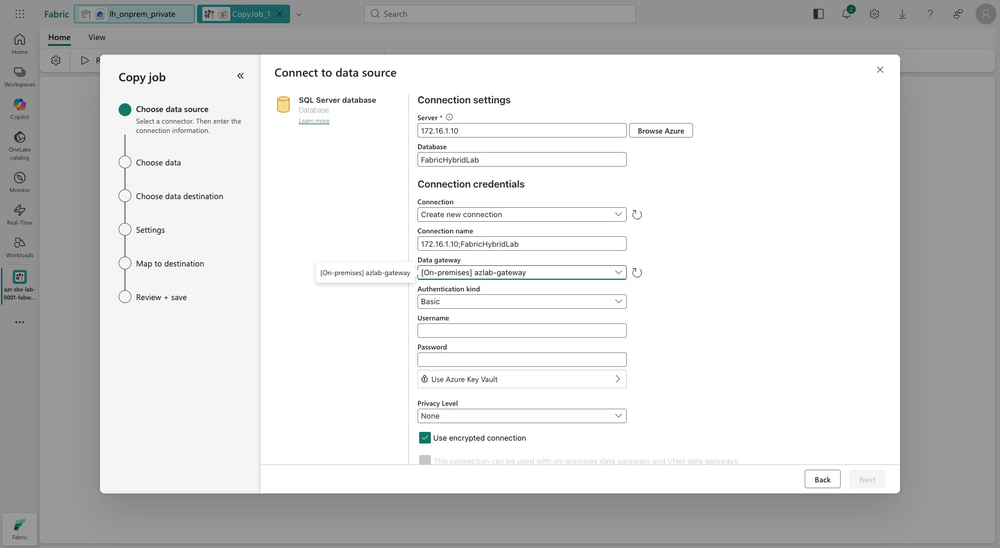

4. Complete the connection (server, database, Basic auth, `fabric_gateway`).
   If the source SQL has no trusted TLS cert, uncheck **Use encrypted
   connection** (see note above):

   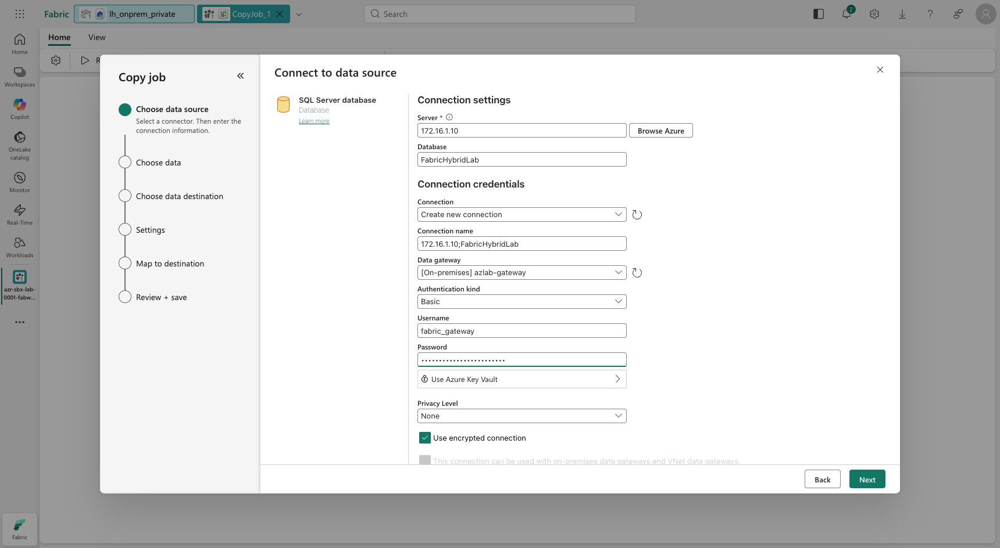

5. **Choose data** — the gateway enumerates `dbo.SalesOrders` through the
   firewall-routed path:

   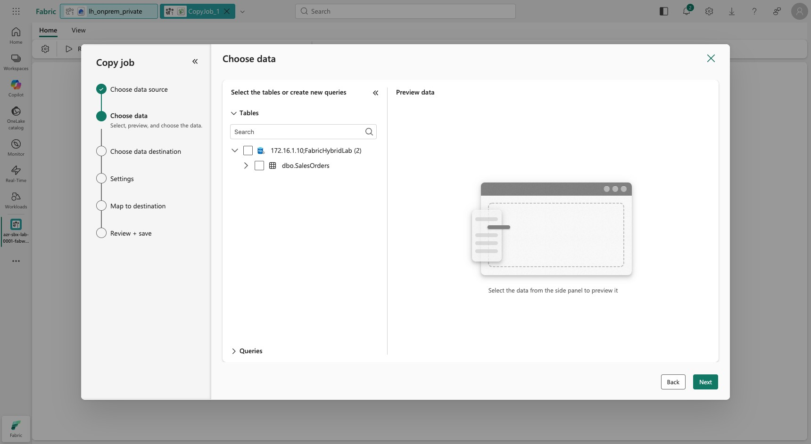

6. **Settings** — keep **Full copy** and destination root **Tables** (managed
   Delta):

   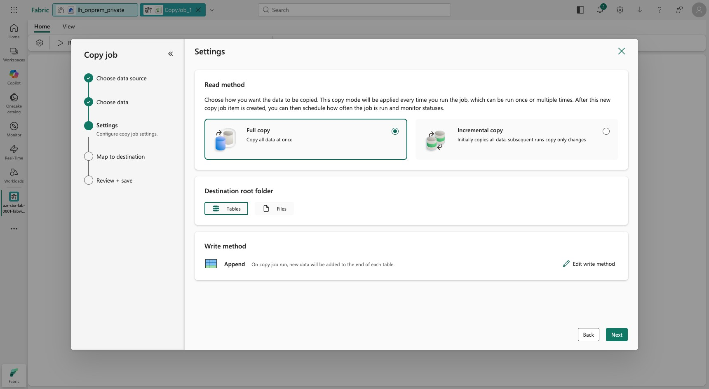

7. **Map to destination** — confirm `dbo.SalesOrders` → `dbo.SalesOrders`:

   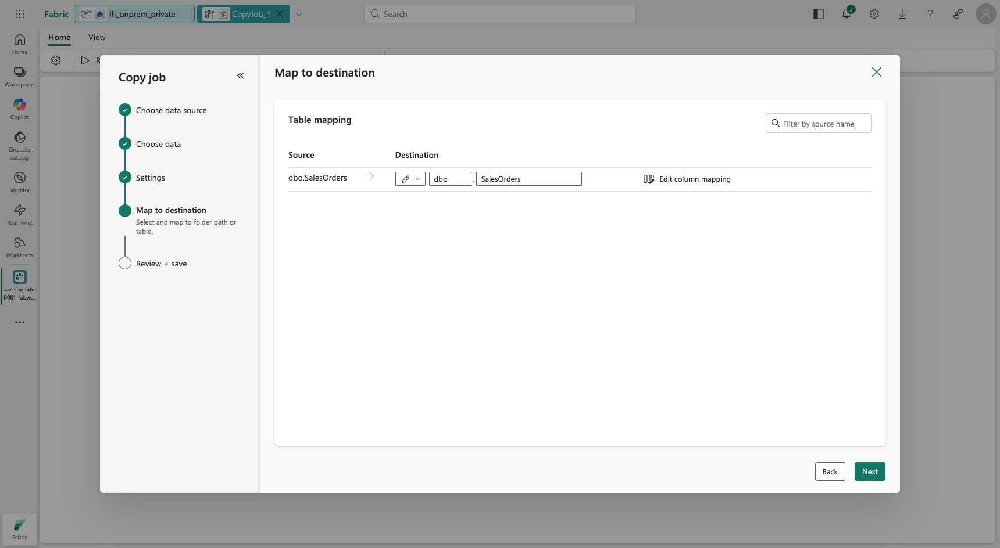

8. **Review + save** — confirm the summary, then **Save + Run**:

   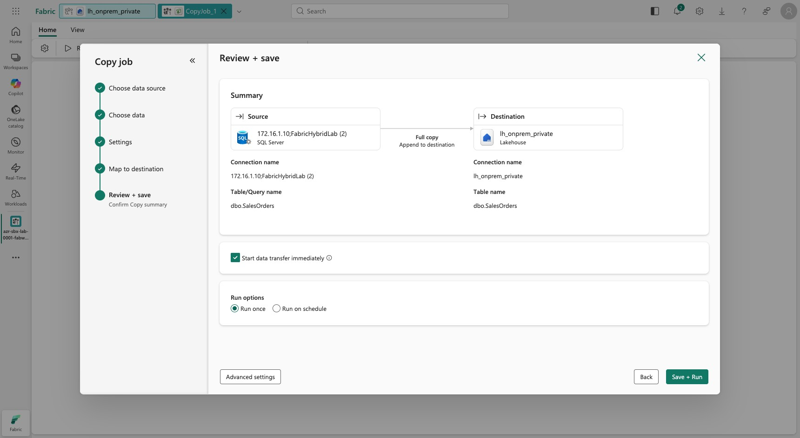

</details>

**Rollback:** disable the schedule/trigger, delete only the failed pipeline run
artifacts and destination table created by this change, then correct the
connection or mapping. Do not delete a shared customer connection without owner
approval.

**STOP:** ingestion must pass before Workspace A public access is restricted.

### 12. Phase 7: build the public semantic model and report

> **Mode: 🟨 MANUAL (PORTAL)** — build the semantic model and report yourself in Microsoft Fabric.

**PORTAL: Workspace B**

This is a compatibility gate. Workspace-level Private Link support varies by
Fabric item and connection mode. Confirm the selected semantic-model pattern is
supported in the customer's tenant before committing to it. Sharing an F
capacity does not grant Workspace B network access to Workspace A.

1. Obtain Workspace A's SQL analytics endpoint from the Lakehouse settings
  (Lakehouse > **Settings** > **SQL analytics endpoint** > copy the connection
  string, e.g. `<hash>.datawarehouse.fabric.microsoft.com`). The endpoint's
  database name equals the lakehouse name (`lh_onprem_private` in the lab).
2. In Workspace B, select **New item** > **Semantic model** (or **Report** >
  **Get data**). Choose **Get Data** > **SQL Server database**.
3. Enter the SQL analytics endpoint as **Server** and the lakehouse name as
  **Database**. For **initial build while Workspace A is still public**, leave
  **Data gateway** = `(none)` and set **Authentication kind** =
  **Organizational account** (Entra/OAuth). Do not use Basic/SQL auth here.
  > ⚠️ **This cloud connection stops refreshing once Workspace A is locked down
  > in Phase 9** (fails with `CrossWorkspaceRequestNotAllowed`). To keep the
  > public model refreshing against a private Workspace A you MUST bind it to a
  > **data gateway** using the workspace-private `z{xy}` connection string. See
  > [`docs/fabric-cross-workspace-private-refresh.md`](docs/fabric-cross-workspace-private-refresh.md)
  > and do it before/after lockdown per that runbook.
4. Select **Next**, choose the source table (`dbo.SalesOrders`), confirm the
  preview shows the expected rows, then **Transform data** > **Create a report**
  (Import). This creates the semantic model and report in Workspace B.
5. Name the semantic model (lab: `sm_salesorders_public`) and confirm the target
  workspace is **Workspace B (public)**. Select **Create**.
6. Build a table/visual that proves the expected rows, then **Save** the report
  to **Workspace B** (lab: `rpt_salesorders_public`). Verify it renders the rows
  in reading view.
7. Open **Semantic model settings** > **Gateway and cloud connections**. Confirm
  the **Cloud connections** section lists the SQL analytics endpoint data source
  with a green check (bound), and that no on-premises gateway is required.
8. Under **Refresh** (or via the model's **Refresh now**), trigger a refresh.
  Open **Refresh history** and verify the run shows `Completed`. Import mode
  means Workspace B holds its own copy of the data, so the public report keeps
  working after Workspace A is locked down in Phase 9.

**Screenshots (captured, 2026-07-20):**

Semantic model cloud connection — the public model in Workspace B binds to
Workspace A's SQL analytics endpoint as a cloud data source (no gateway, OAuth):

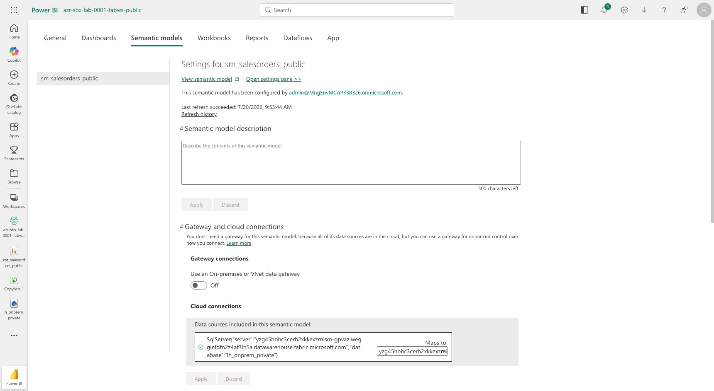

Refresh history — Import refresh `Completed` (initial web-modeling load + a
manual refresh):


Public report in Workspace B rendering the SalesOrders rows read from the
private lakehouse (Adventure Works 2,199.99 / Contoso Retail 1,250.00 /
Fabrikam Stores 875.50; total 4,325.49):


> **Design note (Import vs DirectQuery):** the lab uses **Import** so Workspace B
> caches the data and does not need live network access to Workspace A after
> refresh — this is what lets Workspace A be restricted to private access in
> Phase 9. If the customer requires **DirectQuery** to a restricted Workspace A,
> that is the compatibility gate: confirm workspace-level Private Link is
> supported for the chosen connection mode before committing. Direct Lake is not
> the fallback for an unsupported restricted-workspace path.

<details>
<summary><b>Get Data / semantic model + report walkthrough (step-by-step screenshots)</b></summary>

1. In Workspace B, **New item** > **Semantic model** (or **Report**) > **Get
   Data**:

   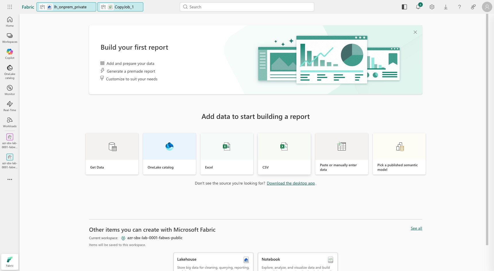

2. Choose **SQL Server database** and open the connect form:

   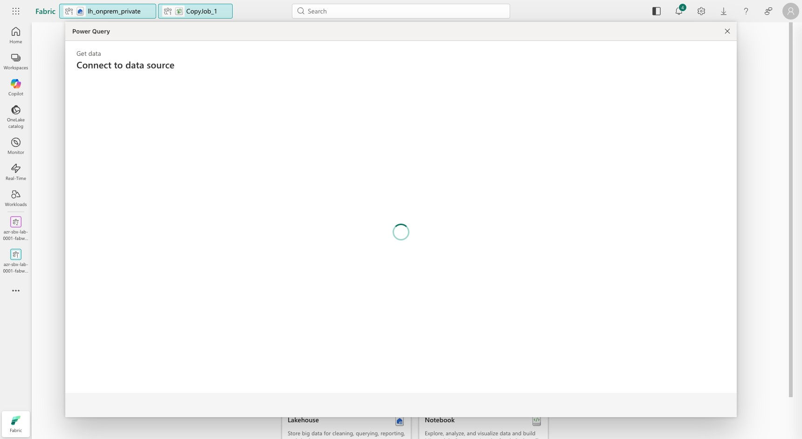

3. Enter the SQL analytics endpoint as **Server**, the lakehouse name as
   **Database**, leave **Data gateway = (none)**, set **Authentication kind =
   Organizational account** (the signed-in Fabric user authenticates — no
   gateway, no Basic auth):

   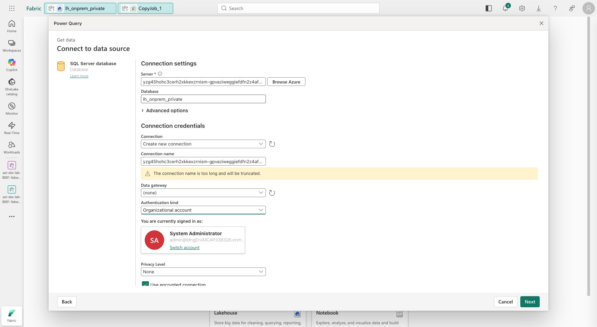

4. The endpoint enumerates its tables cross-workspace — select `SalesOrders`:

   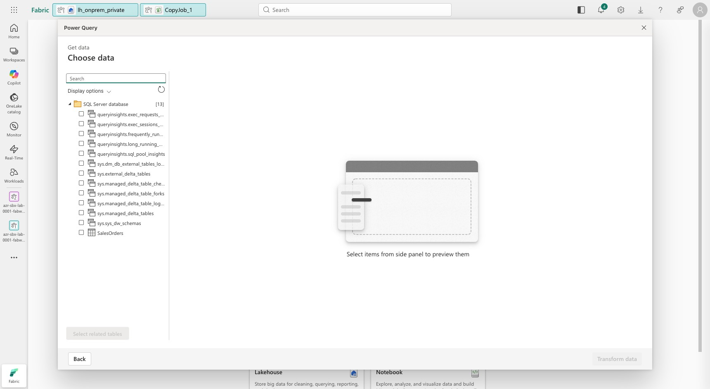

5. Preview confirms the 3 rows read from the private lakehouse:

   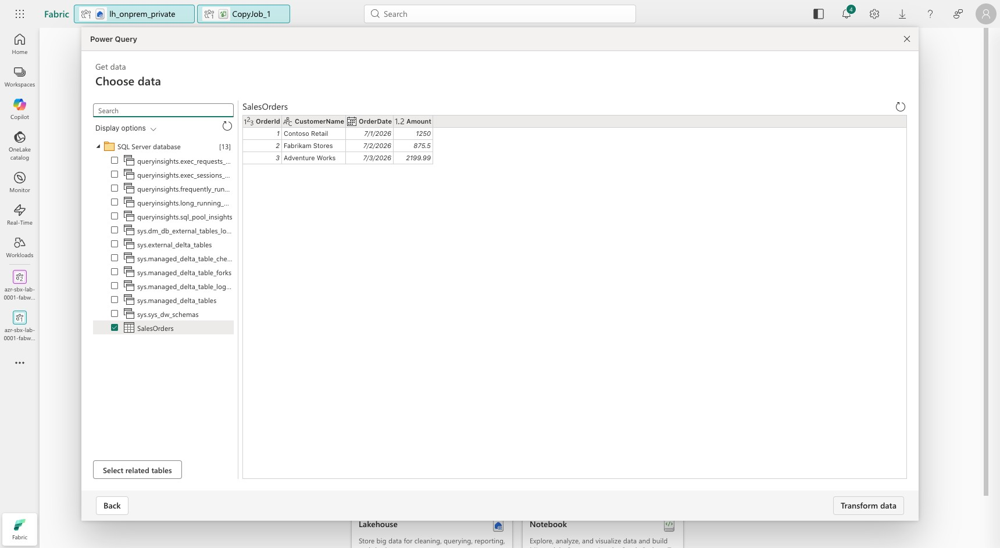

6. **Transform data** opens Power Query (Import) — 3 rows, 4 columns:

   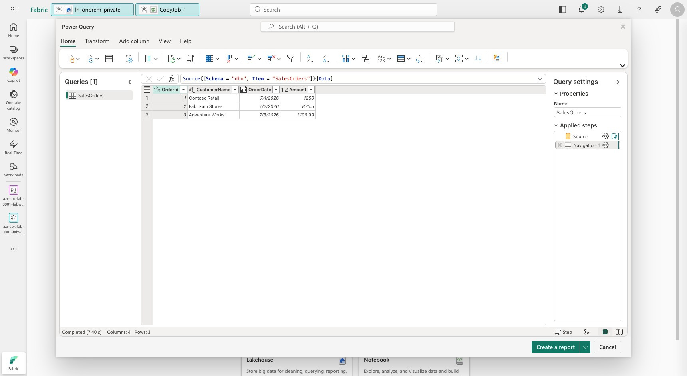

7. **Create a report** — name the semantic model and target **Workspace B
   (public)**:

   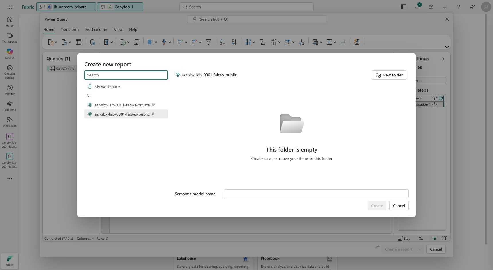

8. Build a table visual showing the rows:

   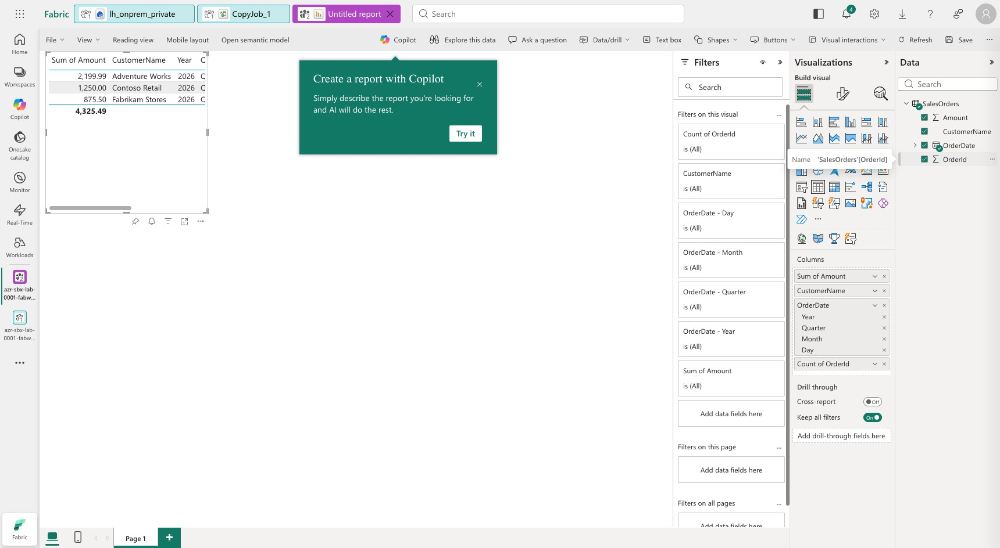

9. **Save** the report — select **Workspace B (public)** (the dialog may default
   to the private workspace; switch it):

   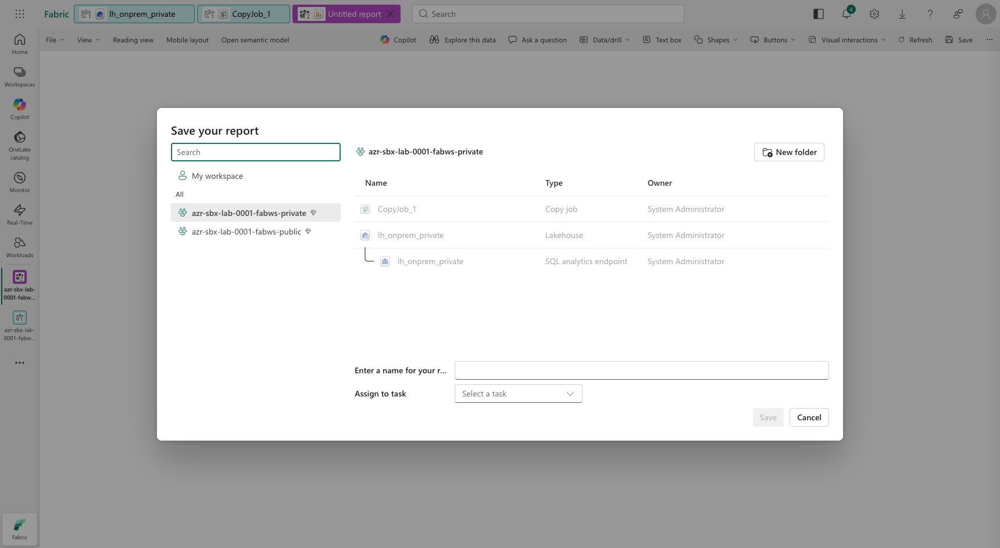

</details>

Record semantic model ID, report ID, connection mapping, refresh ID, refresh
time, mode, and row count.

If the chosen item or connection mode is unsupported with workspace-level
Private Link, stop and return to architecture review. Do not weaken Workspace A
network policy to make an unsupported design appear to work.

**STOP:** connection binding and refresh must succeed before lockdown.

### 13. Phase 8: final pre-lockdown validation

> **Mode: ⬜ VALIDATE (CHECK)** — read-only end-to-end validation; no changes.

**CHECK**

- [ ] Five Workspace A FQDNs resolve from OPDG to the five addresses returned by
  `workspace_private_endpoint_ips`; none resolve publicly.
- [ ] TCP 443 succeeds to all five workspace FQDNs.
- [ ] OPDG reaches SQL on the approved port and authenticates with the intended
  least-privilege identity.
- [ ] SQL query returns the approved source row count.
- [ ] Authenticated Workspace A API request returns HTTP `200` privately.
- [ ] Private endpoint and connection remain `Succeeded`/`Approved`.
- [ ] Copy pipeline run succeeds through OPDG with matching row counts.
- [ ] Workspace B semantic-model refresh succeeds through the bound connection.
- [ ] Workspace A and B communication policies still show inbound/outbound
  public access `Allow`.
- [ ] All three Terraform roots return plan exit code `0`.
- [ ] Rollback operator is online and has Workspace A Admin.

Store command output, pipeline/refresh IDs, timestamps, and screenshots in the
change record. This is the final go/no-go review.

**STOP:** any failure keeps Workspace A public access enabled.

### 14. Phase 9: restrict Workspace A last

> **Mode: 🟨 MANUAL (PORTAL)** — apply the final public-access restriction yourself in Microsoft Fabric.

**PORTAL: Workspace A**

1. Perform this action from a client that already proved private Workspace A
  access. Keep a second Workspace A Admin available for rollback.
2. Open **Workspace settings** > **Inbound networking**.
3. Record the current `Allow` state.
4. Select **Allow connections from selected networks and workspace level
   private links**.
5. Select **Apply**. Wait up to 30 minutes; do not declare success while the UI
  shows unapplied or propagating changes.
6. Refresh and verify the restricted selection persists.
7. Capture `19-private-workspace-inbound-restricted.jpeg`.
8. Repeat every Step 13 private, pipeline, gateway, and refresh test.
9. From a client outside the private/allowed network, verify Workspace A is
  denied.
10. Verify Workspace B remains publicly reachable under Entra Conditional
   Access.

**Screenshot (captured 2026-07-20):** Workspace A inbound networking persisted as
*"Allow connections from selected networks and workspace level private links"*
(public addresses Not configured = private-link only):


**Post-lockdown re-validation results (this run):**

- ✅ **Copy job (on-prem -> Workspace A) still succeeds** through the OPDG over
  the workspace private endpoint (public access = Deny) — instance completed,
  3 rows.
- ⚠️ **Public Workspace B semantic-model refresh fails** with
  `CrossWorkspaceRequestNotAllowed` while it uses the ordinary cloud connection.
  This is expected (Fabric access protector) and is fixed by binding the model
  to a data gateway — see
  [`docs/fabric-cross-workspace-private-refresh.md`](docs/fabric-cross-workspace-private-refresh.md).

API equivalent for an approved automation path:

```bash
TOKEN=$(az account get-access-token \
  --resource https://api.fabric.microsoft.com \
  --query accessToken -o tsv)

curl -sS -X PUT \
  -H "Authorization: Bearer $TOKEN" \
  -H 'Content-Type: application/json' \
  "https://api.fabric.microsoft.com/v1/workspaces/$WORKSPACE_A_ID/networking/communicationPolicy" \
  -d '{"inbound":{"publicAccessRules":{"defaultAction":"Deny"}}}' | jq .

unset TOKEN
```

**Rollback from a private/allowed client:** return to **Workspace settings** >
**Inbound networking**, select the option that allows public connections, and
select **Apply**. API rollback changes `defaultAction` to `Allow`. Wait for
propagation, verify public recovery, then diagnose DNS, endpoint, routing,
gateway, and item compatibility before retrying.

> ⚠️ **Cross-workspace refresh gate (verified 2026-07-20):** after this lockdown,
> the OPDG copy job (on-prem -> Workspace A) keeps working over the private
> endpoint, but a public **Workspace B** semantic-model refresh that reads
> Workspace A over an ordinary **cloud connection** fails with
> `CrossWorkspaceRequestNotAllowed`. This is by design (Fabric access protector).
> The supported fix is to bind the Workspace B model to a **data gateway** (VNet
> or the existing OPDG) using the workspace-private `z{xy}` datawarehouse
> connection string. Full root-cause, Microsoft citations, and step-by-step fix:
> [`docs/fabric-cross-workspace-private-refresh.md`](docs/fabric-cross-workspace-private-refresh.md).

**STOP:** success requires private access and data workflows to pass, public
Workspace A access to fail, Workspace B to remain available under CA, and the
restricted screenshot/evidence to be approved.

### 15. Pause nonproduction resources when idle

> **Mode: 🟨 MANUAL (PORTAL)** — pause/resume capacity and stop lab VMs yourself.

**LAPTOP**

1. Confirm no pipeline, refresh, Spark job, or interactive user is active.
2. Pause nonproduction F capacity if customer policy permits.
3. Deallocate only customer-approved nonproduction VMs. Production OPDG/SQL HA
   hosts normally remain running.
4. Verify all VM states and the capacity state.

```bash
FABRIC_CAPACITY_ID=<full-fabric-capacity-resource-id>

az rest --method post \
  --url "https://management.azure.com${FABRIC_CAPACITY_ID}/suspend?api-version=2023-11-01"

for vm_name in <approved-nonproduction-vm-names>; do
  az vm deallocate \
    --subscription "$WORKLOADS_SUBSCRIPTION_ID" \
    --resource-group <vm-resource-group> \
    --name "$vm_name" \
    --no-wait
done

az rest --method get \
  --url "https://management.azure.com${FABRIC_CAPACITY_ID}?api-version=2023-11-01" \
  --query '{name:name,state:properties.state,provisioning:properties.provisioningState}' \
  -o json
```

Pausing F2 stops Fabric compute billing. VM deallocation stops VM compute
billing. Azure Firewall, NAT Gateway, disks, public IPs, Private
Endpoints, DNS, state storage, and OneLake storage continue to incur charges.

## Evidence acceptance criteria

For every manual portal action, capture the **final applied state after a page
refresh**, not only the form before Save/Apply. Each evidence item must include:

- Change/ticket ID, operator, UTC timestamp, tenant/subscription/workspace, and
  action performed.
- Screenshot or command/API output proving the expected state.
- Resource/item IDs and the validation result.
- No password, bearer token, recovery key, cookie, SAS, access key, private
  connection secret, or unrelated personal/tenant data.
- Approver and explicit go/no-go result for the next STOP gate.

The ten embedded screenshots are reference examples only. Customer evidence
must be captured in the customer environment. Screenshots 09-19 remain pending
until their phases are executed.

## Rollback order

Rollback in reverse dependency order. Never destroy a shared hub, backend,
capacity, connection, or gateway because one workload test failed.

1. **Workspace lockdown:** restore Workspace A public access to `Allow` from a
  private/allowed client; verify recovery.
2. **Report/model:** disable refresh schedules, unbind the failed connection,
  and remove only newly created report/model items after owner approval.
3. **Pipeline/lakehouse:** stop triggers, preserve run logs, remove only the
  failed pipeline and destination artifacts created by the change.
4. **OPDG:** remove a failed member only after another cluster member is Online;
  retain the recovery key and connection ownership.
5. **Phase B:** run a fresh plan. Destroy/import only the private endpoint and
  hidden Private Link service owned by the Phase B state. Retain runner
  Workspace Admin until Terraform lifecycle work is complete.
6. **Workspaces:** remove only empty workspaces after confirming no items,
  connections, assignments, or audit-retention obligations remain.
7. **Phase A:** pause capacity for cost control before considering destroy.
  Destroy only after Phase B/workspaces are removed and shared DNS/peering
  ownership is confirmed.
8. **Layer 1/backend:** customer platform change only. Preserve state versions,
  logs, and backups according to retention policy.

Before any Terraform rollback:

```bash
terraform state list
terraform plan -destroy -var-file="$TFVARS_FILE" -out=rollback.tfplan
terraform show -no-color rollback.tfplan
```

Approval is required before applying a destroy plan.

## Troubleshooting matrix

| Symptom | Likely cause | Operator action |
|---|---|---|
| Backend `403` | Runner lacks Blob data-plane role, wrong identity, or network rules block it | Verify private DNS/TCP 443, then **Storage Blob Data Contributor** and token context; do not enable storage keys |
| Backend name resolves publicly | Private DNS record/link/forwarder missing | Stop; network/DNS owner fixes `privatelink.blob.core.windows.net` path |
| Phase A data source not found | `env`, `org`, or `subcode_connectivity`/`subcode_monitor` mismatch | Compare actual Layer 1 names with private tfvars; regenerate plan |
| Peering not Connected | Hub or on-prem/spoke peering missing, or forwarded traffic not allowed | Network owner corrects the VNet peering (both directions, allow forwarded traffic); the firewall is the transit |
| Phase B `409 Workspace validation failed` | Deployment identity is not Workspace A Admin, or tenant/workspace ID is wrong | Repeat Step 7 read-back, verify IDs, delete saved plan, replan |
| Private endpoint not Approved | Private Link service validation or Azure permissions failed | Inspect endpoint connection state and activity log; do not lock down |
| FQDN resolves publicly/NXDOMAIN | Incorrect workspace FQDN, DNS zone group, zone link, or on-prem forwarder | Reconstruct FQDN from workspace ID; compare PE NIC IPs and DNS records |
| TCP 443 fails after private DNS works | Route, NSG, Firewall/SWG, or return path blocks traffic | Use Network Watcher next hop and connection troubleshoot; network owner fixes path |
| Authenticated private API is `401/403` | Token audience, managed identity workspace role, or Fabric permission issue | Acquire token for `https://api.fabric.microsoft.com`; verify role assignment; never print token |
| Gateway network test fails | Missing Relay/Entra/Fabric FQDN or port; proxy/TLS issue | Open detailed port-test result, update approved egress, retry |
| Gateway is Offline | Windows service stopped, version unsupported, Relay blocked, or cluster registration issue | Check `PBIEgwService`, gateway logs/version, port test, and cluster member status |
| SQL connection test fails | DNS/route/firewall, SQL listener/TLS, or credential permission | Test from OPDG host, verify least privilege and certificate; do not broaden to sysadmin |
| Pipeline row counts differ | Source filter, mapping, conversion, or partial write | Preserve run logs, stop downstream use, correct mapping, rerun to a clean target |
| Semantic refresh unsupported/fails | Unsupported item/mode with restricted workspace or wrong gateway mapping | Return to architecture review; do not reopen Workspace A public access permanently |
| Public deny breaks private path | Lockdown was premature or private endpoint/DNS/client FQDN is wrong | Roll back to `Allow` from private client, diagnose, repeat Step 13 |

### Terraform state lock recovery

The AzureRM backend uses an Azure Blob lease. If Terraform reports a lock:

1. Confirm no operator, CI job, or background process is running Terraform.
2. Record the lock ID and owner from the error.
3. Use `terraform force-unlock <LOCK_ID>` only after ownership is confirmed and
  according to the customer's change process.
4. Do not break the storage blob lease manually unless Terraform cannot clear
  it and the storage owner approves the recovery.
5. Run `terraform plan` immediately after recovery and investigate drift.

## Evidence index

| Evidence | Location |
|---|---|
| Layer 1 screenshots and inventory | [platform/DEPLOYMENT.md](platform/DEPLOYMENT.md) |
| Fabric portal screenshots | `workloads/fabric/images/` |
| Fabric full runbook and API evidence | [workloads/fabric/README.md](workloads/fabric/README.md) |
| Architecture diagrams | `docs/diagrams/` and `docs/images/` |
| Terraform validation | Run in each Terraform root before plan/apply |
| Secrets check | `bash scripts/check-sensitive.sh` |

## Firewall rule reference (OPDG + Fabric)

This is the complete, **tag-free** firewall rule set that lets the on-premises
data gateway (OPDG) and Microsoft Fabric operate through the hub Azure Firewall.
Every rule is an explicit **FQDN** or **IP/port** — no Azure service tags and no
FQDN tags — so the same set can be replicated on a customer on-premises firewall
that has no Azure tag support.

- Implemented as code: [platform/20-connectivity-hub/firewall-rules.tf](platform/20-connectivity-hub/firewall-rules.tf)
  (rule collection group `opdg-fabric` on the hub firewall policy).
- Standalone reference with discovery queries: [docs/fabric-opdg-firewall-rules.md](docs/fabric-opdg-firewall-rules.md)
- Sources: Microsoft OPDG communication settings and the Fabric allowlist URLs docs.

**Rule processing order** in Azure Firewall is DNAT → Network → Application (a
network match short-circuits application rules). Therefore only IP/private-link
flows live in the network collection; all HTTP/HTTPS/TDS flows are application
rules (Azure Firewall rejects wildcard FQDNs in network rules).

### Network rules — `opdg-network-allow` (priority 100, Allow)

Source for all rules: the on-premises address space (e.g. `172.16.0.0/16`).

| Rule | Destination | Ports | Purpose |
|---|---|---|---|
| `fabric-privatelink-443` | Fabric private-endpoint subnet (e.g. `10.2.0.0/27`) | TCP 443 | Fabric data-plane over Private Link |

### Application rules — `opdg-app-allow` (priority 200, Allow)

Source for all rules: the on-premises address space.

| Rule | FQDNs | Protocol/Port | Purpose |
|---|---|---|---|
| `gateway-auth` | `*.login.windows.net`, `login.live.com`, `aadcdn.msauth.net`, `login.microsoftonline.com`, `*.microsoftonline-p.com` | Https 443 | Entra ID / OAuth2 sign-in |
| `gateway-core` | `*.download.microsoft.com`, `*.powerbi.com`, `*.analysis.windows.net`, `*.servicebus.windows.net`, `*.dc.services.visualstudio.com`, `ecs.office.com`, `gatewayadminportal.azure.com` | Https 443 | Cluster discovery, installer, **Azure Relay/Service Bus**, telemetry, admin |
| `gateway-ncsi` | `*.msftncsi.com` | Http 80 | Internet connectivity test |
| `fabric-workload` | `*.core.windows.net`, `*.dfs.fabric.microsoft.com`, `*.frontend.clouddatahub.net` | Https 443 | OneLake writes, DFS, pipeline front-end |
| `fabric-platform` | `*.fabric.microsoft.com`, `*.onelake.dfs.fabric.microsoft.com`, `*.onelake.blob.fabric.microsoft.com`, `*.pbidedicated.windows.net` | Https 443 | Fabric portal + OneLake |
| `fabric-sql-tds` | `*.datawarehouse.fabric.microsoft.com`, `*.datawarehouse.pbidedicated.windows.net`, `*.datawarehouse.pbidedicated.microsoft.com`, `*.datamart.fabric.microsoft.com`, `*.datamart.pbidedicated.microsoft.com`, `*.pbidedicated.microsoft.com`, `*.pbidedicated.windows.net`, `*.database.fabric.microsoft.com`, `*.cloudapp.azure.com` | Mssql 1433 | Fabric DW / Datamart / staging lakehouse (TDS) |
| `certificate-revocation` | `oneocsp.microsoft.com`, `ocsp.digicert.com`, `crl3.digicert.com`, `crl4.digicert.com`, `cacerts.digicert.com`, `www.microsoft.com`, `crl.microsoft.com`, `ctldl.windowsupdate.com` | Http 80, Https 443 | CRL / OCSP checks (often missing from docs) |

### Management-plane rules — `management-plane` (priority 150, Allow)

Only required when the **management/runner** host egress is also forced through
the firewall (so Terraform/az keep working). Map these to the management path,
not the OPDG workload, in production.

| Rule | FQDNs | Protocol/Port | Purpose |
|---|---|---|---|
| `runner-arm-storage` | `management.azure.com`, `management.core.windows.net`, `*.blob.core.windows.net`, `login.microsoftonline.com`, `login.windows.net` | Https 443 | ARM control plane + storage data plane |

### Default deny (discovery instrument) — `opdg-deny-log` (priority 300, Deny)

| Rule | FQDNs | Protocol/Port | Purpose |
|---|---|---|---|
| `deny-all-web-log` | `*` | Http 80, Https 443 | Log every web FQDN not explicitly allowed; becomes the production default-deny |

### Validation notes

- **HTTPS-only mode confirmed.** The gateway app *Network ports test* connected
  to every Azure Relay server on **TCP 443 only** (no AMQP 5671-5672 / 9350-9354).
  With HTTPS mode enforced, the `gateway-core` `*.servicebus.windows.net` rule on
  443 is sufficient; the AMQP ports can be omitted. The ports test is the
  authoritative per-gateway, per-region endpoint list.
- **Confirmed by firewall logs.** With all OPDG egress routed through the hub
  firewall, `AZFWApplicationRule` showed `gateway-core` allowing
  `*.servicebus.windows.net` and `fabric-workload` allowing
  `*.frontend.clouddatahub.net` — a 76/76 ports-test pass through least-privilege
  wildcard rules, no IPs or tags.
- **Discovery:** remove any broad allow, run a gateway refresh, then read
  `AZFWApplicationRule`/`AZFWNetworkRule` `Deny` entries to surface endpoints the
  docs missed, and promote confirmed ones into the allow rules above.
- **No inbound internet ports** are required by the OPDG.
- OPDG↔SQL (TCP 1433) is on-premises-only and is **not** seen by the Azure
  firewall; validate that port on the gateway host itself.

## Reference lab resume appendix

This appendix applies only to the reference sandbox deployed on 2026-07-13. It
must not be copied into a customer production change.

Resume the reference lab F2 and only the three VMs required for Phase 5:

```bash
SUBSCRIPTION_ID=<reference-lab-subscription-id>
RESOURCE_GROUP=azr-sbx-lab-0001-rg-onprem-sim

az rest --method post \
  --url "https://management.azure.com/subscriptions/$SUBSCRIPTION_ID/resourceGroups/azr-sbx-lab-0001-rg-fabric-spoke/providers/Microsoft.Fabric/capacities/azrsbxlab0001fabcap/resume?api-version=2023-11-01"

for vm_name in \
  azr-sbx-lab-0001-vm-onprem-runner \
  azr-sbx-lab-0001-vm-onprem-sql \
  azr-sbx-lab-0001-vm-onprem-opdg

  az vm start --subscription "$SUBSCRIPTION_ID" \
    --resource-group "$RESOURCE_GROUP" --name "$vm_name"
done
```
When returning to this deployment, begin at **Step 3**, verify the resumed
resources, then continue at **Step 10**. Do not repeat completed portal or
Terraform phases unless a read-only check or Terraform plan shows drift.
