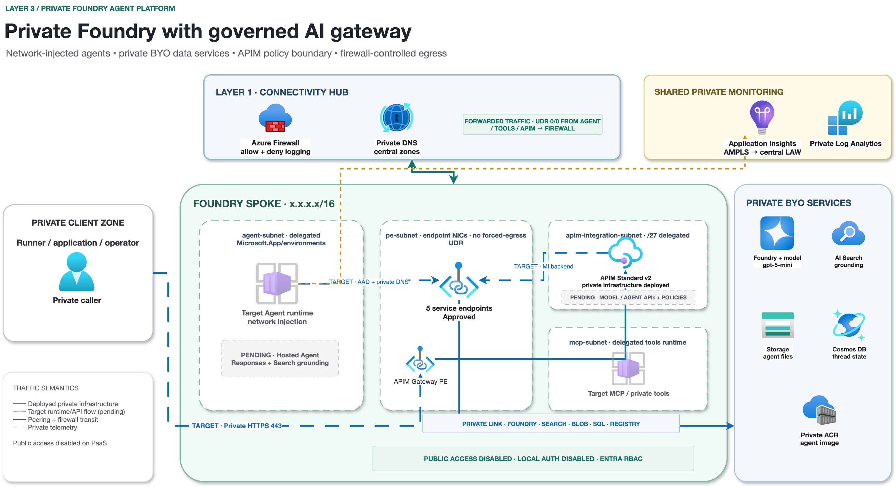
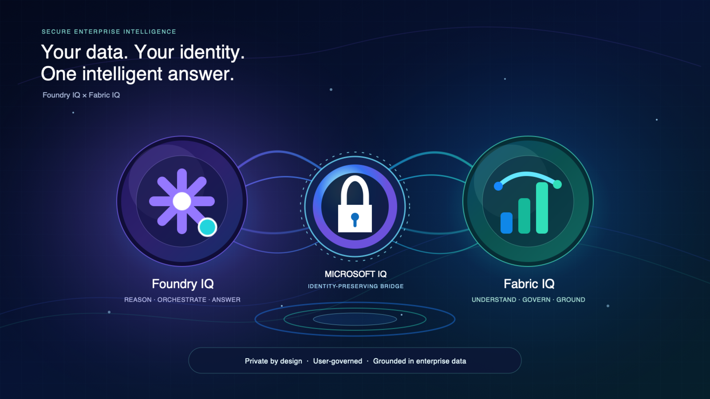

# Azure Landing Zone — Fabric & Foundry Workloads

A vendor-neutral, **Hub & Spoke** Azure Landing Zone reference, built as **three
independent layers** so each can be developed and tested on its own.

> This repository contains **only technology and architecture**. It carries no
> customer, partner, or environment identity. See
> [docs/PUBLISHING.md](docs/PUBLISHING.md) for how that separation is enforced.

## Start here

| Goal | Authoritative document |
|---|---|
| Deploy or review the Layer 1–3 lifecycle | [DEPLOYMENT-GUIDE.md](DEPLOYMENT-GUIDE.md) |
| Understand the overall architecture | This README and the [documentation index](docs/README.md) |
| Understand the Fabric module | [workloads/fabric/README.md](workloads/fabric/README.md) |
| Review the completed Fabric reference lab | [workloads/fabric/REFERENCE-LAB.md](workloads/fabric/REFERENCE-LAB.md) |
| Review Layer 1 as-built evidence | [platform/DEPLOYMENT.md](platform/DEPLOYMENT.md) |
| Contribute without exposing environment identity | [docs/PUBLISHING.md](docs/PUBLISHING.md) |

`DEPLOYMENT-GUIDE.md` is the single deployment lifecycle for all three layers.
It contains executable procedures for released Terraform roots and explicit
STOP gates for architecture-only layers. Component READMEs describe
implementation boundaries and do not maintain competing procedures.

## Table of Contents

- [Design principles](#design-principles)
- [Architecture diagrams](#architecture-diagrams)
  - [1. Management group governance](#1-management-group-governance)
  - [2. Hub and spoke topology](#2-hub-and-spoke-topology)
  - [3. Forced egress and the Zscaler stand-in](#3-forced-egress-and-the-zscaler-stand-in)
  - [4. Deployment stages](#4-deployment-stages)
- [The three layers](#the-three-layers)
  - [Layer 1: Platform (Landing Zone foundation)](#layer-1-platform-landing-zone-foundation)
  - [Layer 2: Fabric workload](#layer-2-fabric-workload)
  - [Layer 3: Foundry workload](#layer-3-foundry-workload)
- [Foundry IQ + Fabric IQ integration vision](#foundry-iq--fabric-iq-integration-vision)
- [Repository layout](#repository-layout)
- [Naming convention](#naming-convention)
- [Getting started (lab)](#getting-started-lab)
- [Layers and order](#layers-and-order)
- [License](#license)

## Design principles

- **Terraform-first operations** — Azure infrastructure is managed as code.
  Fabric and Entra actions that do not have a suitable Terraform lifecycle are
  explicit portal/API stop gates with required screenshot or response evidence.
- **Hub & Spoke** — one connectivity hub, isolated workload spokes, using
  **classic VNet peering + UDR** (no Azure Virtual Network Manager). See
  [platform/README.md](platform/README.md).
- **All east-west and on-prem traffic flows through Azure Firewall.**
- **Internet egress is forced through a 3rd-party Secure Web Gateway (SWG)** —
  the module is vendor-agnostic; the brand is configured privately.
- **North-south publishing through Azure API Management.**
- **Public IP protection with Azure DDoS.**
- **Defender for Cloud + a CNAPP layer** for posture and workload protection.

## Architecture diagrams

Diagram sources live in [docs/diagrams/](docs/diagrams) (`.drawio` and `.svg`,
using Azure icons) and render to [docs/images/](docs/images).

### 1. Management group governance

CAF ALZ engine stamping a custom `mgmt / workloads / monitor / sandbox` tree with
a minimal policy baseline.


### 2. Hub and spoke topology

Central hub (Firewall, DDoS, Private DNS Resolver, egress),
workload spokes, on-prem and monitoring — all east-west via the firewall.


### 3. Forced egress and the Zscaler stand-in

All spoke egress is forced to a Secure Web Gateway. Production uses **Zscaler**;
the lab mimics it with a **self-hosted proxy** — one swap point.


### 4. Deployment stages

Terraform stages `00 → 50`, driven by GitHub Actions with secret + identity
guards on every push.


## The three layers

### Layer 1: Platform (Landing Zone foundation)

Management groups, connectivity hub (Azure Firewall, DDoS,
Private DNS Resolver), secure egress, central monitoring, and security tooling.
Deployed once, in stage order. **Full detail + diagrams:**
[platform/README.md](platform/README.md).


### Layer 2: Fabric workload

A spoke for **Microsoft Fabric** with workspace-level Private Link (inbound) and
on-prem SQL → OneLake ingestion via an On-premises Data Gateway. See
[workloads/fabric/README.md](workloads/fabric/README.md) and
[docs/02-fabric-workload.md](docs/02-fabric-workload.md).


### Layer 3: Foundry workload

A spoke for **Microsoft Foundry + Azure AI Search + APIM**, reusing the
private-networking patterns from
[Azure-AI-Foundry-Networking](https://github.com/roie9876/Azure-AI-Foundry-Networking).
See [workloads/foundry/README.md](workloads/foundry/README.md) and
[docs/03-foundry-workload.md](docs/03-foundry-workload.md).



## Foundry IQ + Fabric IQ integration vision

The target integration connects a Foundry agent to a **published Fabric data
agent** by using the Microsoft Fabric tool and a Foundry project connection.
The signed-in user's identity is passed to Fabric On-Behalf-Of, so Fabric item
permissions, RLS/CLS, and Purview policy continue to govern every read-only
query. The agent configuration contains no embedded user credential. The
Foundry project and Fabric data agent must be in the **same Microsoft Entra
tenant**; cross-tenant OBO isn't supported.

The two identity contexts remain separate: the Foundry runtime managed identity
accesses its Azure dependencies, while the user's OBO identity authorizes every
Fabric query. Neither identity substitutes for the other.

For the first private-link implementation, scope Fabric IQ to lakehouse,
warehouse, or SQL sources in private Workspace A. Semantic models, KQL, mirrored
sources, and Fabric IQ Plan items are excluded until Microsoft documents support
for those items in the required Private Link configuration. The tool integration
is preview and must be validated in the target tenant and region before release.



Current state: this is the approved logical target only. The published Fabric
data agent, Foundry project connection, Fabric tool configuration, OBO permission
model, APIM API, and end-to-end private evidence are the next implementation
workstream.

## Repository layout

```
platform/            Layer 1 — Landing Zone foundation (Terraform stages)
  00-bootstrap/         remote state, providers, CI identity
  10-management-groups/ mgmt / workloads / monitor / sandbox
  20-connectivity-hub/  hub VNet, Firewall + policy, DDoS, DNS resolver
  30-egress/            forced-tunnel egress to the SWG (vendor-agnostic)
  40-monitoring/        Log Analytics, AMPLS, alerts, DCR, workbooks
  50-security/          Defender for Cloud, CNAPP onboarding hooks
workloads/
  fabric/            Layer 2 — module README, Terraform, reference-lab evidence
    README.md           architecture and Terraform boundary
    REFERENCE-LAB.md    completed lab history and evidence links
  foundry/           Layer 3 — Foundry + AI Search + APIM spoke
modules/             reusable Terraform modules (naming, spoke-vnet, ...)
examples/
  lab/               small sandbox values (safe placeholders)
  enterprise/        the enterprise-shaped topology, fully tokenized
docs/                sanitized architecture, diagrams, and how-to
_private/            git-ignored real values (never published)
```

## Naming convention

Resources follow `azr-<env>-<org>-<subcode>-<type>-<role>`. The **scheme** is
public; the real `org` and `subcode` values live only in `_private/`. See
[docs/naming-convention.md](docs/naming-convention.md).

## Getting started (lab)

For the complete timeline, current checkpoint, exact execution surface, expected
plan results, portal actions, and evidence names, follow
[DEPLOYMENT-GUIDE.md](DEPLOYMENT-GUIDE.md).

```bash
# 1. Install guardrails (blocks identity leaks before they are committed)
pipx install pre-commit && pre-commit install

# 2. Create your private overlay
cp _private/denylist.txt.example      _private/denylist.txt
cp _private/enterprise.tfvars.example _private/enterprise.private.tfvars
#   ...edit both with your real values...

# 3. Deploy a layer (example)
cp examples/lab/lab.tfvars.example examples/lab/lab.tfvars   # now git-ignored
cd platform/20-connectivity-hub
terraform init
terraform apply -var-file=../../examples/lab/lab.tfvars
```

## Layers and order

```
platform/00 → 10 → 20 → 30 → 40 → 50   (foundation, once)
        │
        ├── workloads/fabric            (Layer 2)
        └── workloads/foundry           (Layer 3)
```

## License

[MIT](LICENSE).
