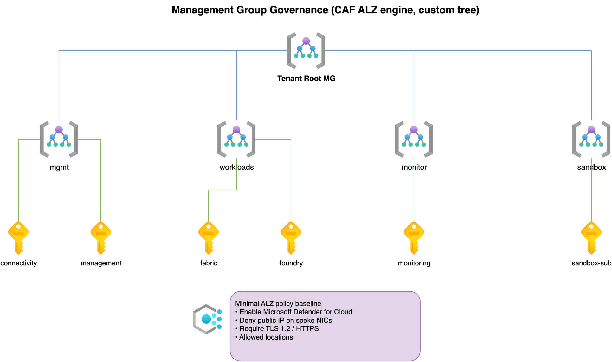
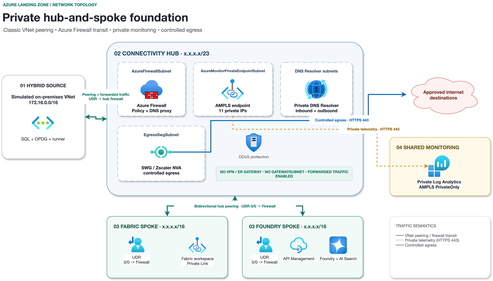
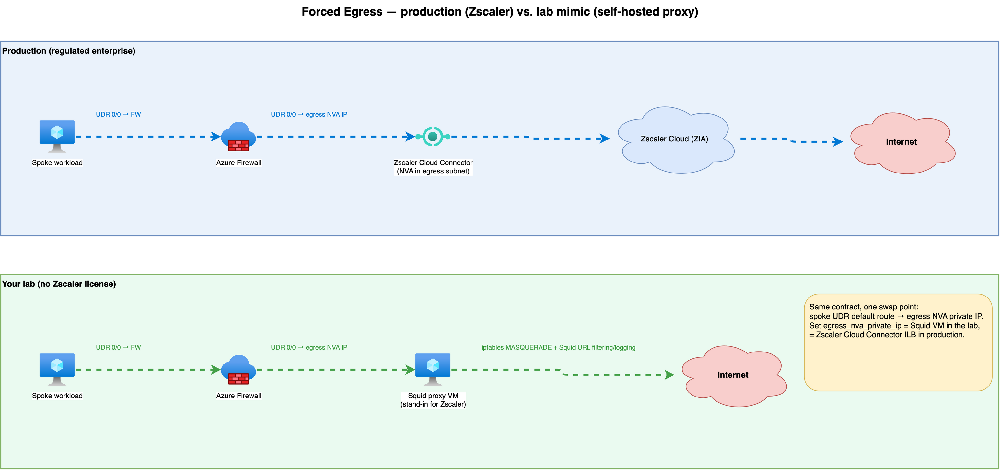
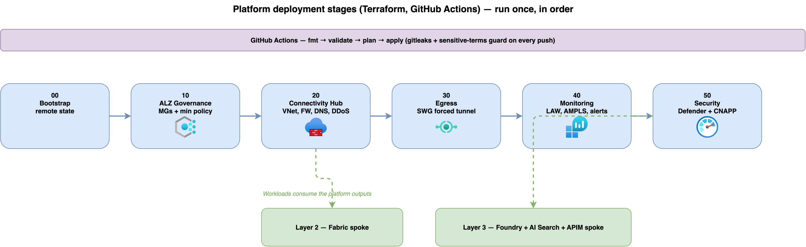

# Azure Landing Zone — Fabric & Foundry Workloads

A vendor-neutral, **Hub & Spoke** Azure Landing Zone reference, built as **three
independent layers** so each can be developed and tested on its own.

> This repository contains **only technology and architecture**. It carries no
> customer, partner, or environment identity. See
> [docs/PUBLISHING.md](docs/PUBLISHING.md) for how that separation is enforced.

## Table of Contents

- [Design principles](#design-principles)
- [Architecture diagrams](#architecture-diagrams)
  - [1. Management group governance](#1-management-group-governance)
  - [2. Hub and spoke topology](#2-hub-and-spoke-topology)
  - [3. Forced egress and the Zscaler stand-in](#3-forced-egress-and-the-zscaler-stand-in)
  - [4. Deployment stages](#4-deployment-stages)
- [The three layers](#the-three-layers)
  - [Layer 1: Platform (Landing Zone foundation)](#layer-1-platform-landing-zone-foundation)
  - [Layer 2: Fabric workload](#layer-2-fabric-workload)
  - [Layer 3: Foundry workload](#layer-3-foundry-workload)
- [Repository layout](#repository-layout)
- [Naming convention](#naming-convention)
- [Getting started (lab)](#getting-started-lab)
- [Layers and order](#layers-and-order)
- [License](#license)

## Design principles

- **Everything as code** — Terraform only; no manual production changes.
- **Hub & Spoke** — one connectivity hub, isolated workload spokes. The public
  reference uses **classic peering + UDR** (Azure Virtual Network Manager is an
  optional production upgrade — see [platform/README.md](platform/README.md)).
- **All east-west and on-prem traffic flows through Azure Firewall.**
- **Internet egress is forced through a 3rd-party Secure Web Gateway (SWG)** —
  the module is vendor-agnostic; the brand is configured privately.
- **North-south publishing through Azure API Management.**
- **Public IP protection with Azure DDoS.**
- **Defender for Cloud + a CNAPP layer** for posture and workload protection.

## Architecture diagrams

Diagram sources live in [docs/diagrams/](docs/diagrams) (`.drawio`, Azure icons)
and render to [docs/images/](docs/images) via `./scripts/render-diagrams.sh`.

### 1. Management group governance

CAF ALZ engine stamping a custom `mgmt / workloads / monitor / sandbox` tree with
a minimal policy baseline.



### 2. Hub and spoke topology

Central hub (Firewall, ER/VPN gateway, DDoS, Private DNS Resolver, egress),
workload spokes, on-prem and monitoring — all east-west via the firewall.



### 3. Forced egress and the Zscaler stand-in

All spoke egress is forced to a Secure Web Gateway. Production uses **Zscaler**;
the lab mimics it with a **self-hosted proxy** — one swap point.



### 4. Deployment stages

Terraform stages `00 → 50`, driven by GitHub Actions with secret + identity
guards on every push.



## The three layers

### Layer 1: Platform (Landing Zone foundation)

Management groups, connectivity hub (Azure Firewall, ER/VPN gateway, DDoS,
Private DNS Resolver), secure egress, central monitoring, and security tooling.
Deployed once, in stage order. **Full detail + diagrams:**
[platform/README.md](platform/README.md).

### Layer 2: Fabric workload

A spoke for **Microsoft Fabric** with workspace-level Private Link (inbound) and
on-prem SQL → OneLake ingestion via an On-premises Data Gateway. See
[workloads/fabric/README.md](workloads/fabric/README.md) and
[docs/02-fabric-workload.md](docs/02-fabric-workload.md).

### Layer 3: Foundry workload

A spoke for **Microsoft Foundry + Azure AI Search + APIM**, reusing the
private-networking patterns from
[Azure-AI-Foundry-Networking](https://github.com/roie9876/Azure-AI-Foundry-Networking).
See [workloads/foundry/README.md](workloads/foundry/README.md) and
[docs/03-foundry-workload.md](docs/03-foundry-workload.md).

## Repository layout

```
platform/            Layer 1 — Landing Zone foundation (Terraform stages)
  00-bootstrap/         remote state, providers, CI identity
  10-management-groups/ mgmt / workloads / monitor / sandbox
  20-connectivity-hub/  hub VNet, Firewall + policy, ER/VPN GW, DDoS, DNS resolver
  30-egress/            forced-tunnel egress to the SWG (vendor-agnostic)
  40-monitoring/        Log Analytics, AMPLS, alerts, DCR, workbooks
  50-security/          Defender for Cloud, CNAPP onboarding hooks
workloads/
  fabric/            Layer 2 — Fabric spoke + private links
  foundry/           Layer 3 — Foundry + AI Search + APIM spoke
modules/             reusable Terraform modules (naming, spoke-vnet, ...)
examples/
  lab/               small sandbox values (safe placeholders)
  enterprise/        the enterprise-shaped topology, fully tokenized
docs/                sanitized architecture, diagrams, and how-to
_private/            git-ignored real values (never published)
```

## Naming convention

Resources follow `azr-<env>-<org>-<subcode>-<type>-<role>`. The **scheme** is
public; the real `org` and `subcode` values live only in `_private/`. See
[docs/naming-convention.md](docs/naming-convention.md).

## Getting started (lab)

```bash
# 1. Install guardrails (blocks identity leaks before they are committed)
pipx install pre-commit && pre-commit install

# 2. Create your private overlay
cp _private/denylist.txt.example      _private/denylist.txt
cp _private/enterprise.tfvars.example _private/enterprise.private.tfvars
#   ...edit both with your real values...

# 3. Deploy a layer (example)
cp examples/lab/lab.tfvars.example examples/lab/lab.tfvars   # now git-ignored
cd platform/20-connectivity-hub
terraform init
terraform apply -var-file=../../examples/lab/lab.tfvars
```

## Layers and order

```
platform/00 → 10 → 20 → 30 → 40 → 50   (foundation, once)
        │
        ├── workloads/fabric            (Layer 2)
        └── workloads/foundry           (Layer 3)
```

## License

[MIT](LICENSE).
