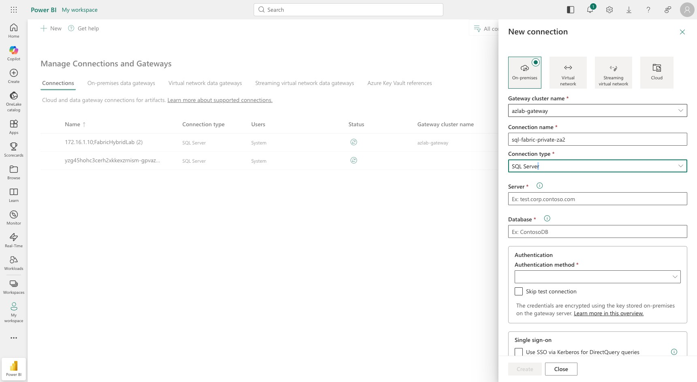
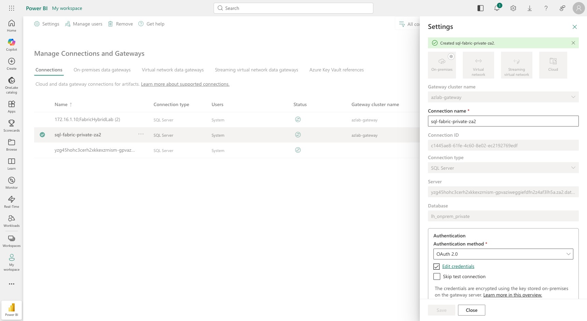

# Cross-workspace semantic-model refresh into a private Workspace A

## The problem (observed in this lab, 2026-07-20)

After Phase 9 locks **Workspace A** (the private lakehouse workspace) to
*"Allow connections from selected networks and workspace-level private links"*
(inbound public access = **Deny**):

- **Hop 1 — on-prem SQL -> Workspace A** (OPDG copy job): **still works.** The
  gateway reaches Workspace A over its workspace private endpoint.
- **Hop 2 — Workspace A -> Workspace B semantic-model refresh**: **FAILS** with:

  ```
  errorCode: ModelRefresh_ShortMessage_ProcessingError
  code:      CrossWorkspaceRequestNotAllowed
  message:   Access protector failed due to CrossWorkspaceRequestNotAllowed
  ```

  Evidence: `workloads/fabric/evidence/post-lockdown-refresh-CrossWorkspaceRequestNotAllowed.json`

So a public **Workspace B** Import model that reads Workspace A's SQL analytics
endpoint over an ordinary **cloud / Organizational-account** connection can no
longer refresh once Workspace A is private. The report keeps showing the last
pre-lockdown data; it cannot pick up new rows.

## Root cause (Microsoft-documented, by design)

When a workspace restricts inbound public access, Fabric's **access protector**
blocks any request that arrives from **another Fabric workspace** over the cloud
path. A Power BI refresh runs in the Fabric backend and initiates the connection
**from Workspace B's service infrastructure**, so it is classified as a
cross-workspace public request and denied. No credential/cloud-connection change
bypasses this — the network path itself is blocked.

> "By default, a workspace with restricted inbound public access restricts
> connections from other workspaces. To enable cross-workspace communication in
> this scenario, you must use either managed private endpoints or a data
> gateway. These options are necessary even if private endpoints exist between
> the client and one or both workspaces. The reason is that the source workspace
> (not the client) initiates the connection."
> — [Cross-workspace communication](https://learn.microsoft.com/en-us/fabric/security/security-cross-workspace-communication)

Two hard limits make the "obvious" workarounds impossible:

- **You cannot co-locate the semantic model in Workspace A.** Semantic models
  are unsupported in workspaces with workspace-level private links — you cannot
  enable private links on a workspace that contains one.
  [Limitations](https://learn.microsoft.com/en-us/fabric/security/security-workspace-level-private-links-support)
- **Managed private endpoints do not cover semantic-model refresh** (only
  shortcuts, notebooks, pipelines, eventstreams). Semantic-model refresh must go
  through a **data gateway**.
  [Cross-workspace communication](https://learn.microsoft.com/en-us/fabric/security/security-cross-workspace-communication)

The topology "model in a separate open Workspace B, lakehouse in restricted
Workspace A, bridged by a gateway" is therefore the **mandated** design, not a
workaround.

## The supported fix: bind the model to a gateway with private access to A

Microsoft publishes two step-by-step walkthroughs for exactly this topology:

- VNet data gateway:
  https://learn.microsoft.com/en-us/fabric/security/security-workspace-private-links-example-power-bi-virtual-network
- On-premises data gateway (OPDG):
  https://learn.microsoft.com/en-us/fabric/security/security-workspace-private-links-example-on-premises-data-gateway

Because this lab already runs an OPDG (`azlab-gateway`) inside the private
network, the OPDG pattern applies.

### Step 1 — Build the workspace-private connection string (mandatory)

The normal warehouse hostname you copy from the portal
(`<hash>.datawarehouse.fabric.microsoft.com`) **stops working** once Workspace A
is private. You must insert one extra label — **`z{xy}`** — into that hostname.
Read this even if you have never touched DNS before; it is just string surgery.

**What `z{xy}` means (the recipe):**

1. **`z`** is always the literal letter `z`. It never changes.
2. **`{xy}`** is the **first two characters of Workspace A's object ID, after you
   delete the dashes**.

**Worked example — Workspace A ID `a20cea33-31c4-4290-8cad-d67802ed67e8`:**

| Step | Do this | Result |
|---|---|---|
| 1 | Remove the dashes from the ID | `a20cea3331c4...` |
| 2 | Take the first **2** characters | **`a2`** |
| 3 | Put a `z` in front of those two characters | **`za2`** |

So for this workspace the label is **`za2`**.

**Where the label goes** — insert `.za2` between the hash and `datawarehouse`.
Everything else in the hostname stays **exactly** the same:

| Which name | Hostname |
|---|---|
| **Public** (fails when private) | `yzg45...af3lh5a.datawarehouse.fabric.microsoft.com` |
| **Private** (this is the one to use) | `yzg45...af3lh5a`**`.za2`**`.datawarehouse.fabric.microsoft.com` |

**What you actually type into the gateway connection:**

- **Server** = the **private** hostname above (the one that contains `.za2.`).
- **Database** = the lakehouse name (`lh_onprem_private`) or the lakehouse GUID.

> **Plain-English summary:** the public name is the blocked front door. Adding
> `z` + the workspace ID's first two characters is like writing the workspace's
> private apartment number on the envelope so the private link can deliver it.

> "You need to add `z{xy}` to the regular warehouse connection string ... This
> FQDN isn't available as part of the DNS configurations for the private
> endpoint."
> — [Workspace-level private links overview](https://learn.microsoft.com/en-us/fabric/security/security-workspace-level-private-links-overview#connecting-to-workspaces)

### Step 2 — DNS for the datawarehouse FQDN (the gap in this lab)

The workspace private endpoint auto-registers these A records in
`privatelink.fabric.microsoft.com` (verified in this lab):

| Sub-resource | Private IP |
|---|---|
| `a20cea33...za2.w.api`   | 10.2.0.4 |
| `a20cea33...za2.c`       | 10.2.0.5 |
| `a20cea33...za2.onelake` | 10.2.0.6 |
| `a20cea33...za2.dfs`     | 10.2.0.7 |
| `a20cea33...za2.blob`    | 10.2.0.8 |

There is **no explicit `datawarehouse` A record** — but one is **not needed**.
The `za2` datawarehouse FQDN resolves through a CNAME chain to the `.c`
sub-resource, which already has a private A record in the zone:

```
yzg45...za2.datawarehouse.fabric.microsoft.com
  -> CNAME a20cea33...za2.c.fabric.microsoft.com
  -> CNAME a20cea33...za2.c.privatelink.fabric.microsoft.com
  -> A     10.2.0.5   (already registered by the workspace private endpoint)
```

Verified from the runner VM (inside the allowed VNet):
`getent hosts yzg45...za2.datawarehouse.fabric.microsoft.com` -> `10.2.0.5`.
So on this lab **no manual DNS record was required** — the existing workspace
private endpoint DNS is sufficient once the gateway uses the `za2` FQDN.

> **VERIFIED WORKING (2026-07-20):** created OPDG SQL connection
> `sql-fabric-private-za2` (server = `za2` datawarehouse FQDN, database
> `lh_onprem_private`, OAuth2). The **test connection passed** and a subsequent
> semantic-model refresh **Completed** with no `CrossWorkspaceRequestNotAllowed`.
> Evidence: `workloads/fabric/evidence/post-lockdown-refresh-FIXED-via-gateway.json`.

**Firewall note:** the hub firewall's existing `fabric-privatelink-443` network
rule (TCP 443 to `10.2.0.0/27`) was **sufficient** — the Fabric SQL analytics
endpoint tunnels over 443 to the `.c` private-endpoint IP. No 1433 rule was
needed.

### Step 3 — Create the gateway SQL connection and bind the model

1. In **Manage connections and gateways**, select **+ New**, choose
   **On-premises**, and pick the OPDG cluster (`azlab-gateway`). Set
   **Connection type = SQL Server**:
   - Server: the `za2` datawarehouse FQDN (Step 1)
   - Database: `lh_onprem_private` (or the lakehouse GUID)
   - Authentication method: **OAuth 2.0** -> **Edit credentials** -> sign in

   

2. Leave **Skip test connection** unchecked and select **Create**. The test must
   pass (green check), confirming the gateway resolves the `za2` FQDN privately
   and reaches the SQL analytics endpoint over 443:

   

3. Bind the semantic model to this connection. Either in **Workspace B ->
   semantic model -> Settings -> Gateway and cloud connections** (toggle
   **Gateway connections** On, map the data source), or via the API:

   ```
   POST https://api.powerbi.com/v1.0/myorg/groups/{workspaceBId}/datasets/{modelId}/Default.BindToGateway
   { "gatewayObjectId": "<opdg-id>", "datasourceObjectIds": ["<connection-id>"] }
   ```

   > Tip: if the model still points at the public FQDN, first repoint its
   > datasource server to the `za2` FQDN via `Default.UpdateDatasources`, so it
   > matches the gateway connection's server string.

4. Trigger a refresh. `CrossWorkspaceRequestNotAllowed` should be gone; traffic
   now flows: model (B) -> gateway -> private endpoint -> Workspace A SQL
   analytics endpoint.

### Do NOT use

- **OneLake catalog / Direct Lake** — Direct Lake is not yet supported against
  inbound-restricted workspaces. Use **Import** or **DirectQuery** against the
  SQL analytics endpoint (Import is what this lab uses).
- **Item/app sharing from Workspace A** — unsupported in restricted workspaces.

## End-to-end proof after lockdown (2026-07-20)

With Workspace A locked to private-only and the Workspace B model re-bound to the
OPDG (this fix), a brand-new on-prem row was pushed all the way to the public
report:

1. Inserted a 4th row on-prem: `(4, 'Northwind Traders', '2026-07-20', 1500.00)`
   -> source now 4 rows, total 5825.49.
2. **Copy job re-run (hop 1)** — triggered from the runner VM over the private
   `w.api` endpoint (`...za2.w.api...` -> 10.2.0.4); status **Completed**.
3. **Model refresh (hop 2)** through the gateway — **Completed**.
4. Public report now shows **4 rows incl. Northwind Traders** (screenshot
   `20-public-report-4th-row-after-lockdown.jpeg`).

### Two operational gotchas observed

- **Management-plane isolation:** after lockdown, triggering the copy job from a
  public client (my laptop) — via both the Fabric REST API and the portal —
  is **denied** (`RequestDeniedByInboundPolicy` / page not found). Job control
  for the private workspace must originate **inside the allowed VNet** (the
  runner VM resolves `w.api` to the private endpoint 10.2.0.4 and succeeds), or
  via a **scheduled** run (which executes in the Fabric backend and is not
  subject to the client inbound check). This is why scheduling both hops is the
  practical customer pattern.
- **SQL analytics endpoint sync lag (the "two engines" problem):** immediately
  after the copy job wrote the Delta row, the first model refresh still returned
  3 rows; a second refresh a few minutes later returned all 4. This happens
  because two different engines are involved and they are **not** updated
  atomically:
  1. The **copy job** writes Parquet + `_delta_log` into the **OneLake** Delta
     table (the physical store) — this is immediate.
  2. The **SQL analytics endpoint** is an auto-generated, read-only T-SQL engine
     that sits *on top of* the lakehouse. It maintains its **own metadata** and
     **background-syncs** from the Delta log on a short delay (seconds to a few
     minutes). It is not the OneLake store itself.
  3. The public **Import semantic model** refreshes **through the SQL analytics
     endpoint** (we chose the "Azure SQL database" / SQL connector, not OneLake /
     Direct Lake). So a refresh that fires *before* the endpoint has synced reads
     the endpoint's stale metadata and loads the old row count — even though the
     OneLake Delta table already has the new row.

  Net effect: OneLake is fresh instantly, but the SQL analytics endpoint (and
  therefore the Import model) trails it. Budget a short delay — or an explicit
  endpoint metadata-refresh — between hop 1 (copy) and hop 2 (model refresh) when
  automating. Direct Lake would read OneLake directly and avoid this lag, but it
  is not yet supported against an inbound-restricted workspace (see below), so the
  SQL-endpoint path with a small delay is the supported pattern here.

## Automating the pipeline (every N minutes)

Both hops can be scheduled so the public report stays current without manual
steps:

- **Hop 1 — Copy job schedule:** Copy job -> **Schedule** (min interval 15 min).
  For delta-only loads, create the job in **Incremental** mode with a watermark
  column (e.g. `OrderId` or a `ModifiedDate`); the current lab job is **Full
  copy** (re-copies all rows each run).
- **Hop 2 — Semantic model scheduled refresh:** model **Settings -> Refresh**.
  Import mode reloads the model each refresh; add an **incremental refresh**
  policy on the model for large tables. Schedule hop 2 a few minutes after hop 1
  to absorb the SQL-endpoint sync lag.

Scheduled runs execute in the Fabric backend, so they are **not** blocked by the
inbound policy that denies public-client job control.

## Operational implication for the customer

- New on-prem data always reaches **private Workspace A** (hop 1 via OPDG).
- The **public report refreshes only if hop 2 goes through a gateway** with
  private access to A (this fix). Without it, the public report is
  point-in-time as of the last pre-lockdown refresh.
- There is **no tenant admin toggle** that bypasses the access protector.

## References

- Cross-workspace communication — https://learn.microsoft.com/en-us/fabric/security/security-cross-workspace-communication
- Workspace-level private links overview — https://learn.microsoft.com/en-us/fabric/security/security-workspace-level-private-links-overview
- Supported scenarios and limitations — https://learn.microsoft.com/en-us/fabric/security/security-workspace-level-private-links-support
- VNet gateway walkthrough — https://learn.microsoft.com/en-us/fabric/security/security-workspace-private-links-example-power-bi-virtual-network
- OPDG walkthrough — https://learn.microsoft.com/en-us/fabric/security/security-workspace-private-links-example-on-premises-data-gateway
