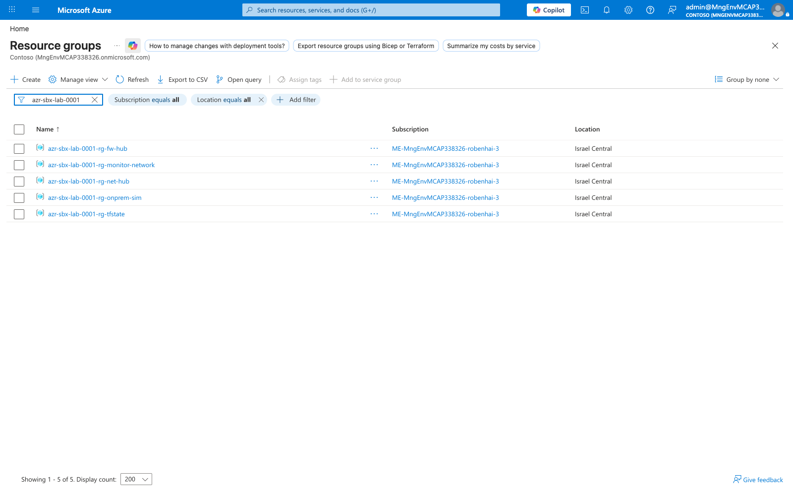
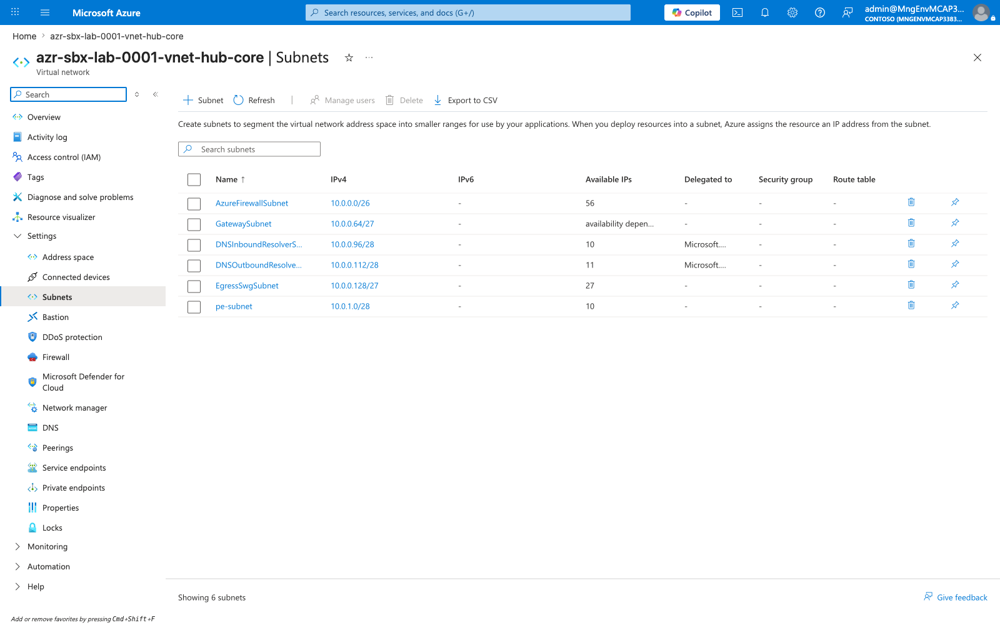
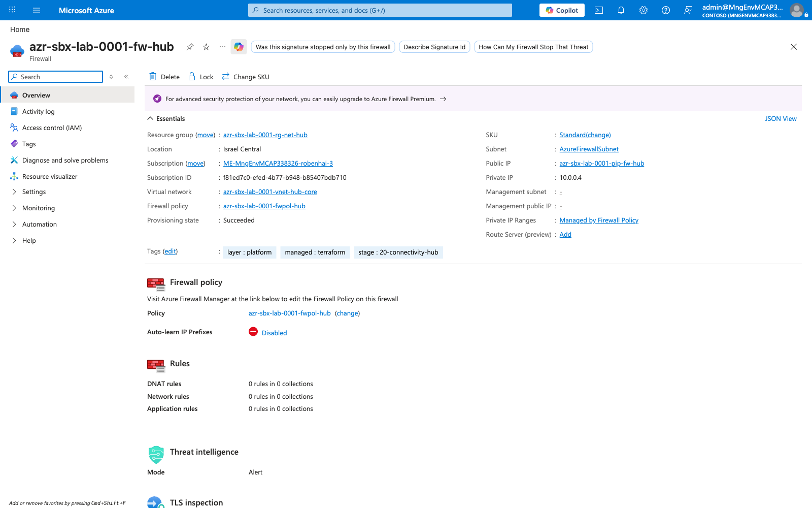
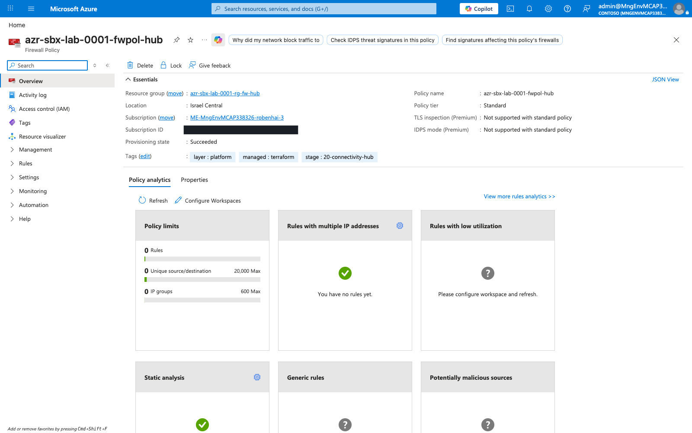
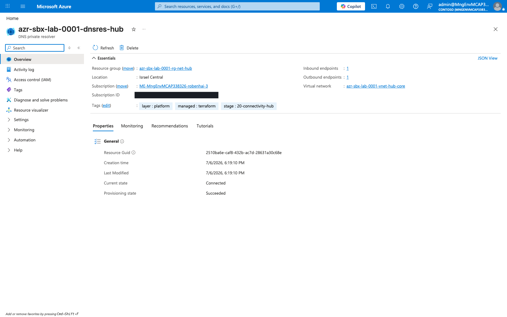
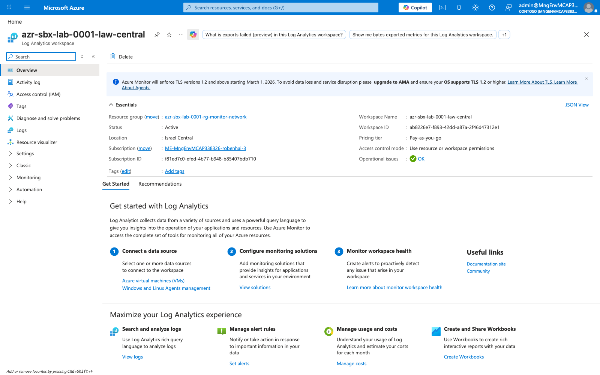
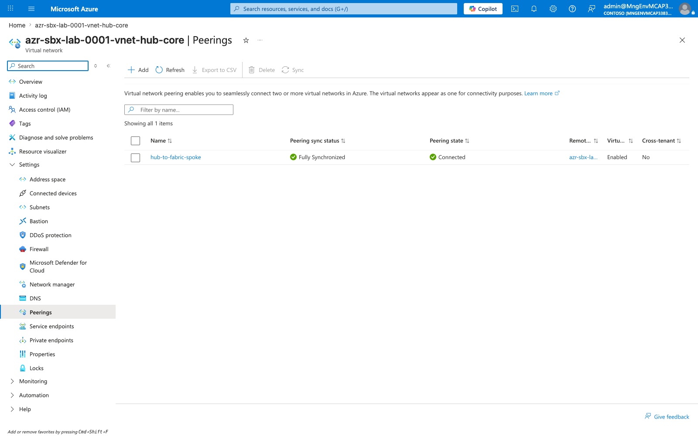
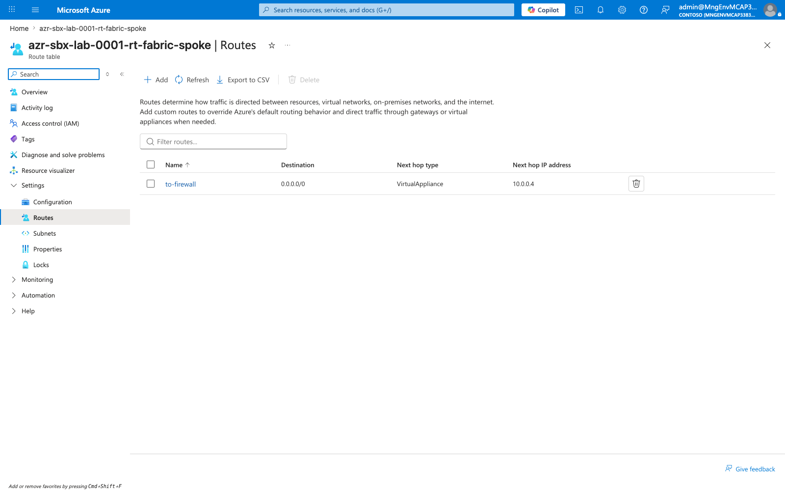
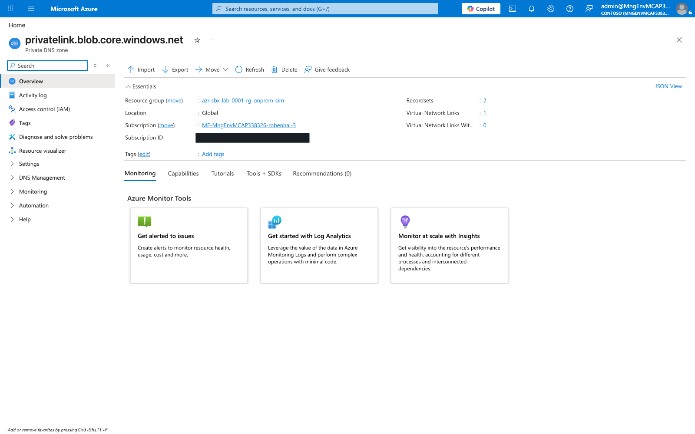
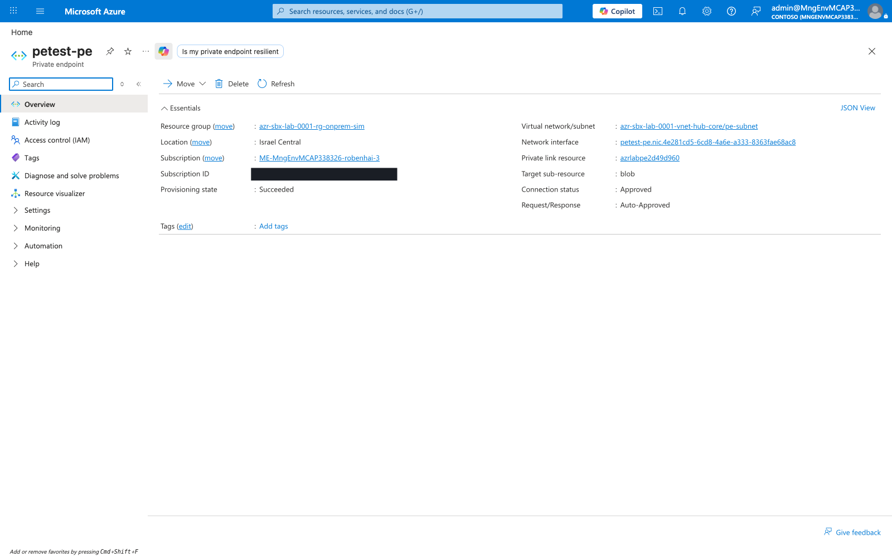

# Platform (Layer 1) — As-Built Deployment

This document captures the **actual deployed state** of the Layer 1 platform
foundation, verified against the live Azure portal. The Terraform in
`platform/` produced the resources shown below. Screenshots are stored in
[`images/`](./images).

> **Scope note.** This is a **lab / sandbox** deployment (`azr-sbx-lab-0001`) in
> **Israel Central**. Resource IDs and subscription details are visible in the
> screenshots by design (see the repo root README for the identity-handling
> policy). Production deployments follow the same shape with real values kept in
> `_private/`.

---

## 1. Resource groups

Layer 1 is organized into purpose-scoped resource groups, all tagged
`layer:platform` and `managed:terraform`.

| Resource group | Purpose |
|---|---|
| `azr-sbx-lab-0001-rg-tfstate` | Remote Terraform state backend (storage account) |
| `azr-sbx-lab-0001-rg-net-hub` | Connectivity hub: VNet, Firewall, DNS resolver |
| `azr-sbx-lab-0001-rg-fw-hub` | Azure Firewall public IP + Firewall Policy |
| `azr-sbx-lab-0001-rg-monitor-network` | Central Log Analytics workspace |
| `azr-sbx-lab-0001-rg-onprem-sim` | On-prem simulation, peered to the hub (connectivity validation — see below) |

---

## 2. Hub virtual network & subnets

The connectivity hub VNet `azr-sbx-lab-0001-vnet-hub-core` uses address space
`10.0.0.0/23`, carved into purpose-built subnets.

| Subnet | CIDR | Role |
|---|---|---|
| `AzureFirewallSubnet` | `10.0.0.0/26` | Azure Firewall data plane |
| `DNSInboundResolverSubnet` | `10.0.0.96/28` | Private DNS Resolver inbound (delegated) |
| `DNSOutboundResolverSubnet` | `10.0.0.112/28` | Private DNS Resolver outbound (delegated) |
| `EgressSwgSubnet` | `10.0.0.128/27` | Secure Web Gateway NVA (forced egress) |
| `pe-subnet` | `10.0.1.0/28` | Private endpoints |

---

## 3. Azure Firewall

The single east-west / hybrid inspection point. SKU **AZFW_VNet, Standard tier**,
private IP `10.0.0.4`, associated with the hub Firewall Policy.

- **SKU / tier:** Standard
- **Private IP:** `10.0.0.4`
- **Firewall policy:** `azr-sbx-lab-0001-fwpol-hub`
- **Threat intelligence mode:** Alert
- **Tags:** `layer:platform`, `managed:terraform`, `stage:20-connectivity-hub`

### Firewall Policy

- **Policy tier:** Standard (Premium-only TLS inspection / IDPS not enabled)
- Rule collections start empty in the lab baseline — populate per the egress and
  workload requirements.

---

## 4. Private DNS Resolver

Hybrid name resolution with both inbound and outbound endpoints, bound to the
hub VNet.

- **Inbound endpoints:** 1 (`DNSInboundResolverSubnet`)
- **Outbound endpoints:** 1 (`DNSOutboundResolverSubnet`)
- **State:** Connected / Succeeded

---

## 5. Hybrid connectivity — VNet peering + firewall transit

On-premises connects to the hub over **VNet peering**, and the hub **Azure
Firewall is the transit / default gateway**. There is no VPN or ExpressRoute
gateway and no `GatewaySubnet`.

- On-prem → hub: direct via VNet peering.
- On-prem → Fabric spoke and on-prem → internet: on-prem UDR sends the spoke
  prefix and `0.0.0.0/0` to the Azure Firewall (`10.0.0.4`), which transits/SNATs.
- The on-prem simulation VNet (`azr-sbx-lab-0001-rg-onprem-sim`) is peered to the
  hub in both directions with forwarded traffic allowed.

---

## 6. Connectivity model — classic peering + UDR

This landing zone uses **classic VNet peering + UDR**. Each workload spoke peers
directly to the hub VNet and carries its own route table forcing `0.0.0.0/0` to
the Azure Firewall (`10.0.0.4`). **Azure Virtual Network Manager (AVNM) is not
used** — an earlier AVNM scaffold was removed so code and docs agree on a single
connectivity model.

---

## 7. Central monitoring — Log Analytics

Central workspace `azr-sbx-lab-0001-law-central` in the monitoring resource
group; platform and workload diagnostics ship here.

- **Workspace:** `azr-sbx-lab-0001-law-central`
- **Pricing tier:** Pay-as-you-go
- **Status:** Active
- **Access control mode:** Resource- or workspace-permissions

---

## 8. Network connectivity, routing, DNS & private endpoints

### 8.1 Hybrid connectivity — VNet peering

The hub VNet is peered with the on-prem simulation VNet in both directions with
forwarded traffic allowed, so the hub firewall transits on-prem ↔ spoke traffic.

- **Peering state:** Connected (both directions)
- **Forwarded traffic:** allowed (firewall transit)
- On-prem routes `0.0.0.0/0` and the Fabric spoke prefix to the firewall
  (`10.0.0.4`); the firewall forwards/returns via peering.

### 8.2 Spoke connectivity — classic peering + UDR

Workload spokes connect with **classic VNet peering** to the hub plus a
per-spoke route table (`0.0.0.0/0` → firewall `10.0.0.4`). No AVNM network
groups or connectivity configurations are used.

### 8.3 User-defined routes (UDRs) & VNet peerings

With the **Fabric workload spoke** now deployed, the classic peering + UDR model
is realized end to end.

**Hub → spoke VNet peering** (`hub-to-fabric-spoke`): **Fully Synchronized /
Connected**, with forwarded traffic allowed so the firewall transits traffic
between the spoke and on-prem (which is separately peered to the hub).

**Forced-tunnel UDR** on the Fabric spoke (`azr-sbx-lab-0001-rt-fabric-spoke`):
a single route sends **`0.0.0.0/0` → VirtualAppliance `10.0.0.4`** (the Azure
Firewall), so all spoke egress is inspected by the hub firewall.

| Route | Destination | Next hop type | Next hop |
|---|---|---|---|
| `to-firewall` | `0.0.0.0/0` | VirtualAppliance | `10.0.0.4` (hub Azure Firewall) |

### 8.4 DNS — Private DNS zone

Hybrid private-name resolution is validated with a `privatelink.blob.core.windows.net`
zone linked to the hub VNet (works alongside the Private DNS Resolver from §4).

- **Zone:** `privatelink.blob.core.windows.net`
- **Record sets:** 2
- **Virtual network links:** 1 (`hub-link` → hub VNet)

### 8.5 Private endpoint

A private endpoint in the hub `pe-subnet` validates the private-link data path
(the target of the on-prem → hub connectivity test).

- **Name:** `petest-pe` in `pe-subnet` (`10.0.1.0/28`)
- **Target sub-resource:** blob (storage account)
- **Connection status:** Approved (Auto-Approved), Provisioning **Succeeded**

---

## Verified deployment inventory

| Stage | Resource(s) deployed | Status |
|---|---|---|
| 00-bootstrap | `azrlab0001tfstate` (remote state) | ✅ |
| 10-management-groups | MG hierarchy | ✅ (control plane) |
| 20-connectivity-hub | Hub VNet, Firewall + Policy, DNS Resolver | ✅ |
| 40-monitoring | `law-central` Log Analytics | ✅ |
| 30-egress / 50-security | Egress NVA / Defender plans | ⏳ pending |

---

*Screenshots captured live from portal.azure.com (sandbox subscription,
Israel Central). Regenerate by re-running the portal capture against the same
resource IDs after any Terraform change.*
