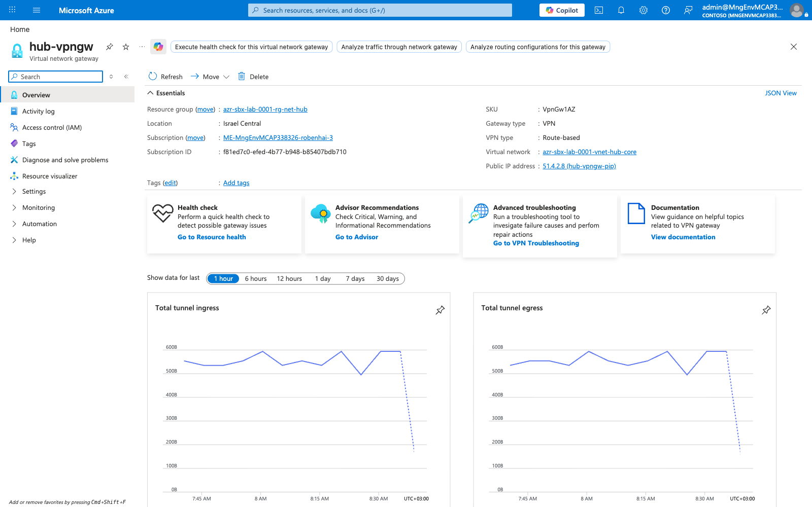
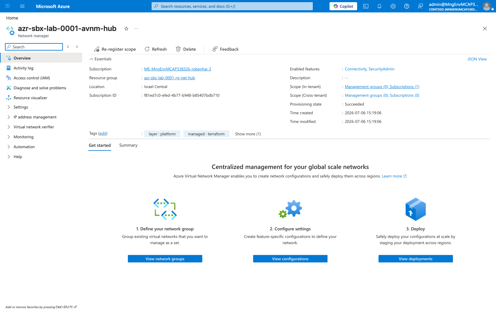

# Platform (Layer 1) — As-Built Deployment

This document captures the **actual deployed state** of the Layer 1 platform
foundation, verified against the live Azure portal. The Terraform in
`platform/` produced the resources shown below. Screenshots are stored in
[`images/`](./images).

> **Scope note.** This is a **lab / sandbox** deployment (`azr-sbx-lab-0001`) in
> **Israel Central**. Resource IDs and subscription details are visible in the
> screenshots by design (see the repo root README for the identity-handling
> policy). Production deployments follow the same shape with real values kept in
> `_private/`.

---

## 1. Resource groups

Layer 1 is organized into purpose-scoped resource groups, all tagged
`layer:platform` and `managed:terraform`.

| Resource group | Purpose |
|---|---|
| `azr-sbx-lab-0001-rg-tfstate` | Remote Terraform state backend (storage account) |
| `azr-sbx-lab-0001-rg-net-hub` | Connectivity hub: VNet, Firewall, DNS resolver, VPN GW, AVNM |
| `azr-sbx-lab-0001-rg-fw-hub` | Azure Firewall public IP + Firewall Policy |
| `azr-sbx-lab-0001-rg-monitor-network` | Central Log Analytics workspace |
| `azr-sbx-lab-0001-rg-onprem-sim` | On-prem S2S simulation (connectivity validation — see below) |

---

## 2. Hub virtual network & subnets

The connectivity hub VNet `azr-sbx-lab-0001-vnet-hub-core` uses address space
`10.0.0.0/23`, carved into purpose-built subnets.

| Subnet | CIDR | Role |
|---|---|---|
| `AzureFirewallSubnet` | `10.0.0.0/26` | Azure Firewall data plane |
| `GatewaySubnet` | `10.0.0.64/27` | VPN / ExpressRoute gateway |
| `DNSInboundResolverSubnet` | `10.0.0.96/28` | Private DNS Resolver inbound (delegated) |
| `DNSOutboundResolverSubnet` | `10.0.0.112/28` | Private DNS Resolver outbound (delegated) |
| `EgressSwgSubnet` | `10.0.0.128/27` | Secure Web Gateway NVA (forced egress) |
| `pe-subnet` | `10.0.1.0/28` | Private endpoints |

---

## 3. Azure Firewall

The single east-west / hybrid inspection point. SKU **AZFW_VNet, Standard tier**,
private IP `10.0.0.4`, associated with the hub Firewall Policy.

- **SKU / tier:** Standard
- **Private IP:** `10.0.0.4`
- **Firewall policy:** `azr-sbx-lab-0001-fwpol-hub`
- **Threat intelligence mode:** Alert
- **Tags:** `layer:platform`, `managed:terraform`, `stage:20-connectivity-hub`

### Firewall Policy

- **Policy tier:** Standard (Premium-only TLS inspection / IDPS not enabled)
- Rule collections start empty in the lab baseline — populate per the egress and
  workload requirements.

---

## 4. Private DNS Resolver

Hybrid name resolution with both inbound and outbound endpoints, bound to the
hub VNet.

- **Inbound endpoints:** 1 (`DNSInboundResolverSubnet`)
- **Outbound endpoints:** 1 (`DNSOutboundResolverSubnet`)
- **State:** Connected / Succeeded

---

## 5. Hybrid connectivity — VPN Gateway

The lab realizes hybrid connectivity with a **zone-redundant VPN gateway**
(`hub-vpngw`). The reference target uses ExpressRoute; the lab substitutes a VPN
gateway + an on-prem simulation to validate the same routing and BGP behavior
without an ER circuit.

- **SKU:** `VpnGw1AZ` (zone-redundant)
- **Gateway type:** VPN, **route-based**
- **Public IP:** `hub-vpngw-pip`
- Live tunnel ingress/egress metrics confirm an active S2S connection to the
  on-prem simulation (`azr-sbx-lab-0001-rg-onprem-sim`), with BGP established.

---

## 6. Azure Virtual Network Manager (AVNM)

AVNM `azr-sbx-lab-0001-avnm-hub` is deployed with **Connectivity** and
**SecurityAdmin** features enabled, scoped to the sandbox subscription.

- **Enabled features:** Connectivity, SecurityAdmin
- **Scope:** 1 subscription (in-tenant)

> **As-built note.** The public `platform/README.md` describes the reference as
> "classic peering + UDR (no AVNM)" for teachability, while
> `docs/01-landing-zone.md` lists AVNM. This deployment **does** include AVNM
> (Connectivity + SecurityAdmin). Reconcile the two READMEs to match the intended
> production posture.

---

## 7. Central monitoring — Log Analytics

Central workspace `azr-sbx-lab-0001-law-central` in the monitoring resource
group; platform and workload diagnostics ship here.

- **Workspace:** `azr-sbx-lab-0001-law-central`
- **Pricing tier:** Pay-as-you-go
- **Status:** Active
- **Access control mode:** Resource- or workspace-permissions

---

## Verified deployment inventory

| Stage | Resource(s) deployed | Status |
|---|---|---|
| 00-bootstrap | `azrlab0001tfstate` (remote state) | ✅ |
| 10-management-groups | MG hierarchy | ✅ (control plane) |
| 20-connectivity-hub | Hub VNet, Firewall + Policy, DNS Resolver, VPN GW, AVNM | ✅ |
| 40-monitoring | `law-central` Log Analytics | ✅ |
| 30-egress / 50-security | Egress NVA / Defender plans | ⏳ pending |

---

*Screenshots captured live from portal.azure.com (sandbox subscription,
Israel Central). Regenerate by re-running the portal capture against the same
resource IDs after any Terraform change.*
