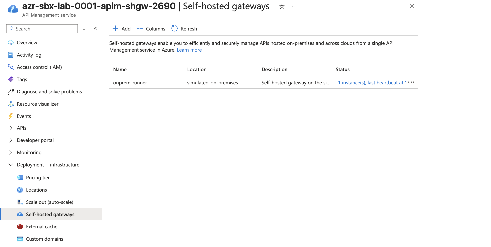

# APIM self-hosted gateway lab

This isolated root creates a paid APIM **Developer classic** control plane and a
self-hosted gateway registration for the simulated on-premises runner. It does
not modify the StandardV2 APIM instance connected to private Foundry.

## Cost and support boundary

- `Developer_1` is billable and has no production SLA.
- The gateway container runs on the runner VM; its uptime and capacity are the
  operator's responsibility.
- Token authentication is limited to 30 days. Runtime credentials stay under
  `/home/azureuser/.config/apim-shgw-lab` and must never be committed.
- Foundry recognizes this Developer classic instance as an **AI Gateway**. That
  inventory registration is separate from enabling the gateway for a Foundry
  project and from assigning APIs to the self-hosted gateway runtime.

## Deploy the control plane

Run from the private runner with its managed identity:

```bash
terraform init -reconfigure -backend-config=../../_private/backend.hcl
terraform validate
terraform plan -var-file=../../_private/apim-self-hosted-lab.private.tfvars -out=lab.tfplan
terraform show -no-color lab.tfplan
terraform apply lab.tfplan
```

APIM provisioning can take 30-60 minutes. Do not start the gateway until the
APIM instance and `onprem-runner` child gateway both report `Succeeded`.

Start the gateway on the private runner without copying its token off-host:

```bash
export APIM_SUBSCRIPTION_ID="<subscription-id>"
export APIM_RESOURCE_GROUP="azr-sbx-lab-0001-rg-onprem-sim"
export APIM_SERVICE_NAME="<apim-developer-name>"
export APIM_GATEWAY_NAME="onprem-runner"
bash scripts/start-apim-shgw-lab.sh
bash scripts/start-apim-shgw-echo-backend.sh
```

The script uses the runner managed identity to generate a 29-day token, writes
it to a mode-`0600` local file, and starts the pinned `2.9.2` gateway container.
The second script starts a deterministic private backend on the same Docker
network. Terraform publishes `/runner-echo` only through `onprem-runner`.

## Runtime placement

The runner binds the gateway to private ports `9080` and `9081`:

```text
172.16.1.5:9080 -> container 8080 (HTTP)
172.16.1.5:9081 -> container 8081 (HTTPS)
```

Only clients with private routing to the workload subnet should call these
ports. The subnet NAT and firewall public IPs are outbound-only and do not expose
the gateway to the internet.

Validate the proxy path from the runner or another privately routed client:

```bash
curl -fsS \
  -H "Host: <apim-name>.azure-api.net" \
  http://172.16.1.5:9080/runner-echo
# apim-self-hosted-gateway-ok
```

## Applied state

The reference lab was validated on 28 July 2026:

| Check | Applied result |
|---|---|
| APIM control plane | `azr-sbx-lab-0001-apim-shgw-2690`, Developer classic, Israel Central, `Succeeded` |
| Self-hosted runtime | Pinned gateway image `2.9.2`; reported runtime `2.9.3169.0` |
| Azure connectivity | `onprem-runner` reported 51 heartbeats during acceptance testing |
| Private listener | `172.16.1.5:9080` for HTTP and `172.16.1.5:9081` for HTTPS |
| API assignment | `runner-echo` assigned to `onprem-runner` |
| Runner proxy test | `/runner-echo` and `/runner-echo/` returned HTTP `200` with `apim-self-hosted-gateway-ok` |
| Separate private client | `azr-sbx-lab-0001-vm-onprem-opdg` received the same HTTP `200` response |
| Terraform convergence | Detailed exit code `0`; no changes |
| Foundry inventory | Developer APIM displayed as an AI Gateway in Foundry Admin |



The Foundry gateway page displayed a disabled association for `projectljpk`,
which belongs to a different private Foundry account. That row was intentionally
not enabled. Registering an APIM instance in the Foundry AI Gateway inventory
does not automatically associate it with every project, and project association
does not route traffic to a self-hosted gateway unless the API is also assigned
to that gateway in APIM.

## Cleanup

Stop and remove the runtime first, delete its private credential directory, then
destroy the isolated Terraform state:

```bash
docker rm -f apim-shgw-lab apim-shgw-echo
docker network rm apim-shgw-lab
rm -rf /home/azureuser/.config/apim-shgw-lab
terraform plan -destroy -var-file=../../_private/apim-self-hosted-lab.private.tfvars -out=destroy.tfplan
terraform show -no-color destroy.tfplan
terraform apply destroy.tfplan
```