# Fabric workload — reference lab deployment record

> **Reference lab only:** This document preserves the detailed execution
> history, screenshots, API checks, and applied-state evidence from the
> `azr-sbx-lab-0001` deployment. It is not the customer deployment procedure.
> Follow [../../DEPLOYMENT-GUIDE.md](../../DEPLOYMENT-GUIDE.md) to deploy the
> solution. See [README.md](README.md) for the Fabric module architecture and
> Terraform boundary.

Spoke for **Microsoft Fabric** with private connectivity, peered to the hub
(classic peering + UDR) and governed by the platform policies.

## Reference execution ledger

This ledger records how the reference environment was executed. The
**Operator** column identifies where each action ran and whether the evidence is
command output or a portal screenshot.

| Phase | Operator | Action | Status / stop gate |
|---|---|---|---|
| 0 | Entra + Fabric portals | Assign Fabric Admin; enable workspace inbound rules | **Complete**; screenshots stored |
| 1 | Terraform runner | Deploy F2 capacity, Fabric spoke, UDR, peerings, DNS | **Complete**; no drift |
| 2 | Fabric portal | Create private/open workspaces on F2 | **Complete**; screenshots stored |
| 3 | Terraform runner + Fabric API | Deploy Workspace A Private Link and endpoint | **Complete**; no drift |
| 4 | Terraform runner | Deploy simulated on-prem SQL and stage OPDG installer | **Complete**; validated, no drift |
| 5 | Azure Run Command + Fabric sign-in | Register OPDG cluster and verify it online | **Complete**; gateway Online and documented |
| 6 | Fabric portal/API | Create restricted lakehouse and sample ingestion path | **Complete**; ingestion and Delta evidence stored |
| 7 | Fabric portal | Create public semantic model/report and bind OPDG | **Complete**; gateway refresh validated |
| 8 | Fabric API + on-prem tests | Re-run private authenticated, DNS, SQL and refresh tests | **Complete**; validation evidence stored |
| 9 | Fabric portal/API | Deny Workspace A public inbound access | **Lockdown complete**; private-only access and post-lockdown refresh validated. Workspace B Conditional Access evidence **pending** |
| 10 | Azure API | Pause/resume F2 and lab compute | **Resumed 2026-07-19**; F2 active, all stopped compute restored |

### Command execution rule

Terraform commands run on `azr-sbx-lab-0001-vm-onprem-runner` because the state
backend is private. The laptop uses Azure VM Run Command to drive the runner.
Each Terraform root owns a separate state key:

| Root | State key |
|---|---|
| `workloads/fabric` | `workloads-fabric.tfstate` |
| `workloads/fabric-private-link` | `workloads-fabric-private-link.tfstate` |
| `workloads/onprem-lab` | `workloads-onprem-lab.tfstate` |

## Topology (target)

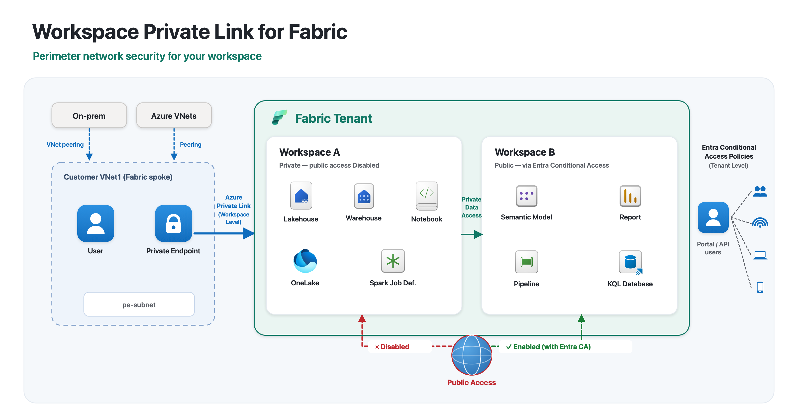

This is the target access model — **workspace-level Private Link** for private,
per-workspace inbound access to Fabric. Reading it left to right:

- **Sources (left).** Clients reach Fabric from **on-prem** and from **Azure
  VNets** — both over **VNet peering** to the hub, with the hub firewall as the
  transit. In our LZ these all route through the hub, so the "Customer VNet" is
  simply the **Fabric spoke**.
- **Customer VNet (Fabric spoke).** A **Private Endpoint** for the Fabric
  workspace lives in the spoke's **pe-subnet**. A user in (or routed to) this
  VNet reaches Fabric through that private IP — never the public internet.
- **Azure Private Link (Workspace Level).** The private endpoint is scoped to a
  **specific workspace** (not the whole tenant), so you control inbound access
  per workspace.
- **Fabric Tenant.**
  - **Workspace A** — **public access Disabled**. Reachable **only** through the
    private endpoint. Holds Lakehouse, Warehouse, Notebook, **OneLake**, and
    Spark Job Definitions. *Note:* enabling private link + block-public forces
    workspace **Spark into a managed VNet** (starter pools disabled, slower
    session start).
  - **Workspace B** — **public access Enabled**, but gated by **Entra
    Conditional Access** at the **tenant level** (a portal/API user must satisfy
    CA policy). Holds Semantic Model, Report, Pipeline, KQL Database.
  - **Cross-workspace access** — access from Workspace B to restricted
    Workspace A requires a supported managed private endpoint or data gateway;
    sharing the same capacity is not sufficient.
- **Two inbound postures side by side.** Workspace A = **network isolation**
  (private endpoint, no public); Workspace B = **identity isolation** (public
  endpoint + Conditional Access). Real tenants often mix both.

How this maps to the LZ: the Private Endpoint sits in the Fabric spoke's
`pe-subnet`; the Fabric/OneLake **private-DNS zones** live in the hub and are
linked to the spoke; **on-prem conditional-forwards** to the hub Private DNS
Resolver so the Fabric FQDNs resolve to the private-endpoint IPs (not public).

## Build order

Requires Layer 1: `platform/20-connectivity-hub` and `platform/40-monitoring`.

Layer 2 is deliberately split into two Terraform roots because the workspace
Private Link resource cannot exist until the private Fabric workspace has an
object ID:

1. `workloads/fabric` — Phase A foundation: F capacity, spoke, UDR, peerings,
  central diagnostics, and `privatelink.fabric.microsoft.com` linked to the
  hub and spoke.
2. Fabric control plane — create the private and public workspaces, assign both
  to the F capacity, and record the private workspace ID.
3. `workloads/fabric-private-link` — Phase B: create the workspace Private Link
  service, private endpoint, and DNS zone group.

These roots have separate remote-state keys. Do not combine them or use
`-target` to bypass the workspace-ID dependency.

## Manual operation evidence

Every operation performed manually in the Microsoft Fabric, Microsoft Entra, or
Azure portal must be documented in this README and supported by a screenshot.
Do not continue to the dependent deployment phase until the evidence is stored
in `workloads/fabric/images/` and linked beside the corresponding step.

For each manual operation:

1. Document the portal path, setting or resource name, intended value, scope,
  and why the manual action is required.
2. Capture the final applied state after selecting **Apply**, **Save**,
  **Create**, or **Approve**. A screenshot showing pending or unapplied changes
  is procedural evidence only and does not prove completion.
3. Refresh the page and confirm that the applied value persists before taking
  the completion screenshot.
4. Use a numbered, descriptive filename such as
  `01-fabric-admin-role-assigned.jpeg` or
  `02-workspace-inbound-rule-applied.jpeg`.
5. Do not capture passwords, tokens, access keys, cookies, private connection
  strings, or other credentials. Crop or redact unrelated tenant information
  when practical.
6. Record any propagation delay, approval state, validation result, and rollback
  action directly below the screenshot.

Terraform plans and applies are command-line operations rather than portal
operations. Their evidence is the saved plan summary, resource action list,
validation output, and post-apply resource checks recorded in this runbook.

## Mandatory deployment sequence

### 0. Tenant prerequisites

Open the Fabric **Admin portal** from the settings menu before changing tenant
settings.

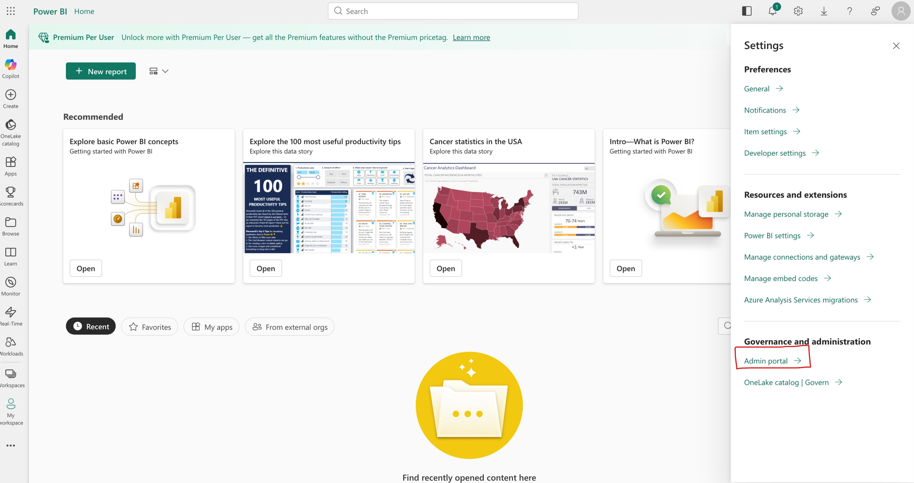

#### Assign the Fabric Administrator role

The operator needs the Microsoft Entra **Fabric Administrator** role. An Azure
subscription Owner or Contributor assignment is not sufficient.

1. In the Microsoft Entra admin center, open **Identity governance** >
   **Privileged Identity Management** > **Microsoft Entra roles**.
2. Add or activate the **Fabric Administrator** role for the operator at
   directory scope. If the role is eligible through PIM, activate it before
   opening the Fabric admin portal.
3. Complete the assignment wizard, sign out of Fabric, and sign in again.


The screenshot shows the role and member selection. The assignment is complete
only after finishing the remaining wizard steps. Access to **Admin portal** >
**Tenant settings** confirms that the role is effective.

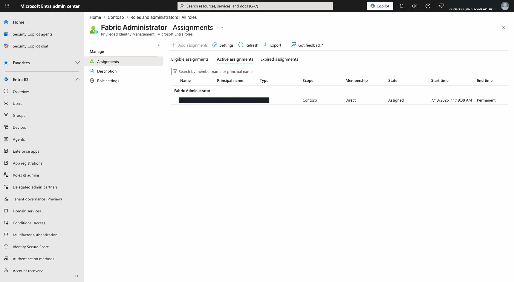

The active-assignment view confirms that the operator has the **Fabric
Administrator** role at directory scope with state **Assigned**.

#### Enable workspace-level inbound network rules

1. In Fabric, open **Settings** > **Admin portal** > **Tenant settings**.
2. Search for **Configure workspace-level inbound network rules** under
   **Advanced networking**.
3. Set it to **Enabled** for the entire organization and select **Apply**.


The screenshot shows the intended enabled state, but also shows **Unapplied
changes**. The prerequisite is complete only after selecting **Apply**, the
unapplied-changes message disappears, and the setting remains enabled after a
page refresh.

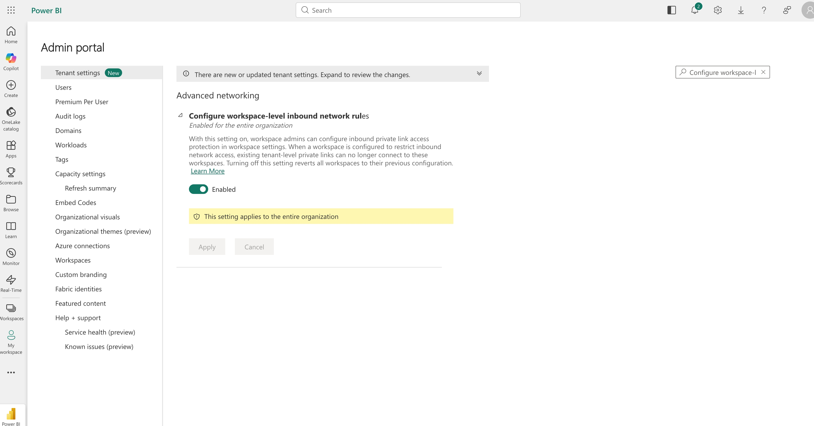

The applied-state screenshot confirms that the setting remains **Enabled** for
the entire organization after refresh, with no pending changes and the
**Apply** button disabled.

Wait up to 15 minutes for the tenant setting to propagate. Keep tenant-level
public access enabled so the public workspace remains reachable; Conditional
Access is configured separately in Entra ID.

Finally, re-register `Microsoft.Fabric` in the subscription before the tenant's
first workspace-level Private Link deployment:

```bash
az provider register \
  --namespace Microsoft.Fabric \
  --subscription f81ed7c0-efed-4b77-b948-b85407bdb710 \
  --wait
```

### 1. Deploy Phase A

From the private on-prem runner, using managed identity:

```bash
cd /home/azureuser/lz/workloads/fabric
terraform init -backend-config=../../_private/backend.hcl
terraform plan -var-file=../../_private/lab.private.tfvars -out=phase-a.tfplan
terraform apply phase-a.tfplan
```

Phase A creates no Fabric workspace and does not change workspace public access.

#### Phase A as-built result (2026-07-13)

Phase A was applied from the private runner with managed identity and the
private Azure Storage backend. No Fabric, Entra, or Azure portal operation was
performed during this phase, so no portal screenshot is required for the apply.
The deployment evidence is the reviewed Terraform plan, apply result, live Azure
queries, and post-apply convergence plan.

- Apply result: **13 added, 0 changed, 0 destroyed**.
- Post-apply Terraform plan: exit code `0` (**No changes**).
- Capacity `azrsbxlab0001fabcap`: `F2`, `Active`, provisioning `Succeeded`,
  Israel Central. F2 hourly billing started when the capacity was created.
- Fabric spoke: `azr-sbx-lab-0001-vnet-fabric-spoke`, `10.2.0.0/24`,
  provisioning `Succeeded`.
- Private-endpoint subnet: `pe-subnet`, `10.2.0.0/27`, associated with
  `azr-sbx-lab-0001-rt-fabric-spoke`.
- Forced-tunnel route: `0.0.0.0/0` -> virtual appliance `10.0.0.4`,
  provisioning `Succeeded`.
- Peerings `fabric-spoke-to-hub` and `hub-to-fabric-spoke`: `Connected` and
  `FullyInSync`; forwarded traffic allowed so the firewall transits spoke ↔ on-prem.
- Private DNS zone `privatelink.fabric.microsoft.com`: hub and Fabric-spoke
  links are `Completed` / `Succeeded`.
- Diagnostic setting `diag-to-law`: `AllMetrics` enabled and targeting
  `azr-sbx-lab-0001-law-central`.

The shared tfvars file produces expected warnings for variables declared by
other stages; these warnings do not represent Phase A drift or failure.

### 2. Create the workspaces

#### Create Workspace A (private)

1. In Fabric, open **Workspaces** and select **New workspace**.

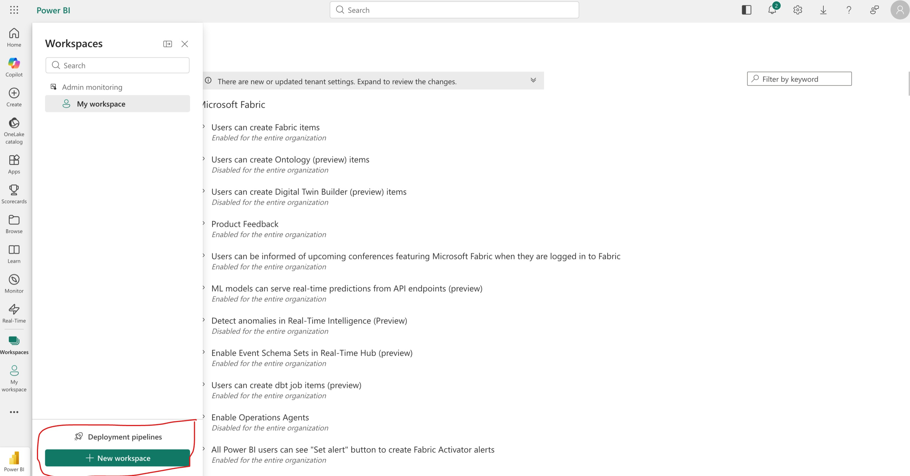

2. Enter `azr-sbx-lab-0001-fabws-private` as the name. Leave **Domain** empty
  for this lab and keep the administrator in the contact list.

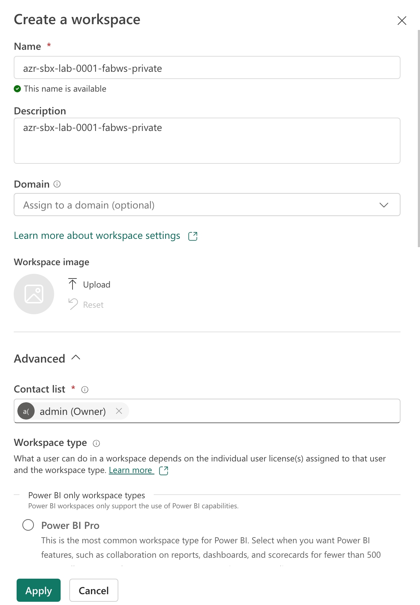

3. Select the Fabric capacity `azrsbxlab0001fabcap - Israel Central`. Do not
  select Fabric Trial, Power BI Premium, or Power BI Pro. Leave template-app
  development disabled and select **Apply**.

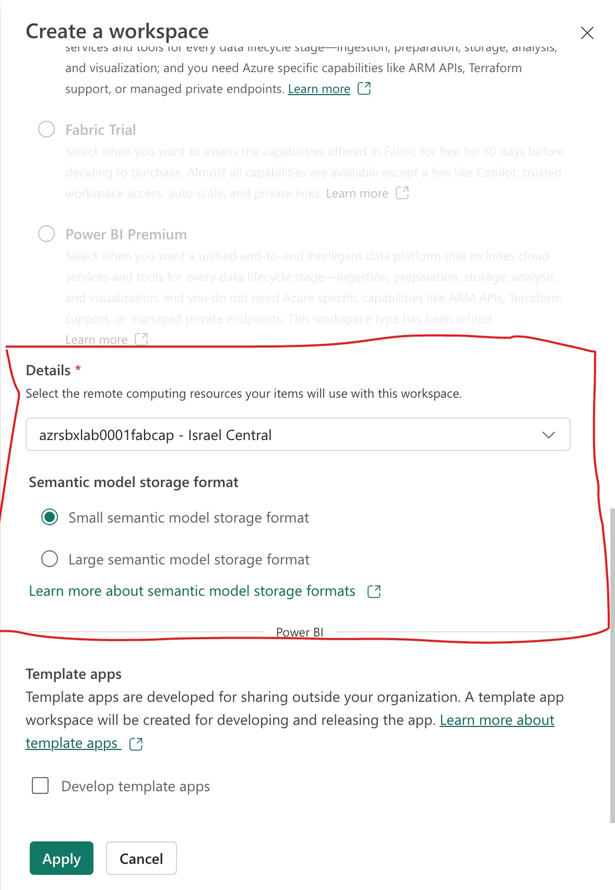

The three screenshots above are procedural evidence. Completion requires a
post-create screenshot showing Workspace A in the workspace list and a refreshed
**Workspace settings** > **Workspace type** screen showing
`azrsbxlab0001fabcap` as the applied capacity.

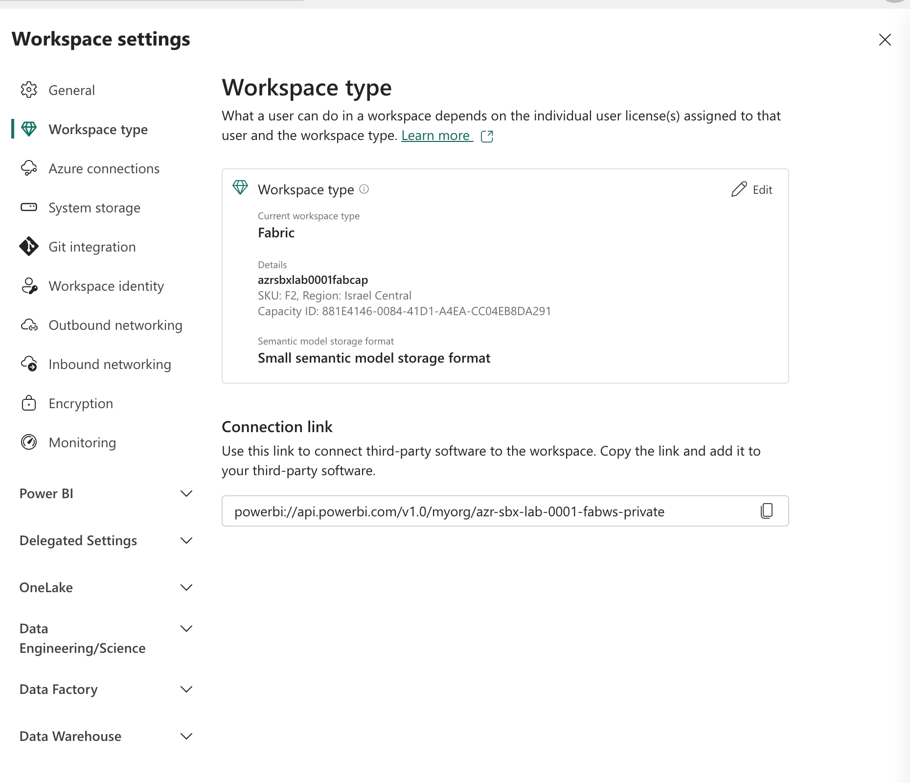

The applied-state screenshot confirms that Workspace A exists as
`azr-sbx-lab-0001-fabws-private`, its workspace type is **Fabric**, and it is
assigned to `azrsbxlab0001fabcap` (`F2`, Israel Central). The workspace name is
also visible in the connection link. This single screen satisfies both creation
and capacity-assignment evidence requirements.

Read-only Fabric API verification confirmed:

- Workspace object ID: `a20cea33-31c4-4290-8cad-d67802ed67e8`.
- Capacity ID: `881e4146-0084-41d1-a4ea-cc04eb8da291`, matching the screenshot.
- Workspace item count: `0`.
- Inbound public access: `Allow`.
- Outbound public access: `Allow`.

Keep public access allowed during provisioning. Do not assign Workspace A to a
deployment pipeline and do not create unsupported items, including Power BI
semantic models.

After creation, add the Workspace A GUID to the private tfvars file:

```hcl
fabric_private_workspace_id = "<workspace-a-object-id>"
```

#### Create Workspace B (public)

Workspace B was created as `azr-sbx-lab-0001-fabws-public`. Its General settings
screen confirms that the workspace exists and that the saved name persisted.

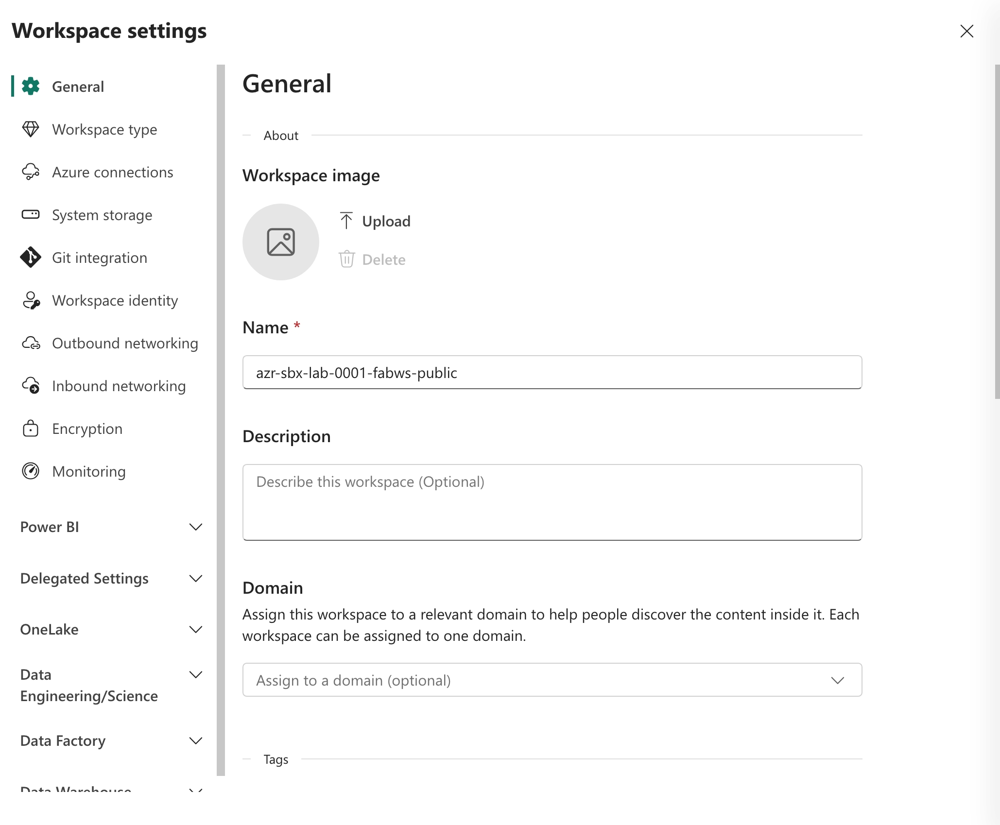

The applied Workspace type screen confirms that Workspace B is **Fabric** and is
assigned to `azrsbxlab0001fabcap` (`F2`, Israel Central). The public workspace
name is visible in the connection link.

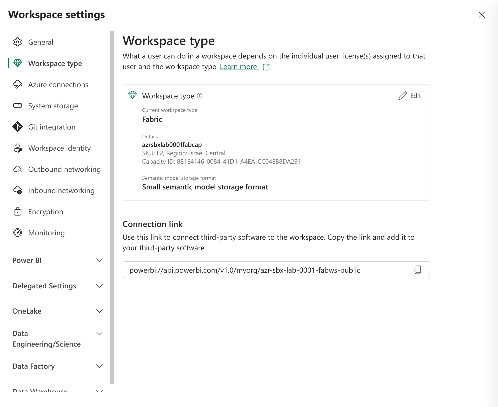

These two screenshots satisfy Workspace B creation and capacity-assignment
evidence. Keep its inbound public access enabled; Workspace B hosts semantic
models and reports and is protected separately with Entra Conditional Access.

Read-only Fabric API verification confirmed:

- Workspace object ID: `80196352-de18-4a77-853c-745ba3ea86d5`.
- Capacity ID: `881e4146-0084-41d1-a4ea-cc04eb8da291`, matching Workspace A.
- Workspace item count: `0`.
- Inbound public access: `Allow`.
- Outbound public access: `Allow`.

#### Configure Conditional Access for public Fabric access

Conditional Access is tenant-level identity protection; it is not scoped to a
single Fabric workspace. In the Microsoft Entra admin center, create or select
the policy that protects the applicable Fabric/Power BI cloud application,
scope its user or group assignments, configure the required grant controls,
exclude emergency-access accounts, and validate it in report-only mode before
enforcement. Workspace B remains publicly addressable, but assigned users must
satisfy this policy.

> **Evidence status — pending**
>
> Capture the policy overview after saving it, showing the policy name, target
> resources, user/group scope, grant controls, and current mode (**Report-only**
> or **On**). Store the permanent repository evidence as
> `images/09-entra-conditional-access-fabric-applied.jpeg`.

### 3. Deploy Phase B

```bash
cd /home/azureuser/lz/workloads/fabric-private-link
terraform init -backend-config=../../_private/backend.hcl
terraform plan -var-file=../../_private/lab.private.tfvars -out=phase-b.tfplan
terraform apply phase-b.tfplan
```

Phase B creates one
`Microsoft.Fabric/privateLinkServicesForFabric@2024-06-01` resource for
Workspace A, then a private endpoint targeting subresource `workspace`. The
endpoint currently allocates five private IPs; reserve at least ten subnet
addresses per workspace endpoint.

#### Phase B plan checkpoint (2026-07-13)

The Phase B configuration was synchronized to the private managed-identity
runner, initialized with the separate
`workloads-fabric-private-link.tfstate` backend key, and validated. No portal
operation was performed and nothing was applied.

- Plan result: **2 to add, 0 to change, 0 to destroy**.
- No replacement or destroy actions.
- Private Link service: `azr-sbx-lab-0001-fabpls-private`, location `global`,
  bound to tenant `9dce4dc6-16c7-48c4-9f57-52897cc5a893` and Workspace A
  `a20cea33-31c4-4290-8cad-d67802ed67e8`.
- Private endpoint: `azr-sbx-lab-0001-pe-fabric-private`, Israel Central, in
  the Fabric spoke `pe-subnet`.
- Target subresource: `workspace`.
- DNS zone group: `workspace-private-dns`, using
  `privatelink.fabric.microsoft.com`.
- Planned workspace API FQDN:
  `a20cea3331c442908cadd67802ed67e8.za2.w.api.fabric.microsoft.com`.

The shared tfvars warnings refer only to variables used by other deployment
stages. The saved plan is waiting for explicit apply approval.

#### Phase B as-built result (2026-07-13)

The first apply attempt stopped before creating resources with
`409 InvalidRequest: Workspace validation failed. Not Found.` The Terraform
runner managed identity had Azure Contributor access but was not a Workspace A
administrator. Microsoft requires the identity creating the workspace Private
Link service to have both Azure permissions and Workspace Admin access.

No partial Private Link service, private endpoint, or Terraform state entry was
created by the failed attempt. Using the signed-in Fabric Administrator, the
runner managed identity was added through the Fabric role-assignment API:

- Managed identity: `azr-sbx-lab-0001-vm-onprem-runner`.
- Service principal object ID: `9584626c-3c5a-4f17-a53f-aa8ea45a70d0`.
- Workspace: `a20cea33-31c4-4290-8cad-d67802ed67e8`.
- Role: `Admin`.
- API response: `HTTP 201`.

This permission is retained for the Terraform lifecycle because future updates
or destruction of the Private Link service require the same workspace
validation. This was an API operation rather than a portal operation; its
request/result and the read-back role assignment are the deployment evidence.

After regenerating the unchanged **2 add, 0 change, 0 destroy** plan, Phase B
applied successfully:

- Apply result: **2 added, 0 changed, 0 destroyed**.
- Private Link service `azr-sbx-lab-0001-fabpls-private`: `Succeeded`, global,
  bound to Workspace A.
- Private endpoint `azr-sbx-lab-0001-pe-fabric-private`: `Succeeded` and
  connection `Approved`, subresource `workspace`.
- Workspace A public policy remained inbound `Allow` / outbound `Allow`.
- Workspace B public policy remained inbound `Allow` / outbound `Allow`.
- Post-apply Terraform plan: exit code `0` (**No changes**).

The endpoint NIC and private DNS zone contain five workspace-specific mappings:

| Workspace endpoint | Private IP |
|---|---|
| `a20cea3331c442908cadd67802ed67e8.za2.w.api.fabric.microsoft.com` | `10.2.0.4` |
| `a20cea3331c442908cadd67802ed67e8.za2.c.fabric.microsoft.com` | `10.2.0.5` |
| `a20cea3331c442908cadd67802ed67e8.za2.onelake.fabric.microsoft.com` | `10.2.0.6` |
| `a20cea3331c442908cadd67802ed67e8.za2.dfs.fabric.microsoft.com` | `10.2.0.7` |
| `a20cea3331c442908cadd67802ed67e8.za2.blob.fabric.microsoft.com` | `10.2.0.8` |

AzureRM did not populate `custom_dns_configs` for this multi-IP endpoint, so the
Terraform output was corrected to read the generated endpoint NIC directly. The
output-only repair applied with **0 added, 0 changed, 0 destroyed** and now
returns all five private IPs.

From the on-prem test VM, all five FQDNs resolved through the hub resolver
`10.0.0.100` to their expected private IPs and TCP 443 was open on each. On-prem
reaches the Fabric spoke through the hub firewall (VNet peering + firewall transit).

An authenticated test also ran from the on-prem Terraform runner by acquiring a
Fabric token from Azure Instance Metadata and calling Workspace A through its
private API FQDN. It resolved to `10.2.0.4`, returned HTTP `200`, and returned the
correct workspace ID and display name. No token was printed or stored.

### 4. Deploy the simulated on-prem SQL and OPDG hosts

This lab phase represents customer-owned on-prem infrastructure. It extends the
existing `onprem-vnet` workload subnet but does not own or modify the VNet, NAT,
hub peering, or existing test/runner VMs.

#### Lab versus customer sizing

| Host | Lab | Customer baseline |
|---|---|---|
| SQL Server | `Standard_B4ms`, SQL Server 2022 Developer | Size from SQL workload assessment; licensed SQL edition |
| OPDG | `Standard_B2s` minimum-cost functional lab | Microsoft recommends 8 cores, 8 GB+ RAM, SSD, HA cluster |

Both lab VMs have static private IPs, managed disks, system-assigned identities,
NIC-scoped NSGs, no public IP, and no inbound RDP rule. Azure VM Run Command is
used for bootstrap and validation.

```bash
cd /home/azureuser/lz/workloads/onprem-lab
terraform init -backend-config=../../_private/backend.hcl
terraform validate
terraform plan \
  -var-file=../../_private/lab.private.tfvars \
  -out=onprem-lab.tfplan
terraform apply onprem-lab.tfplan
```

Expected plan for a new environment: **14 add, 0 change, 0 destroy**. It creates:

- SQL VM `azr-sbx-lab-0001-vm-onprem-sql` at `172.16.1.10`.
- OPDG VM `azr-sbx-lab-0001-vm-onprem-opdg` at `172.16.1.11`.
- Two NICs, two NIC NSG associations and two dedicated NSGs.
- Random Windows and SQL gateway credentials stored only in the private
  Terraform state.
- SQL bootstrap extension: TCP 1433, database `FabricHybridLab`, read-only login
  `fabric_gateway`, and `dbo.SalesOrders` sample rows. Database work runs as the
  marketplace image administrator through Azure Managed Run Command; its script
  revision is tracked so changes replace only the command child resource and
  resend the write-only RunAs password.
- OPDG bootstrap extension: PowerShell 7.4, the current DataGateway PowerShell
  module, and the official standard-mode gateway installer staged at
  `C:\Installers\GatewayInstall.exe`.

**Pass criteria:** both VMs `Succeeded`; SQL marker `C:\FabricHybridLab.ready`;
OPDG staging marker `C:\FabricGatewayInstaller.ready`; OPDG-to-SQL TCP 1433
succeeds; all five Workspace A private FQDNs resolve and connect from the OPDG
VM. Gateway software and service validation occur after the operator completes
the supported interactive installation in Phase 5.

#### Phase 4 as-built result (2026-07-13)

The initial VM apply was interrupted at the client while Azure continued
provisioning. Both VMs were retained. The existing OPDG extension was imported
into `workloads-onprem-lab.tfstate`; no VM, NIC, disk, IP address, or generated
credential was replaced.

Two bootstrap assumptions were corrected during convergence:

- Azure VM Run Command executes as `NT AUTHORITY\SYSTEM`, which is not a SQL
  sysadmin on the SQL Server marketplace image. SQL database provisioning now
  uses Azure Managed Run Command as local administrator `lzadmin`, with the
  Windows and SQL passwords passed only through protected Terraform fields.
- DataGateway module `3000.318.6` requires PowerShell 7.4. The module's
  `Install-DataGateway` command also requires an authenticated service account;
  it is not an unattended software-only installation command. Terraform now
  stages Microsoft's official installer and leaves supported interactive
  installation and tenant registration to Phase 5.

Managed Run Command requires the Windows Secondary Logon service for `RunAs`.
The SQL host extension starts this service before the dependent database
command. Because Azure does not return or reliably reuse the write-only
`run_as_password` during command updates, a hash of the SQL script triggers
replacement of only the Managed Run Command child resource when the script
changes. The SQL script is idempotent; the VM and database persist.

Final applied and runtime evidence:

- SQL VM `172.16.1.10`: running, provisioning `Succeeded`; SQL bootstrap and
  Microsoft Defender extensions `Succeeded`.
- OPDG VM `172.16.1.11`: running, provisioning `Succeeded`; OPDG bootstrap and
  Microsoft Defender extensions `Succeeded`.
- Managed SQL command: provisioning/execution `Succeeded`, exit code `0`, output
  `SQL_AUTH_VALIDATED_ROWS=3 REVISION=2`.
- SQL Server service is running and listening on TCP 1433; marker
  `C:\FabricHybridLab.ready` contains `SQL_READY`.
- PowerShell `7.4.6`, DataGateway module `3000.318.6`, official installer, and
  marker `C:\FabricGatewayInstaller.ready` are present on the OPDG VM.
- OPDG-to-SQL TCP 1433 succeeded.
- From OPDG, the five workspace FQDNs resolved respectively to `10.2.0.4`,
  `10.2.0.5`, `10.2.0.6`, `10.2.0.7`, and `10.2.0.8`; TCP 443 succeeded for
  every address.
- Final Terraform detailed-exit-code plan returned `0`: **No changes**.

No SQL password, Windows password, access token, or gateway recovery key was
printed or stored in this runbook. **Phase 4 is complete. Phase 5 remains a
manual stop gate.**

### 5. Install and register the On-premises Data Gateway

Terraform stages Microsoft's official standard-mode installer but does not
silently execute it. Microsoft documents installation and registration as an
administrator interaction that requires an organizational sign-in and a
recovery key. This is a customer/operator identity step, not Terraform state.

1. Retrieve the SQL credential only when needed from the private runner:

  ```bash
  cd /home/azureuser/lz/workloads/onprem-lab
  terraform output -raw sql_gateway_password
  ```

  Do not paste the value into chat, Git, screenshots, shell history, or README.

2. On the OPDG VM, run `C:\Installers\GatewayInstall.exe` as Administrator,
  retain the default installation path, accept the terms, and select
  **Install**.
3. Sign in with the Fabric gateway administrator organizational account.
4. Select **Register a new gateway on this computer** and register a
  **standard-mode** gateway named `azr-sbx-lab-0001-opdg`.
5. Generate a strong recovery key outside Terraform and store it in the
  customer's approved secret manager. Microsoft cannot recover it.
6. In Fabric, open **Settings** > **Manage connections and gateways** and verify
  that the gateway cluster and member are **Online**.

**Required screenshots:**

- Completed standard-mode software installation:

  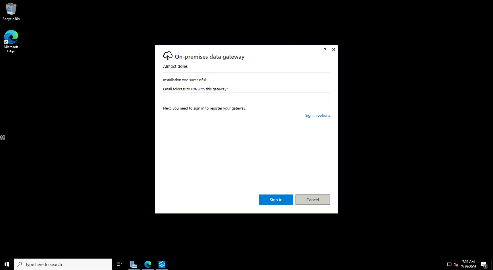

- Final local registration state; no recovery key is exposed:

  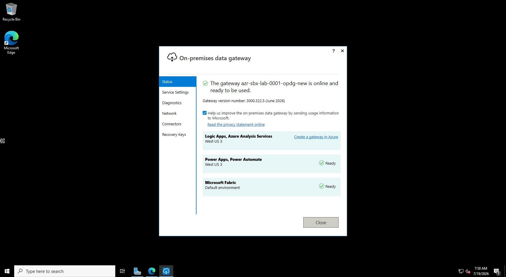

- Fabric gateway management page showing the cluster Online:

  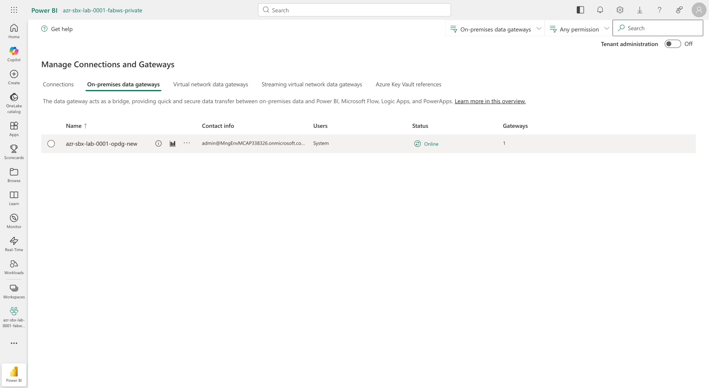

**STOP:** do not continue until the gateway is online and all three screenshots
are stored and linked here.

### 6. Create the private lakehouse and ingest on-prem SQL

1. In Workspace A, create lakehouse `lh_onprem_private`.
2. Create a Fabric SQL Server connection through
  `azr-sbx-lab-0001-opdg`:
  - Server: `172.16.1.10`
  - Database: `FabricHybridLab`
  - Authentication: Basic
  - User: `fabric_gateway`
  - Password: retrieve from private Terraform output
3. Create pipeline `pl_sql_to_onelake_private` and copy
  `dbo.SalesOrders` into the lakehouse as a Delta table.
4. Run the pipeline and verify three sample rows in the destination.

**Required screenshots:**

- `12-private-lakehouse-created.jpeg`
- `13-sql-connection-gateway.jpeg` (no password visible)
- `14-copyjob-succeeded-3rows.jpeg`
- `15-lakehouse-salesorders-delta.jpeg`

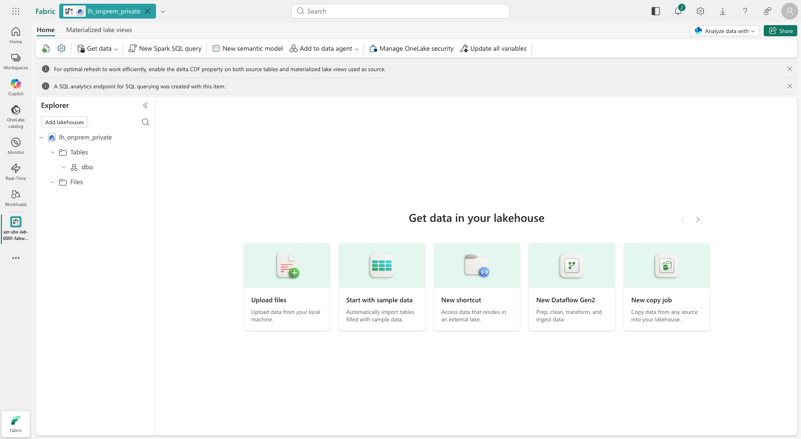

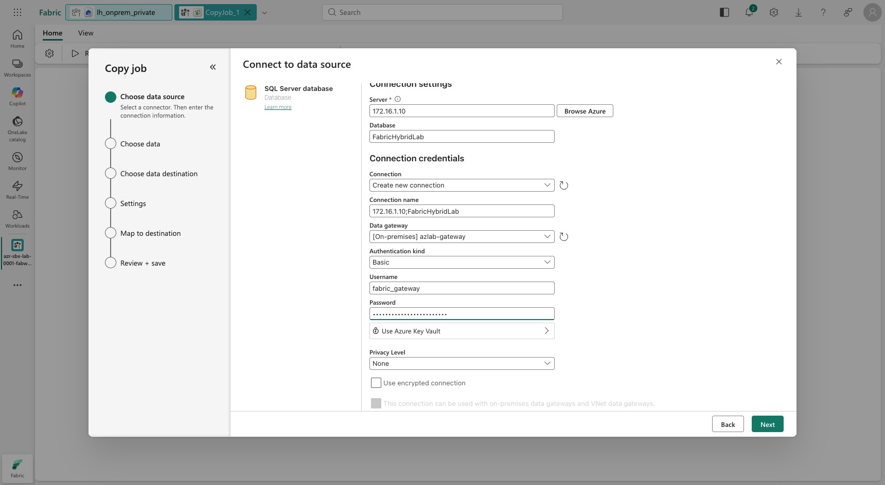

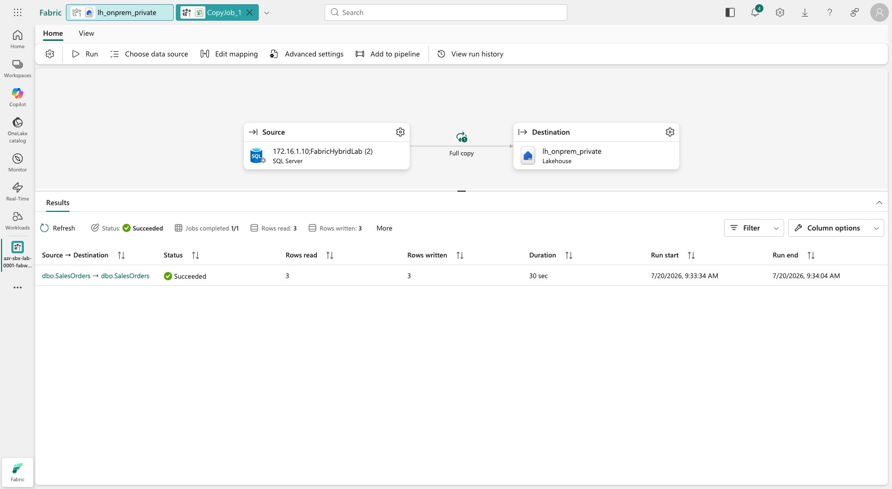

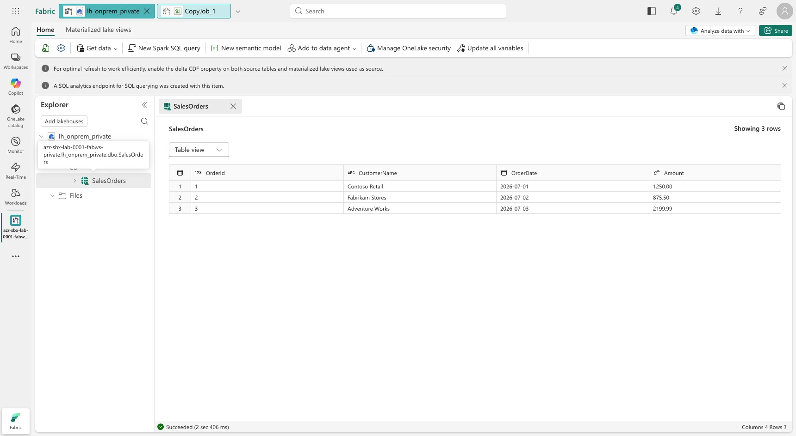

Record the lakehouse, SQL analytics endpoint, pipeline and connection IDs below
the screenshots. **STOP:** do not restrict Workspace A until ingestion succeeds.

### 7. Connect the public workspace to the restricted data path

In Workspace B, create an import or DirectQuery semantic model against Workspace
A's SQL analytics endpoint by using the workspace-specific private warehouse
connection string and the OPDG. Direct Lake is not supported for this restricted
workspace scenario.

1. Create the semantic model in Workspace B.
2. In semantic model settings, enable **Gateway connections**.
3. Select the lab OPDG cluster (`azlab-gateway`) and the approved private SQL
   connection (`sql-fabric-private-za2`).
4. Refresh the model and create a report that displays the three orders.

**Required screenshots:**

- `16-public-semantic-model-gateway-binding.jpeg`
- `17-public-semantic-model-refresh-succeeded.jpeg`
- `18-public-report-salesorders.jpeg`

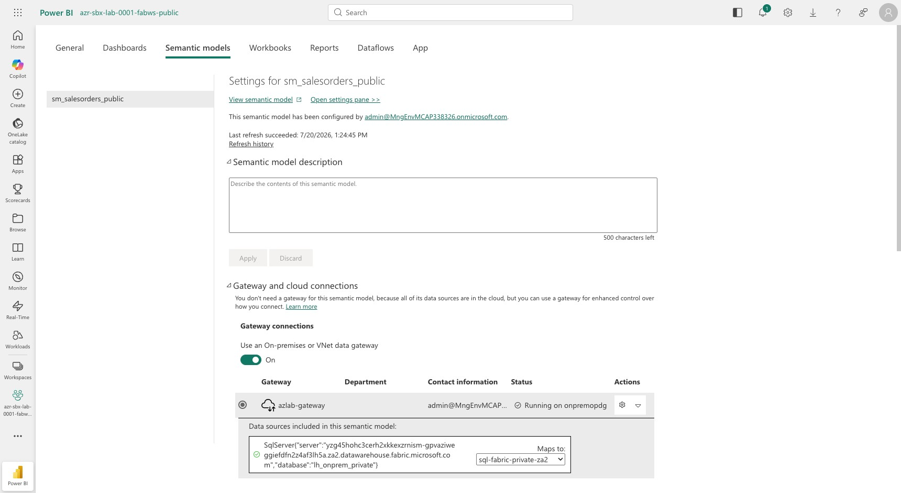

The applied settings show **Gateway connections** enabled, the on-premises
gateway running, and the workspace-private SQL source mapped to the approved
gateway connection.

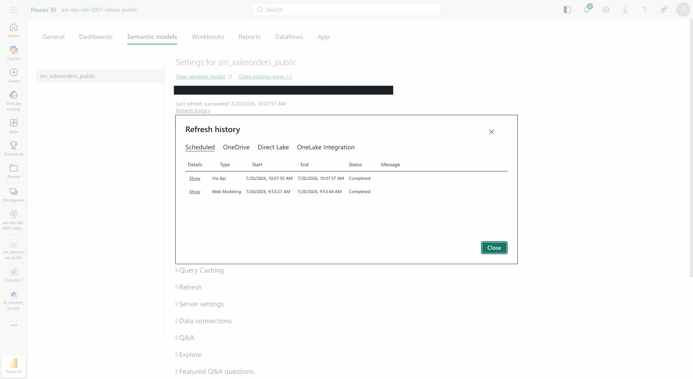

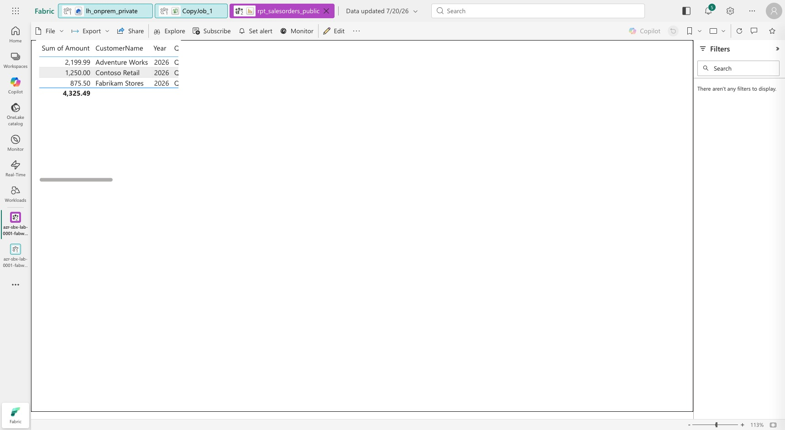

**STOP:** gateway binding and refresh must succeed before lockdown.

### 8. Final pre-lockdown validation

Record each result as command evidence:

- OPDG VM resolves five Workspace A FQDNs to `10.2.0.4`-`10.2.0.8`.
- OPDG VM reaches all five private IPs on TCP 443.
- OPDG VM reaches SQL VM on TCP 1433 and queries three rows.
- Workspace A private API call returns HTTP 200 through `10.2.0.4`.
- Copy pipeline succeeds through OPDG.
- Workspace B semantic-model refresh succeeds through OPDG.
- Workspace A and B policies remain inbound/outbound `Allow` at this checkpoint.

**STOP:** any failure keeps Workspace A public access enabled.

### 9. Deny Workspace A public access last

1. In Workspace A, open **Workspace settings** > **Inbound networking**.
2. Select **Allow connections from selected networks and workspace level private
  links** and select **Apply**.
3. Wait up to 30 minutes and refresh.
4. Capture `19-private-workspace-inbound-restricted.jpeg` showing the persisted
  applied state.
5. Repeat every Phase 8 private/gateway test.
6. Confirm a public request to Workspace A is denied and Workspace B remains
  publicly reachable under its Entra Conditional Access policy.

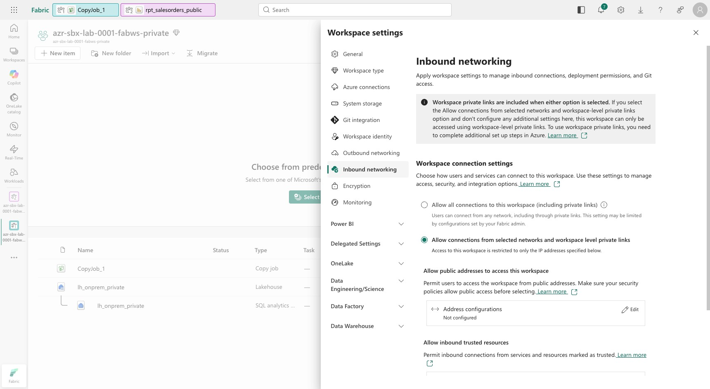

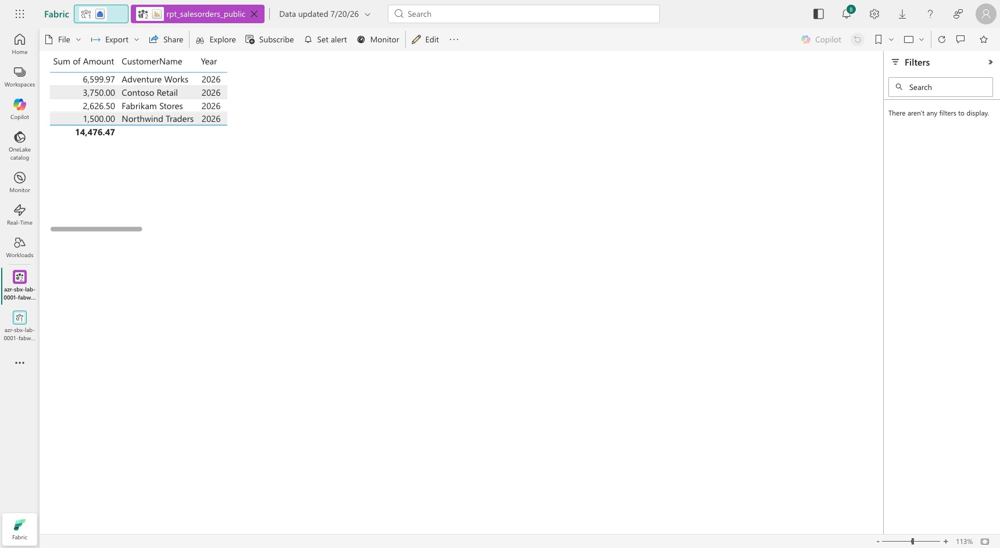

Rollback: use the workspace communication policy API or portal to restore
`publicAccessRules.defaultAction` to `Allow`; then diagnose DNS, endpoint,
gateway and item compatibility before retrying.

### 10. Daily shutdown and resume

When testing is finished for the day:

1. Confirm no pipeline, refresh, Spark job or interactive user is active.
2. Pause Fabric capacity `azrsbxlab0001fabcap` through the Azure API.
3. Deallocate SQL and OPDG VMs; optionally deallocate the test VM and runner
  after all Terraform work is complete.
4. Verify capacity state `Paused` and VM power states `VM deallocated`.

Before the next session, resume the F2 capacity and start only the VMs needed for
that phase. Pausing stops Fabric compute billing; deallocation stops VM compute
billing. Disks, OneLake storage, Firewall, and NAT public IPs
continue to incur charges.

#### Shutdown checkpoint (2026-07-13)

The temporary cost-control shutdown completed successfully:

- Fabric capacity `azrsbxlab0001fabcap`: `Paused`, provisioning `Succeeded`.
- All six subscription VMs: `VM deallocated`.
  - `azr-sbx-lab-0001-vm-onprem-runner`
  - `azr-sbx-lab-0001-vm-onprem-sql`
  - `azr-sbx-lab-0001-vm-onprem-opdg`
  - `onprem-vm`
  - `vm-foundry-private`
  - `vm-deny4`
- Container App `app-7bsfsfvbjjufs`: its active revision was deactivated; active
  revision count is `0`.
- Final verification: running VM count `0`, Fabric state `Paused`, active
  Container App revision count `0`.

#### Resume checkpoint (2026-07-19)

The complete July 13 shutdown set was restored:

- Fabric capacity `azrsbxlab0001fabcap`: `Active`, provisioning `Succeeded`.
- All six subscription VMs: `VM running`, provisioning `Succeeded`.
- Container App revision `app-7bsfsfvbjjufs--3i7k5i8`: active with one replica.
- On-prem ↔ hub: VNet peering `Connected`; on-prem reaches the Fabric spoke via
  the hub firewall transit.
- SQL service and `SQL_READY` marker are present; the protected managed-command
  validation remains `Succeeded`, exit code `0`, with three authenticated rows.
- OPDG reaches SQL on TCP 1433 and resolves the five Workspace A FQDNs to
  `10.2.0.4`-`10.2.0.8`; TCP 443 succeeds for all five.
- Runner authenticated private Workspace A API validation resolves to
  `10.2.0.4` and returns HTTP `200` for the expected workspace.
- The live PE subnet had default outbound access disabled; Terraform now pins
  `default_outbound_access_enabled = false` so future plans cannot enable it.
- Final detailed-exit-code plans: Fabric Phase A `0`, Phase B `0`, on-prem lab
  `0` (**No changes** for all three states).

At this **2026-07-19 checkpoint**, the next action was Phase 5: install and
register the On-premises Data Gateway. That action and the later lockdown phases
were completed on 2026-07-20; see the reference execution ledger at the top of
this document for the final state.

To resume Phase 5, start only the Fabric lab dependencies:

```bash
SUBSCRIPTION_ID=f81ed7c0-efed-4b77-b948-b85407bdb710

az rest --method post \
  --url "https://management.azure.com/subscriptions/$SUBSCRIPTION_ID/resourceGroups/azr-sbx-lab-0001-rg-fabric-spoke/providers/Microsoft.Fabric/capacities/azrsbxlab0001fabcap/resume?api-version=2023-11-01"

az vm start --subscription "$SUBSCRIPTION_ID" \
  --resource-group azr-sbx-lab-0001-rg-onprem-sim \
  --name azr-sbx-lab-0001-vm-onprem-runner
az vm start --subscription "$SUBSCRIPTION_ID" \
  --resource-group azr-sbx-lab-0001-rg-onprem-sim \
  --name azr-sbx-lab-0001-vm-onprem-sql
az vm start --subscription "$SUBSCRIPTION_ID" \
  --resource-group azr-sbx-lab-0001-rg-onprem-sim \
  --name azr-sbx-lab-0001-vm-onprem-opdg
```

Start `onprem-vm` only when an independent network test host is needed. The two
Foundry VMs and the unrelated Container App remain stopped until their own
workloads resume.

Azure Firewall, NAT Gateway, managed disks, public IPs,
Private Endpoints, DNS, state storage, and OneLake storage have no temporary
stop operation and continue to incur their normal fixed or storage charges.

## Decided target (Layer 2)

**Access to Fabric — workspace-level Private Link (inbound).**
Fabric workspace exposed via an **Azure Private Endpoint** in the Fabric spoke's
`pe-subnet`; workspace **public access Disabled**. Reached privately from:
- **on-prem** (a remote VNet joined to the hub by **VNet peering**; the hub firewall is the transit), and
- **Azure VNets** via hub-spoke peering.

**On-prem SQL → OneLake ingestion — Pattern 2: On-premises Data Gateway (OPDG).**
- A Windows VM running the **OPDG** sits **next to the SQL Server VM in the on-prem VNet**.
- SQL read is **local** (gateway + SQL in the same on-prem VNet).
- The gateway writes to **Fabric / OneLake via the private endpoints**, so that
  data leg travels: on-prem → **peering → hub firewall** → spoke PE, provided DNS
  resolves Fabric/OneLake FQDNs to the private-endpoint IPs.

### Accepted caveat
The OPDG keeps a **mandatory control/registration channel to Azure Relay
(`*.servicebus.windows.net`)** that historically uses **public** endpoints. So
the *data* path stays private (peering → firewall → PE), but the gateway's
*control* channel still **egresses** (through the hub firewall / SWG). Confirm current OPDG + private-link
support in-tenant; the control channel may not be fully forceable onto private link.

### Must be correct for this to work
- **DNS:** workspace-level zone `privatelink.fabric.microsoft.com` is linked to
  the hub and Fabric spoke; on-prem DNS forwards to the hub Private DNS Resolver
  so workspace FQDNs resolve to the five PE IPs.
- **Firewall egress (gateway VM):** allow the OPDG relay/auth FQDNs
  (`*.servicebus.windows.net`, `login.microsoftonline.com`, Fabric backend FQDNs).
- **Spark:** enabling private link + block-public forces workspace Spark into a
  **managed VNet with managed private endpoints** (starter pools disabled, slower
  session start).

### Lab implementation scope
- `workloads/onprem-lab/` — private **SQL Server VM** + **OPDG VM** added to the
  existing on-prem VNet (peered to the hub). **Lab only.**
- `workloads/fabric/` — Fabric spoke + workspace Private Endpoint + Lakehouse +
  OPDG connection + Copy pipeline into OneLake.
- Note: gateway registration + several Fabric artifacts are tenant-scoped /
  click-through → runbook, not fully Terraformable.
